Analysis of Friends of Casco Bay DIN Data
================
Curtis C. Bohlen, Casco Bay Estuary Partnership.
04/26/2021

-   [Introduction](#introduction)
-   [Load Libraries](#load-libraries)
-   [Load Data](#load-data)
    -   [Folder References](#folder-references)
    -   [Load Data](#load-data-1)
-   [Station Names](#station-names)
-   [Data Review](#data-review)
    -   [Data Distributions](#data-distributions)
    -   [Cross- Plot DIN by TN](#cross--plot-din-by-tn)
    -   [Add Shortened Site Names](#add-shortened-site-names)
    -   [Data Prevalence](#data-prevalence)
    -   [Extract Recent Results](#extract-recent-results)
-   [Models](#models)
-   [Recent Data](#recent-data)
    -   [Linear Model](#linear-model)
        -   [Model Diagnostics](#model-diagnostics)
        -   [Marginal Means](#marginal-means)
        -   [Compare to Observed Means](#compare-to-observed-means)
    -   [Simplified Linear Models](#simplified-linear-models)
        -   [Compare to Observed Means](#compare-to-observed-means-1)
    -   [GAM Model](#gam-model)
        -   [Compare to Observed Mean](#compare-to-observed-mean)
    -   [Sample Sizes are Wildly
        Unequal](#sample-sizes-are-wildly-unequal)
-   [Restricted DIN Data (Year = 2019)](#restricted-din-data-year--2019)
    -   [Calculate Descriptive
        Statistics](#calculate-descriptive-statistics)
    -   [Linear Model](#linear-model-1)
    -   [Simplified Linear Model](#simplified-linear-model)
    -   [Robust Linear Model](#robust-linear-model)
    -   [GAM model](#gam-model-1)
        -   [Compare Model Results – Does Model Selection
            Matter?](#compare-model-results--does-model-selection-matter)
-   [Restricted Data – Core Months](#restricted-data--core-months)
    -   [Calculate Descriptive
        Statistics](#calculate-descriptive-statistics-1)
    -   [Linear Model](#linear-model-2)
    -   [Simplified Linear Model](#simplified-linear-model-1)
    -   [Robust Linear Model](#robust-linear-model-1)
    -   [GAM model](#gam-model-3)
        -   [Compare Model Results – Does Model Selection
            Matter?](#compare-model-results--does-model-selection-matter-1)
-   [DIN Recent Condition
    Conclusions](#din-recent-condition-conclusions)
-   [Trend Analysis](#trend-analysis)
    -   [Identify Trend Stations](#identify-trend-stations)
    -   [Generate Trend Data](#generate-trend-data)
    -   [Data Prevalence](#data-prevalence-1)
-   [Core Site Trend Data](#core-site-trend-data)
    -   [Jitter Plot By Year](#jitter-plot-by-year)
    -   [Real Dates and Times](#real-dates-and-times)
-   [Core Months Trend Data](#core-months-trend-data)
    -   [Jitter Plot By Year](#jitter-plot-by-year-1)
-   [Models](#models-1)
    -   [Initial Linear Model](#initial-linear-model)
    -   [Check for Non-linear Patterns](#check-for-non-linear-patterns)


# Introduction

This notebook Looks at DIN numbers from Friends of Casco Bay samples.

FOCB reports the TN samples and DIN samples were sent to different
laboratories, and so direct comparison relies on consistent calibration,
etc. across two labs. Accordingly, here we restrict our analysis to
looking at DIN. A separate notebook looks at TN.

FOCB reports that some DIN samples over the years had unusually high
ammonium values, and that those samples were noted by the laboratory
conducting the analyses, but not flagged as errors. We created a data
set that dropped the top 5% of ammonium valuesd and ammonium data where
DIN was larger than TN. Details are in the
“FOCB\_Nutrients\_Combined.Rmd” notebook.

# Load Libraries

``` r
library(MASS) # for `rlm()` ans `lqs()`for robust regression
              # also `cov.rob()` for robust multivariate scatter and covariance.
              # Because MASS contains a function `select()` that conflicts with
              # the tidyverse `select()` function, `MASS` should be loaded before
              # the tidyverse.

library(readxl)
library(tidyverse)
#> Warning: package 'tidyverse' was built under R version 4.0.5
#> -- Attaching packages --------------------------------------- tidyverse 1.3.1 --
#> v ggplot2 3.3.5     v purrr   0.3.4
#> v tibble  3.1.6     v dplyr   1.0.7
#> v tidyr   1.1.4     v stringr 1.4.0
#> v readr   2.1.0     v forcats 0.5.1
#> Warning: package 'ggplot2' was built under R version 4.0.5
#> Warning: package 'tidyr' was built under R version 4.0.5
#> Warning: package 'dplyr' was built under R version 4.0.5
#> Warning: package 'forcats' was built under R version 4.0.5
#> -- Conflicts ------------------------------------------ tidyverse_conflicts() --
#> x dplyr::filter() masks stats::filter()
#> x dplyr::lag()    masks stats::lag()
#> x dplyr::select() masks MASS::select()

library(mgcv)    # For generalized linear models
#> Warning: package 'mgcv' was built under R version 4.0.5
#> Loading required package: nlme
#> 
#> Attaching package: 'nlme'
#> The following object is masked from 'package:dplyr':
#> 
#>     collapse
#> This is mgcv 1.8-38. For overview type 'help("mgcv-package")'.

library(emmeans)
#> Warning: package 'emmeans' was built under R version 4.0.5
library(moments)  # for skewness and kurtosis)

library(sfsmisc)  # Provides alternative access to wald test for robust models
#> Warning: package 'sfsmisc' was built under R version 4.0.5
#> 
#> Attaching package: 'sfsmisc'
#> The following object is masked from 'package:dplyr':
#> 
#>     last

library(CBEPgraphics)
load_cbep_fonts()
theme_set(theme_cbep())
```

# Load Data

## Folder References

``` r
sibfldnm <- 'Derived_Data'
parent <- dirname(getwd())
sibling <- file.path(parent,sibfldnm)

#dir.create(file.path(getwd(), 'figures'), showWarnings = FALSE)
```

## Load Data

The data we use here has had a number of suspiciously high NH4 values
removed. See “FOCB\_Nutrients\_Combined.Rmd” for details and
explanation.

``` r
strict_data <- read_csv(file.path(sibling, 
                                 "focb_n_data_strict.csv"))%>%
  mutate(month = factor(month, levels = month.abb),
         yearf = factor(year)) %>%
  mutate(dt = as.Date(dt))
#> Rows: 3324 Columns: 16
#> -- Column specification --------------------------------------------------------
#> Delimiter: ","
#> chr   (2): station, month
#> dbl  (13): year, yearf, doy, tn_depth, din_depth, tn, nox, nh4, din, din_N, ...
#> dttm  (1): dt
#> 
#> i Use `spec()` to retrieve the full column specification for this data.
#> i Specify the column types or set `show_col_types = FALSE` to quiet this message.
```

# Station Names

``` r
fn <- 'FOCB Monitoring Sites SHORT NAMES.xlsx'
names_df <- read_excel(file.path(sibling, fn))
```

# Data Review

## Data Distributions

``` r
ggplot(strict_data , aes(din)) +
  geom_histogram()
#> `stat_bin()` using `bins = 30`. Pick better value with `binwidth`.
#> Warning: Removed 419 rows containing non-finite values (stat_bin).
```

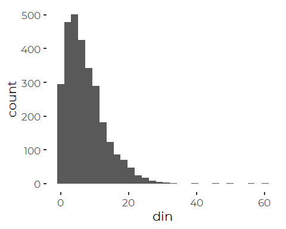

A log transform is “too stong” for the complete DIN data and leaves the
data skewed the other way.

``` r
ggplot(strict_data , aes(din)) +
  geom_histogram(aes(fill = station)) +
  theme(legend.position = 'none') +
  scale_x_log10()
#> Warning: Transformation introduced infinite values in continuous x-axis
#> `stat_bin()` using `bins = 30`. Pick better value with `binwidth`.
#> Warning: Removed 430 rows containing non-finite values (stat_bin).
```

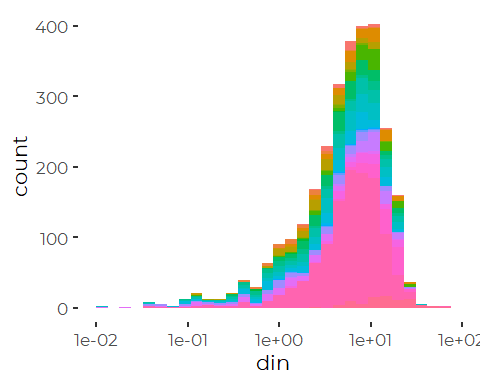

We can partially correct by using a generalized log transform, although
selection of the additive constant is fairly arbitrary. A value between
0.75 and 2 appears to work fairly well.

This assessment of the value of the log + k transform changes with some
data subsets, below. many analyses have better model diagnostics on the
log transform.

``` r
glog = function(.x, .k) log(.x + .k)

ggplot(strict_data , aes(glog(din, 1.5))) +
  geom_histogram(aes(fill = station)) +
  theme(legend.position = 'none')
#> `stat_bin()` using `bins = 30`. Pick better value with `binwidth`.
#> Warning: Removed 419 rows containing non-finite values (stat_bin).
```

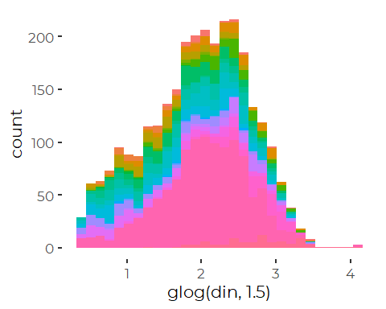

But the log plus one transform looks pretty good for most stations.
Things get complex with later models, on restricted data, where the log
transform performs slightly better.

``` r
ggplot(strict_data , aes(log1p(din))) +
  geom_density(aes(fill = station)) +
  facet_wrap(~ station) +
  theme_minimal() +         # restores gridlines
  theme(legend.position = 'none')
#> Warning: Removed 419 rows containing non-finite values (stat_density).
```

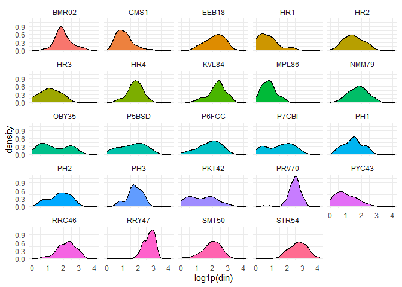
A number of sites show tendencies towards bimodal distributions of DIN.
Later analyses suggest that may reflect seasonal patterns.

## Cross- Plot DIN by TN

``` r
ggplot(strict_data, aes(tn, din_N)) + 
  geom_point(aes(fill = month), size = 2, shape = 21, alpha = 0.5) +
  geom_abline(intercept = 0, slope = 1) +
  #scale_fill_manual(values = cbep_colors()) +
  coord_equal() +
  theme_cbep(base_size = 12) +
    ylab('DIN (mg/ l as N)') +
    xlab('TN (mg/l)') +
  xlim(0, 1.5)
#> Warning: Removed 2659 rows containing missing values (geom_point).
```

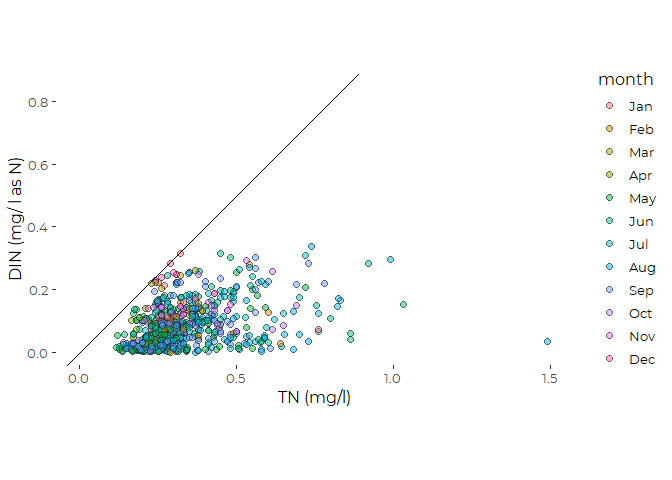
\# Recent Conditions Recent conditions include data from 2015 through
2019.

We remove the data for KVL84 from these analyses, because we have very
limited local data from that site.

``` r
recent_data <- strict_data %>%
  filter(year > 2014) %>%
  filter(station != 'KVL84')
```

## Add Shortened Site Names

The key step here is reordering by median nitrogen values. That ordering
will need to be harmonized with TN ordering to generate final graphics.

``` r
recent_data <- recent_data %>%
   mutate(station_name = names_df$Alt_Name[match(station,
                                                names_df$Station_ID)]) %>%
   mutate(station = factor(station),
          station_name = factor(station_name)) %>%
   mutate(station = fct_reorder(station, tn, na.rm = TRUE),
         station_name = fct_reorder(station_name, tn, na.rm = TRUE)) %>%
   relocate(station_name, .after = station) %>%
   select(-tn_depth, -tn, -organic_N)
```

## Data Prevalence

``` r
xtabs(~station + year, data = strict_data[! is.na(strict_data$din),])
#>        year
#> station 2001 2002 2003 2004 2005 2006 2007 2008 2009 2010 2011 2012 2013 2014
#>   BMR02    0    0    0    0    7    4    5    2    3    8    0    0    0    0
#>   CMS1     0    0    0    0    0    0    0    0   14   19    0    0    0    0
#>   EEB18    0    0    0    0   15   17    2   10   24   19    2    1    0    0
#>   HR1      0    0    0    0    0    0    0    0    0    0    0    0    0    0
#>   HR2      0    0    0    0   20   12   15   10   20   19    0    0    0    0
#>   HR3      0    0    0    0    0    0    0    0    0    0    0    0    0    0
#>   HR4      0    0    0    0    0    0    0    0    0    3    2    2    0    0
#>   KVL84    0    0    0    0    0    0   39   28   22   15    2    2    0    0
#>   MPL86    0    0    0    0    0    0    0    0    0    0    0    0    0    0
#>   NMM79   35   13    0    0   13    6   20   17   17   27    2    5    0    0
#>   OBY35    0    0    0    0    0    0   20   16   20   14    0    0    0    0
#>   P5BSD    3   11   14   13   14   15   10   11    8    8   10    7   12    8
#>   P6FGG   10   12   13   13   12   16   12   11    8    8   10    7   12    7
#>   P7CBI    3    5   12   13   14   14   12   11    7    9   10   10   12    7
#>   PH1      0    0    0    0    0    0    0    0    0    0    0    0    0    0
#>   PH2      0    0    0    0    0    0    0    0    0    0    0    0    0    0
#>   PH3      0    0    0    0    0    0    0    0    0    0    0    0    0    0
#>   PKT42   11    6    9   10   12    8   10    8    4    5    6    6    8    4
#>   PRV70    0    0    0    0    0    0   21   24   12   13    2    2    0    0
#>   PYC43    0    0    0    0   17   20   18   11   10   20    0    0    0    0
#>   RRC46    0    0    0    0   17    4   16    7    8   15    0    0    0    0
#>   RRY47    0    0    0    0   18   16   14   17   17   23    2    2    0    0
#>   SMT50   95  102  139  132   92   82  115   84   48   61   32   10   23    8
#>   STR54    0    0    0    0   13   14    9   12    5   18    2    2    0    0
#>        year
#> station 2015 2016 2017 2019
#>   BMR02    0    0    0    8
#>   CMS1     0    0    2    8
#>   EEB18    0    0    2    8
#>   HR1      0    0    3    8
#>   HR2      0    0    4    3
#>   HR3      0    0    3    3
#>   HR4      0    0    0    7
#>   KVL84    0    0    1    0
#>   MPL86    0    0    0    8
#>   NMM79    0    0    1    7
#>   OBY35    0    0    0    7
#>   P5BSD    7   16    1    8
#>   P6FGG    8   14    1    8
#>   P7CBI    8   11    0    7
#>   PH1      0    0    1    8
#>   PH2      0    0    1    8
#>   PH3      0    0    1    7
#>   PKT42    4    1    2    8
#>   PRV70    0    0    0    7
#>   PYC43    0    0    1    7
#>   RRC46    0    0    0    8
#>   RRY47    0    0    2    8
#>   SMT50   25   45    0    8
#>   STR54    0    0    0    8
```

DIN data has been collected fairly consistently from a handful of sites
over many years, and from many sites only in 2019. Samples have been
collected at different times of year as well, complicating analyses, as
year, station, and season / time of year are confounded.

``` r
xtabs(~ month + station, data = recent_data )%>%
  as_tibble() %>%
  mutate(month = factor(month, levels = month.abb)) %>%
  filter(n>0) %>%

  ggplot(aes(station, month, fill = sqrt(n))) +
  geom_tile() +
  theme_cbep(base_size = 12) +
  theme(axis.text.x = element_text(angle = 90, hjust = 1, vjust = .25))
```

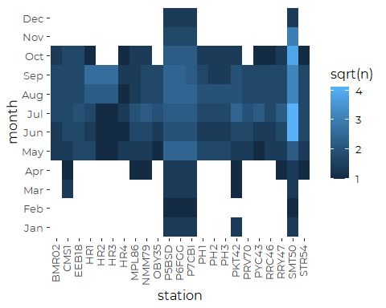

``` r
xtabs(~ year + station, data = recent_data) %>%
  as_tibble() %>% 
  filter(n>0) %>%

  ggplot(aes(station, year, fill = sqrt(n))) +
  geom_tile() +
  theme_cbep(base_size = 12) +
  theme(axis.text.x = element_text(angle = 90, hjust = 1, vjust = .25))
```

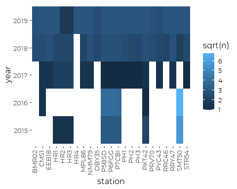

``` r
xtabs(~ year + month, data = recent_data) %>%
  as_tibble() %>% 
  mutate(month = factor(month, levels = month.abb))  %>%
  filter(n>0) %>%

  ggplot(aes(month, year, fill = sqrt(n))) +
  geom_tile() +
  theme_cbep(base_size = 12) +
  theme(axis.text.x = element_text(angle = 90, hjust = 1, vjust = .25))
```

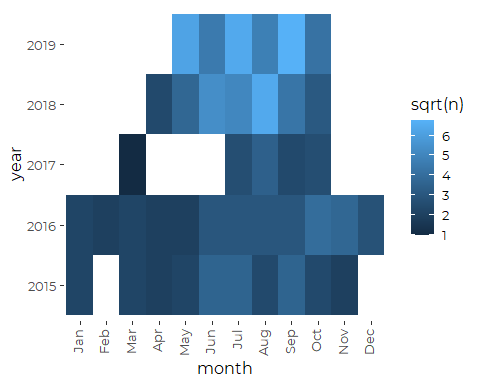

We note that several stations have fewer than ten DIN samples over the
recent period, and sampling has focused on a smaller number of sites, a
smaller number of months, or both.

Only one site (KVL84, Knightville Landing, in South Portland) has fewer
than five DIN values. It was dropped, above, for lack of recent data.

With the relatively low sample sizes and uneven sampling histories for
most sites, complex models may perform poorly. Interactions with year,
time of year, and location, in particular, will lead to many empty cells
in the implicit model design. Those may lead to a variety of model
artifacts.

## Extract Recent Results

This is the simplest analysis, with no hierarchical modeling. We drop
the extreme TN values, ass we do for most analyses coming up.

``` r
recent_results <- recent_data %>%
  group_by(station) %>%
  summarize(across(nox:nh4_N, c(mn = ~ mean(.x, na.rm = TRUE),
                                  sd = ~ sd(.x, na.rm = TRUE), 
                                  n = ~sum(! is.na(.x)),
                                  md = ~ median(.x, na.rm = TRUE),
                                  iqr = ~ IQR(.x, na.rm = TRUE),
                                  p90 = ~ quantile(.x, .9, na.rm = TRUE),
                                  gm = ~ exp(mean(log(.x), na.rm = TRUE))))) %>%
  mutate(station_name = names_df$Alt_Name[match(station,
                                                names_df$Station_ID)]) %>%
  mutate(station = fct_reorder(factor(station), din_md),
         station_name = fct_reorder(factor(station_name), din_md)) %>%
  relocate(station_name, .after = station)
```

# Models

We want to look at recent conditions, taking into account as best we can
possible covariates, including year and time of year. Our goal is to
extract means, medians, or marginal means by station for the recent data
to plot on graphics and GIS.

# Recent Data

## Linear Model

We begin by constructing conventional linear models on log transformed
DIN data.

``` r
full_din_lm <- lm(log(din_N) ~ station *  month + yearf, data = recent_data)
anova(full_din_lm)
#> Analysis of Variance Table
#> 
#> Response: log(din_N)
#>                Df  Sum Sq Mean Sq F value    Pr(>F)    
#> station        22 149.320  6.7873  7.8165 < 2.2e-16 ***
#> month          11  85.155  7.7413  8.9153 1.685e-12 ***
#> yearf           3  28.829  9.6098 11.0671 1.098e-06 ***
#> station:month 120  80.095  0.6675  0.7687    0.9382    
#> Residuals     174 151.088  0.8683                      
#> ---
#> Signif. codes:  0 '***' 0.001 '**' 0.01 '*' 0.05 '.' 0.1 ' ' 1
```

Stepwise model selection confirms that the interaction term is of little
value (by AIC; not shown) .

``` r
din_lm <- lm(log(din_N) ~ station +  month + yearf, data = recent_data)
anova(din_lm)
#> Analysis of Variance Table
#> 
#> Response: log(din_N)
#>            Df  Sum Sq Mean Sq F value    Pr(>F)    
#> station    22 149.320  6.7873  8.6315 < 2.2e-16 ***
#> month      11  85.155  7.7413  9.8448 3.323e-15 ***
#> yearf       3  28.829  9.6098 12.2210 1.473e-07 ***
#> Residuals 294 231.183  0.7863                      
#> ---
#> Signif. codes:  0 '***' 0.001 '**' 0.01 '*' 0.05 '.' 0.1 ' ' 1
```

### Model Diagnostics

``` r
oldpar <- par(mfrow = c(2,2))
plot(din_lm)
```

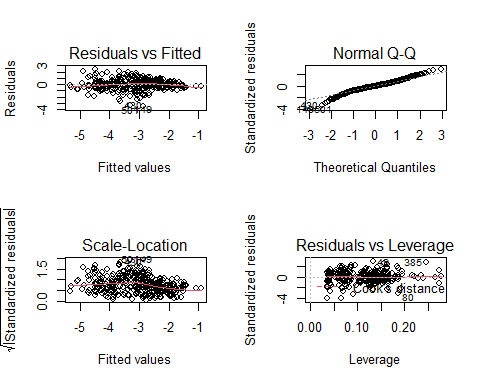

``` r
par(oldpar)
```

We have a few values that are fairly badly underestimated (large
negative residuals), but diagnostics are not dreadful. Residuals are
somewhat heavy tailed. There is some evidence that a plain log transform
has over corrected the skew in the original data.

``` r
recent_data[c(149, 430, 501),]
#> # A tibble: 3 x 14
#>   station station_name  dt          year yearf month   doy din_depth   nox   nh4
#>   <fct>   <fct>         <date>     <dbl> <fct> <fct> <dbl>     <dbl> <dbl> <dbl>
#> 1 P5BSD   Broad Sound   2016-08-16  2016 2016  Aug     229       0.2  0     0.09
#> 2 P7CBI   Clapboard Is~ 2015-05-27  2015 2015  May     147       0.2  0.09  0.03
#> 3 SMT50   SMCC Pier     2016-07-25  2016 2016  Jul     207       0.2  0.09  0.04
#> # ... with 4 more variables: din <dbl>, din_N <dbl>, nox_N <dbl>, nh4_N <dbl>
```

The poorly fit samples are all from 2015 and 2016 during the warm
season. It is possible the fit for those years is affected by the
prevalence of winter samples, with the unbalanced sampling history
biasing estimates for the entire year.

### Marginal Means

``` r
din_emms_lm <- emmeans(din_lm, 'station', type = 'response')
din_emms_lm_jul <- emmeans(din_lm, 'station', type = 'response', 
                       at = list(month = 'Jul'))
```

Unfortunately, the relationship to observed means is only so-so. Again,
this probably reflects unbalanced data, leading to large “corrections”
in some places where available data are biased.

``` r
plot(din_emms_lm) + coord_flip() + 
  theme(axis.text.x = element_text(angle = 90, vjust = 0.25)) +
  geom_point(data = recent_results, aes(y = station, x = din_N_md),
             color = 'red')
```

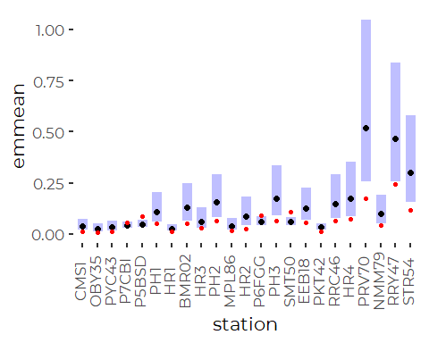

### Compare to Observed Means

Unfortunately, this model does a fairly poor job regenerating the means
from the original data, and standard errors for some estimates are very
large (note the log-log plot). This suggests this model is performing
poorly.

``` r
compare <- recent_results %>%
  select(station, station_name, contains('tn'), contains('din_N')) %>%
  full_join(din_emms_lm, by = 'station', suffix = c('.data', '.lm'), copy = TRUE)

ggplot(compare, aes(din_N_mn, response)) +
  geom_abline(slope = 1, intercept = 0) + 
  geom_point(size = 3, color = 'blue') +
  geom_linerange(aes(xmin = din_N_mn - 2 * din_N_sd/sqrt(din_N_n), 
                     xmax = din_N_mn + 2 * din_N_sd/sqrt(din_N_n))) +
  geom_linerange(aes(ymin = lower.CL, ymax = upper.CL)) +
  xlab('Observed ') +
  ylab('Log Linear Model') +
  coord_equal() +
  scale_x_log10() +
  scale_y_log10()
#> Warning in self$trans$transform(x): NaNs produced
#> Warning: Transformation introduced infinite values in continuous x-axis
#> Warning: Removed 2 rows containing missing values (geom_segment).
```

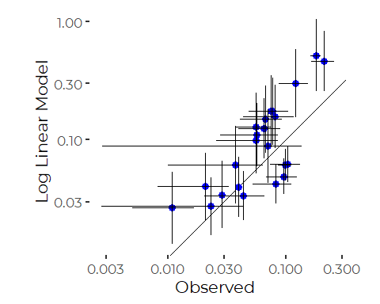

## Simplified Linear Models

We look at a linear models that do not include as many predictors, and
show that they return marginal means that DO match the observed means
fairly well.

``` r
red_din_lm  <- lm(log(din_N) ~ station, data = recent_data)
din_emms_red_lm     <- emmeans(red_din_lm,     'station', type = 'response')
```

### Compare to Observed Means

``` r
compare <- recent_results %>%
  select(station, station_name, contains('tn'), contains('din_N')) %>%
  full_join(din_emms_red_lm, by = 'station', suffix = c('.data', '.lm'), copy = TRUE)

ggplot(compare, aes(din_N_mn, response)) +
  geom_abline(slope = 1, intercept = 0) + 
  geom_point(size = 3, color = 'blue') +
  geom_linerange(aes(xmin = din_N_mn - 2 * din_N_sd/sqrt(din_N_n), 
                     xmax = din_N_mn + 2 * din_N_sd/sqrt(din_N_n))) +
  geom_linerange(aes(ymin = lower.CL, ymax = upper.CL)) +
  xlab('Observed ') +
  ylab('Linear Model') +
  coord_equal() +
  scale_x_log10() +
  scale_y_log10()
#> Warning in self$trans$transform(x): NaNs produced
#> Warning: Transformation introduced infinite values in continuous x-axis
#> Warning: Removed 2 rows containing missing values (geom_segment).
```

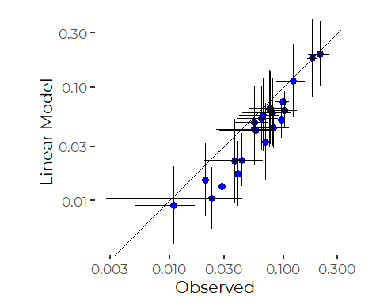
Standard errors are still fairly large, but the model at least provides
results closer to observed means. Error bars tend to overlap the 1:1
line. The differences here probably reflect the differences between
geometric and arithmetic means.

All this suggests we are slicing these data too finely, and we should
take a different approach. We have good data coverage from 2019, so we
can restrict attention to 2019.

## GAM Model

We can use a GAM model to look more closely at seasonal patterns.

``` r
din_gam <- gam(log(din_N) ~ station +  s(doy, bs = 'cc', k = 5) + 
                                         s(yearf, bs = 're'), 
               data = recent_data)
anova(din_gam)
#> 
#> Family: gaussian 
#> Link function: identity 
#> 
#> Formula:
#> log(din_N) ~ station + s(doy, bs = "cc", k = 5) + s(yearf, bs = "re")
#> 
#> Parametric Terms:
#>         df     F p-value
#> station 22 7.732  <2e-16
#> 
#> Approximate significance of smooth terms:
#>            edf Ref.df     F  p-value
#> s(doy)   2.793  3.000 17.06 6.68e-07
#> s(yearf) 2.784  3.000 12.89  < 2e-16
```

``` r
plot(din_gam)
```

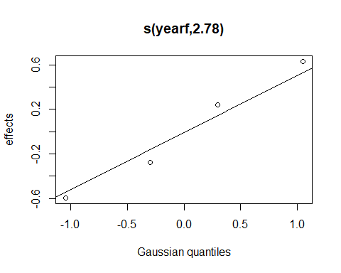
The day of year smoother may be slightly over fit here, and we have not
fully explored interactions between seasonal effects and station.

``` r
oldpar <- par(mfrow = c(2,2))
gam.check(din_gam)
```


    #> 
    #> Method: GCV   Optimizer: magic
    #> Smoothing parameter selection converged after 12 iterations.
    #> The RMS GCV score gradient at convergence was 6.894554e-07 .
    #> The Hessian was positive definite.
    #> Model rank =  30 / 30 
    #> 
    #> Basis dimension (k) checking results. Low p-value (k-index<1) may
    #> indicate that k is too low, especially if edf is close to k'.
    #> 
    #>            k'  edf k-index p-value  
    #> s(doy)   3.00 2.79    0.91   0.075 .
    #> s(yearf) 4.00 2.78      NA      NA  
    #> ---
    #> Signif. codes:  0 '***' 0.001 '**' 0.01 '*' 0.05 '.' 0.1 ' ' 1
    par(oldpar)

Those diagnostics are not too bad, with the exception of a few large
negative residuals again.

#### GAM Marginal Means

``` r
din_emms_gam <- emmeans(din_gam, 'station', type = 'response', 
                        cov_reduce = median,
                        cov_keep = 'year',
                        at = list(doy = 200))
plot(din_emms_gam) + coord_flip() + 
  theme(axis.text.x = element_text(angle = 90, vjust = 0.25))
```

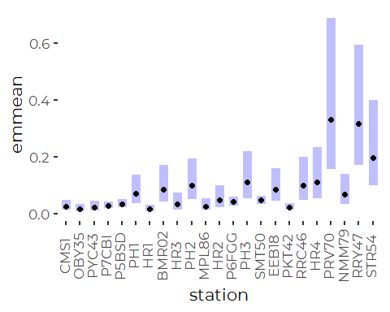

``` r
din_emms_gam <- as_tibble(din_emms_gam)
```

### Compare to Observed Mean

``` r
compare <- recent_results %>%
  select(station, station_name, contains('tn'), contains('din_N')) %>%
  full_join(din_emms_gam, by = 'station', suffix = c('.data', '.lm'), copy = TRUE)

ggplot(compare, aes(din_N_mn, response)) +
  geom_abline(slope = 1, intercept = 0) + 
  geom_point(size = 3, color = 'blue') +
  geom_linerange(aes(xmin = din_N_mn - 2 * din_N_sd/sqrt(din_N_n), 
                     xmax = din_N_mn + 2 * din_N_sd/sqrt(din_N_n))) +
  geom_linerange(aes(ymin = lower.CL, ymax = upper.CL)) +
  xlab('Observed ') +
  ylab('Log Linear Model') +
  coord_equal() +
  scale_x_log10() +
  scale_y_log10()
#> Warning in self$trans$transform(x): NaNs produced
#> Warning: Transformation introduced infinite values in continuous x-axis
#> Warning: Removed 2 rows containing missing values (geom_segment).
```

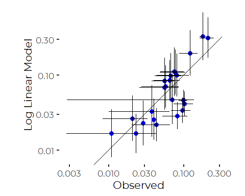

This does better than the linear model, but only slightly.

## Sample Sizes are Wildly Unequal

Sample sizes are wildly unequal….

``` r
xtabs(~ year + month, data = recent_data , subset = ! is.na(din))
#>       month
#> year   Jan Feb Mar Apr May Jun Jul Aug Sep Oct Nov Dec
#>   2015   5   0   5   1   2  13   7   6   6   3   4   0
#>   2016   5   4   2   4   4   9   9   8   8  14  14   6
#>   2017   0   0   1   0   0   0   3  10   5   6   0   0
#>   2019   0   0   0   0  21  21  39  23  45  18   0   0
```

So, seasonal trends outside of summer rest on just a handful of
observations in each of 2015 and 2016.

``` r
xtabs(~ station + year, data = recent_data , subset = ! is.na(din))
#>        year
#> station 2015 2016 2017 2019
#>   CMS1     0    0    2    8
#>   OBY35    0    0    0    7
#>   PYC43    0    0    1    7
#>   P7CBI    8   11    0    7
#>   P5BSD    7   16    1    8
#>   PH1      0    0    1    8
#>   HR1      0    0    3    8
#>   BMR02    0    0    0    8
#>   HR3      0    0    3    3
#>   PH2      0    0    1    8
#>   MPL86    0    0    0    8
#>   HR2      0    0    4    3
#>   P6FGG    8   14    1    8
#>   PH3      0    0    1    7
#>   SMT50   25   45    0    8
#>   EEB18    0    0    2    8
#>   PKT42    4    1    2    8
#>   RRC46    0    0    0    8
#>   HR4      0    0    0    7
#>   PRV70    0    0    0    7
#>   NMM79    0    0    1    7
#>   RRY47    0    0    2    8
#>   STR54    0    0    0    8
```

And those observations come from just a handful of sites.

The problem here is the uneven sampling history. We are trying to
overinterpret available data, leading to statistically unstable
estimates.

# Restricted DIN Data (Year = 2019)

Our primary goal is to provide a map and accompanying chart of DIN
levels. For that, we want to compare all sites on an even footing. We
now know that there are important annual and seasonal processes at work,
so the uneven sampling history affects estimates of site conditions.

Data coverage in 2019 is fairly consistent. Coverage is sparse, but
consistent across stations (but not months) in 2017 as well.

We restrict further attention to just 2019, as that data will not be
affected by the uneven sampling history to the same extent. Later we
will look at just the warmer months of the year, when seasonal variation
is smaller.

``` r
xtabs(~ station + month, data = recent_data, subset = recent_data$year == 2019)
#>        month
#> station Jan Feb Mar Apr May Jun Jul Aug Sep Oct Nov Dec
#>   CMS1    0   0   0   0   2   1   2   1   2   1   0   0
#>   OBY35   0   0   0   0   1   1   2   1   2   0   0   0
#>   PYC43   0   0   0   0   1   1   2   1   2   0   0   0
#>   P7CBI   0   0   0   0   2   1   2   1   2   1   0   0
#>   P5BSD   0   0   0   0   2   1   2   1   2   1   0   0
#>   PH1     0   0   0   0   2   1   2   1   2   1   0   0
#>   HR1     0   0   0   0   2   1   2   1   2   1   0   0
#>   BMR02   0   0   0   0   1   1   2   1   2   1   0   0
#>   HR3     0   0   0   0   0   0   0   1   2   0   0   0
#>   PH2     0   0   0   0   2   1   2   1   2   1   0   0
#>   MPL86   0   0   0   0   2   1   2   1   2   1   0   0
#>   HR2     0   0   0   0   0   0   0   1   2   0   0   0
#>   P6FGG   0   0   0   0   2   1   2   1   2   1   0   0
#>   PH3     0   0   0   0   2   1   2   1   2   1   0   0
#>   SMT50   0   0   0   0   2   1   2   1   2   1   0   0
#>   EEB18   0   0   0   0   2   1   2   1   2   1   0   0
#>   PKT42   0   0   0   0   2   1   2   1   2   1   0   0
#>   RRC46   0   0   0   0   2   1   2   1   2   1   0   0
#>   HR4     0   0   0   0   2   1   2   1   2   1   0   0
#>   PRV70   0   0   0   0   2   1   2   1   2   0   0   0
#>   NMM79   0   0   0   0   2   1   2   1   2   1   0   0
#>   RRY47   0   0   0   0   2   1   2   1   2   1   0   0
#>   STR54   0   0   0   0   2   1   2   1   2   1   0   0
```

So sampling is not completely equal and we do have two sites in the
Haraseeket with poor data coverage, and a few other sites missing
October data. In other analyses, we noted that October often has higher
DIN values than other months, so we drop it from the analysis, since the
eneven samples may affect results.

``` r
yr_2019_data <- recent_data %>%
  filter(year == 2019)  %>%
  filter(month !='Oct') %>%
  filter(! is.na(din)) %>%
  select(station, station_name, dt, month, doy, din_N)
```

``` r
ggplot(yr_2019_data, aes(din_N)) +
  geom_histogram() +
  scale_x_continuous(trans = 'log')
#> `stat_bin()` using `bins = 30`. Pick better value with `binwidth`.
```

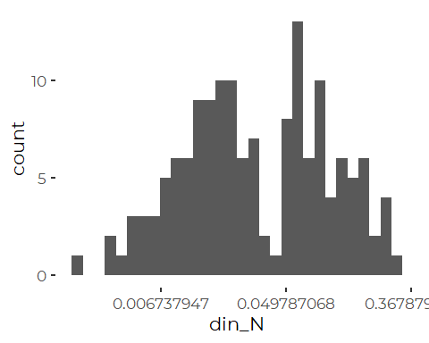

``` r
ggplot(yr_2019_data, aes(din_N, station_name)) +
  geom_point(aes(color = month)) +
  scale_x_log10()
```

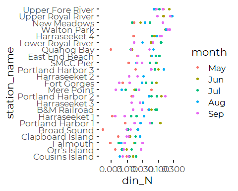

### Calculate Descriptive Statistics

``` r
results_2019 <- yr_2019_data %>%
  group_by(station) %>%
  summarize(across(din_N, c(mn = ~ mean(.x, na.rm = TRUE),
                                  sd = ~ sd(.x, na.rm = TRUE), 
                                  n = ~sum(! is.na(.x)),
                                  md = ~ median(.x, na.rm = TRUE),
                                  iqr = ~ IQR(.x, na.rm = TRUE),
                                  p90 = ~ quantile(.x, .9, na.rm = TRUE),
                                  gm = ~ exp(mean(log(.x), na.rm = TRUE))))) %>%
  mutate(station_name = names_df$Alt_Name[match(station,
                                                names_df$Station_ID)]) %>%
  mutate(station = fct_reorder(factor(station), din_N_md),
         station_name = fct_reorder(factor(station_name), din_N_md)) %>%
  relocate(station_name, .after = station)
```

### Linear Model

``` r
din_lm_2019_draft <- lm(log(din_N) ~ station *  month , data = yr_2019_data)
anova(din_lm_2019_draft)
#> Analysis of Variance Table
#> 
#> Response: log(din_N)
#>               Df  Sum Sq Mean Sq F value    Pr(>F)    
#> station       22 125.312  5.6960  15.608 2.468e-13 ***
#> month          4  18.602  4.6506  12.744 8.898e-07 ***
#> station:month 82  37.317  0.4551   1.247    0.2225    
#> Residuals     40  14.597  0.3649                      
#> ---
#> Signif. codes:  0 '***' 0.001 '**' 0.01 '*' 0.05 '.' 0.1 ' ' 1
```

``` r
din_lm_2019 <- lm(log(din_N) ~ station + month , data = yr_2019_data)
anova(din_lm_2019)
#> Analysis of Variance Table
#> 
#> Response: log(din_N)
#>            Df  Sum Sq Mean Sq F value    Pr(>F)    
#> station    22 125.312  5.6960  13.386 < 2.2e-16 ***
#> month       4  18.602  4.6506  10.929 1.316e-07 ***
#> Residuals 122  51.914  0.4255                      
#> ---
#> Signif. codes:  0 '***' 0.001 '**' 0.01 '*' 0.05 '.' 0.1 ' ' 1
```

``` r
plot(din_emms_lm) + coord_flip() + 
  theme(axis.text.x = element_text(angle = 90, vjust = 0.25)) +
  geom_point(data = recent_results, aes(y = as.numeric(station), x = din_N_md),
             color = 'red')
```

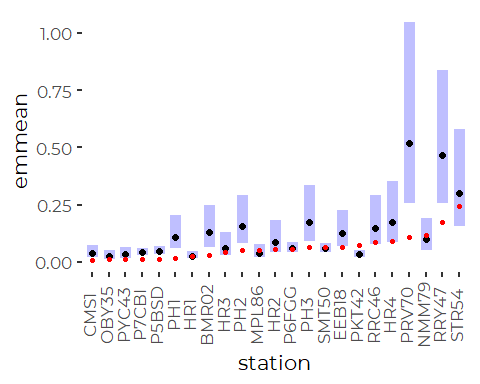

#### Marginal Means

``` r
din_emms_lm_2019 <- emmeans(din_lm_2019, 'station', type = 'response')
plot(din_emms_lm_2019) + coord_flip()+ 
  theme(axis.text.x = element_text(angle = 90, vjust = 0.25)) +
  geom_point(data = results_2019, aes(y = station, x = din_N_md),
             color = 'red')
```

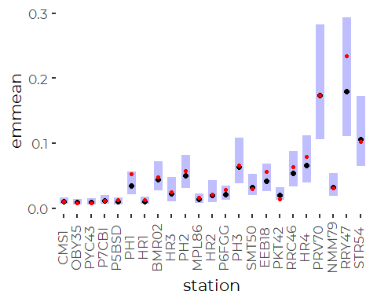

``` r
din_emms_lm_2019_months <- emmeans(din_lm_2019, 'month', type = 'response')
plot(din_emms_lm_2019_months) + coord_flip()+ 
  theme(axis.text.x = element_text(angle = 90, vjust = 0.25))
```

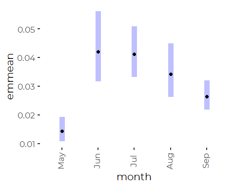

### Simplified Linear Model

``` r
din_lm_2019_red <- lm(log(din_N) ~ station  , data = yr_2019_data)
anova(din_lm_2019_red)
#> Analysis of Variance Table
#> 
#> Response: log(din_N)
#>            Df  Sum Sq Mean Sq F value    Pr(>F)    
#> station    22 125.312  5.6960  10.178 < 2.2e-16 ***
#> Residuals 126  70.516  0.5597                      
#> ---
#> Signif. codes:  0 '***' 0.001 '**' 0.01 '*' 0.05 '.' 0.1 ' ' 1
```

#### Marginal Means

``` r
din_emms_lm_2019_red <- emmeans(din_lm_2019_red, 'station', type = 'response')
plot(din_emms_lm_2019_red) + coord_flip() +
  theme(axis.text.x = element_text(angle = 90, vjust = 0.25))  +
  geom_point(data = results_2019, aes(y = station, x = din_N_md),
             color = 'red')
```


Qualitatively indistinguishable results….

### Robust Linear Model

The `rlm()` function from `MASS` implements robust model fitting using M
estimators. These are estimators that do not use least squares as a
criterion for model fit. Instead, they use other symmetric functions to
quantify the relative importance of the deviation of each observation
from model predictions. To achieve “robust” qualities, these functions
drop off in value at higher deviations from model predictions, making
extreme points count less, or not at all, when fitting the model.

Robust linear models, as implemented via `rlm()` from the `MASS` package
do not accept models not of full rank, which is proven a bit of a
problem for these uneven data sets. We can not fit a station + month
model.

``` r
din_rlm_2019_FAILS <- rlm(log(din_N) ~ station + month, 
                     na.action = na.omit,
                     data = yr_2019_data)
#> Error in rlm.default(x, y, weights, method = method, wt.method = wt.method, : 'x' is singular: singular fits are not implemented in 'rlm'
```

``` r
din_rlm_2019 <- rlm(log(din_N) ~ station, 
                     na.action = na.omit,
                     data = yr_2019_data)
```

#### Marginal Means

``` r
din_emms_lm_2019 <- as_tibble(emmeans(din_lm_2019, 
                                      'station', type = 'response'))
din_emms_rlm_2019 <- as_tibble(emmeans(din_rlm_2019, 
                                      'station', type = 'response'))
```

## GAM model

We can use a GAM model to look at seasonal patterns within this one
year, but this also may be overfitting available data. We don’t fit a
cyclic smoother because our data covers only a small portion of the
year.

``` r
din_gam_2019 <- gam(log(din_N) ~ station +  s(doy, bs = 'cs', k = 6), 
               data = yr_2019_data)
anova(din_gam_2019)
#> 
#> Family: gaussian 
#> Link function: identity 
#> 
#> Formula:
#> log(din_N) ~ station + s(doy, bs = "cs", k = 6)
#> 
#> Parametric Terms:
#>         df    F p-value
#> station 22 13.1  <2e-16
#> 
#> Approximate significance of smooth terms:
#>          edf Ref.df     F  p-value
#> s(doy) 3.992  5.000 7.549 7.07e-07
```

``` r
plot(din_gam_2019)
```

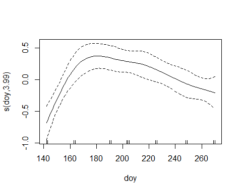
The day of year smoother may be slightly over fit here.

``` r
oldpar <- par(mfrow = c(2,2))
gam.check(din_gam)
```

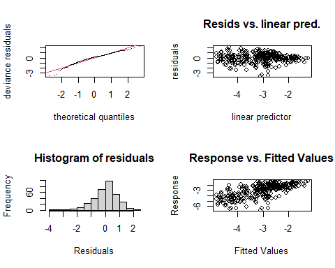

    #> 
    #> Method: GCV   Optimizer: magic
    #> Smoothing parameter selection converged after 12 iterations.
    #> The RMS GCV score gradient at convergence was 6.894554e-07 .
    #> The Hessian was positive definite.
    #> Model rank =  30 / 30 
    #> 
    #> Basis dimension (k) checking results. Low p-value (k-index<1) may
    #> indicate that k is too low, especially if edf is close to k'.
    #> 
    #>            k'  edf k-index p-value  
    #> s(doy)   3.00 2.79    0.91   0.035 *
    #> s(yearf) 4.00 2.78      NA      NA  
    #> ---
    #> Signif. codes:  0 '***' 0.001 '**' 0.01 '*' 0.05 '.' 0.1 ' ' 1
    par(oldpar)

Those diagnostics are not too bad, with the exception of a few large
negative residuals again.

#### GAM Marginal Means

``` r
din_emms_gam_2019 <- emmeans(din_gam_2019, 'station', type = 'response')
plot(din_emms_gam_2019) + coord_flip() + 
  theme(axis.text.x = element_text(angle = 90, vjust = 0.25)) +
  geom_point(data = results_2019, aes(y = station, x = din_N_md),
             color = 'red')
```

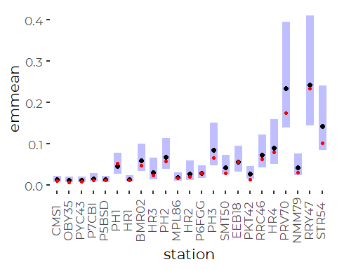

``` r
din_emms_gam_2019 <- as_tibble(din_emms_gam_2019) 
```

Again, qualitatively similar results, but this model appears to slightly
overestimate observed means fairly consistently.

### Compare Model Results – Does Model Selection Matter?

#### Compare Models to Observed Means

##### Log Linear Model

``` r
compare <- results_2019 %>%
  select(station, station_name, contains('tn'), contains('din_N')) %>%
  full_join(din_emms_lm_2019, by = 'station', suffix = c('.data', '.lm'), 
            copy = TRUE)

ggplot(compare, aes(din_N_mn, response)) +
  geom_abline(slope = 1, intercept = 0) + 
  geom_point(size = 3, color = 'blue') +
  geom_linerange(aes(xmin = din_N_mn - 2 * din_N_sd/sqrt(din_N_n), 
                     xmax = din_N_mn + 2 * din_N_sd/sqrt(din_N_n))) +
  geom_linerange(aes(ymin = lower.CL, ymax = upper.CL)) +
  xlab('Observed ') +
  ylab('Linear Model') +
  coord_equal() +
  scale_x_log10()+
  scale_y_log10()
```

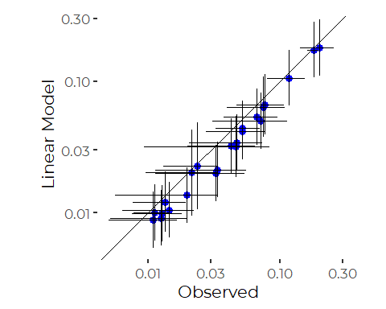
The log linear model generally fits means slightly lower than observed.

##### Robust Log Linear Model

``` r
compare <- results_2019 %>%
  select(station, station_name, contains('tn'), contains('din_N')) %>%
  full_join(din_emms_rlm_2019, by = 'station', suffix = c('.data', '.lm'), 
            copy = TRUE)

ggplot(compare, aes(din_N_mn, response)) +
  geom_abline(slope = 1, intercept = 0) + 
  geom_point(size = 3, color = 'blue') +
  geom_linerange(aes(xmin = din_N_mn - 2 * din_N_sd/sqrt(din_N_n), 
                     xmax = din_N_mn + 2 * din_N_sd/sqrt(din_N_n))) +
  geom_linerange(aes(ymin = asymp.LCL, ymax = asymp.UCL)) +
  xlab('Observed ') +
  ylab('Robust Linear Model') +
  coord_equal() +
  scale_x_log10()+
  scale_y_log10()
```

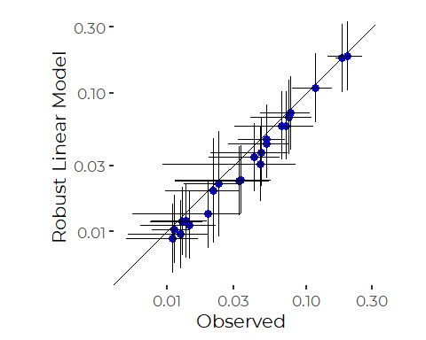
Results of the robust model are very similar.

##### GAM Model

``` r
compare <- results_2019 %>%
  select(station, station_name, contains('tn'), contains('din_N')) %>%
  full_join(din_emms_gam_2019, by = 'station', suffix = c('.data', '.lm'), 
            copy = TRUE)

ggplot(compare, aes(din_N_mn, response)) +
  geom_abline(slope = 1, intercept = 0) + 
  geom_point(size = 3, color = 'blue') +
  geom_linerange(aes(xmin = din_N_mn - 2 * din_N_sd/sqrt(din_N_n), 
                     xmax = din_N_mn + 2 * din_N_sd/sqrt(din_N_n))) +
  geom_linerange(aes(ymin = lower.CL, ymax = upper.CL)) +
  xlab('Observed ') +
  ylab('GAM Model') +
  coord_equal() +
  scale_x_log10()+
  scale_y_log10()
```

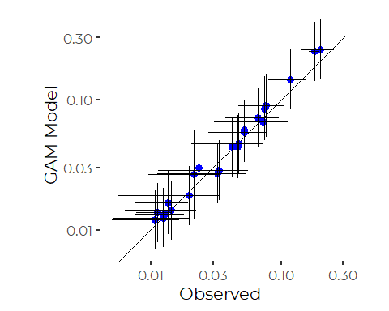

The GAM model provides adjusted estimates that generally lie close to
the observed means. Values are slightly higher than the observed means,
reflecting different time of year adjustments from the linear model.
These estimates are effectively adjusted for different sampling
histories. Note that error bars are higher than for the observed means.

#### Compare Log Linear and Robust Log Linear Models

We can show that more clearly by plotting the predictions of the two
models against one another.

``` r
compare <- as_tibble(din_emms_lm_2019) %>%
  full_join(din_emms_rlm_2019, by = 'station', suffix = c('.lm', '.rlm'))
ggplot(compare, aes(response.lm, response.rlm)) +
  geom_abline(slope = 1, intercept = 0) + 
  geom_point(size = 3, color = 'blue') +
  geom_linerange(aes(xmin = lower.CL, xmax = upper.CL)) +
  geom_linerange(aes(ymin = asymp.LCL, ymax = asymp.UCL)) +
  xlab('Linear Model') +
  ylab('Robust Linear Model') +
  coord_equal() +
  scale_x_log10()+
  scale_y_log10()
```


So, results are qualitatively similar. There is no strong reason to
prefer the robust estimates to the linear model estimates where
qualitative results are similar and model diagnostics are fairly good.

# Restricted Data – Core Months

Another way to focus our analysis is to focus only on the “warmer”
months, which sampled more consistently. While most sites were sampled
in October, a few were not, so we focus on May through September.

``` r
core_months_data <- recent_data %>%
  filter(month %in% month.abb[5:9])  %>%
  filter(! is.na(din)) %>%
  select(station, station_name, dt, year, yearf, month, doy, din_N)
```

``` r
xtabs(~ station + month, data = core_months_data)
#>        month
#> station Jan Feb Mar Apr May Jun Jul Aug Sep Oct Nov Dec
#>   CMS1    0   0   0   0   1   1   2   1   2   0   0   0
#>   OBY35   0   0   0   0   1   1   2   1   2   0   0   0
#>   PYC43   0   0   0   0   1   1   2   1   2   0   0   0
#>   P7CBI   0   0   0   0   3   3   2   3   3   0   0   0
#>   P5BSD   0   0   0   0   2   3   3   4   5   0   0   0
#>   PH1     0   0   0   0   1   1   2   2   2   0   0   0
#>   HR1     0   0   0   0   1   1   2   2   4   0   0   0
#>   BMR02   0   0   0   0   1   1   2   1   2   0   0   0
#>   HR3     0   0   0   0   0   0   0   3   3   0   0   0
#>   PH2     0   0   0   0   1   1   2   2   2   0   0   0
#>   MPL86   0   0   0   0   1   1   2   1   2   0   0   0
#>   HR2     0   0   0   0   0   0   0   3   4   0   0   0
#>   P6FGG   0   0   0   0   2   3   4   4   5   0   0   0
#>   PH3     0   0   0   0   1   1   1   2   2   0   0   0
#>   SMT50   0   0   0   0   3  17  14   8   8   0   0   0
#>   EEB18   0   0   0   0   1   1   3   1   2   0   0   0
#>   PKT42   0   0   0   0   1   1   3   2   3   0   0   0
#>   RRC46   0   0   0   0   1   1   2   1   2   0   0   0
#>   HR4     0   0   0   0   1   1   1   1   2   0   0   0
#>   PRV70   0   0   0   0   1   1   2   1   2   0   0   0
#>   NMM79   0   0   0   0   1   1   2   1   1   0   0   0
#>   RRY47   0   0   0   0   1   1   3   1   2   0   0   0
#>   STR54   0   0   0   0   1   1   2   1   2   0   0   0
```

We see a few little sampled sites, especially in the Haraseeket, but
otherwise, representation is fairly uniform.

``` r
ggplot(core_months_data, aes(din_N)) +
  geom_histogram() +
  scale_x_continuous(trans = 'log10')
#> `stat_bin()` using `bins = 30`. Pick better value with `binwidth`.
```

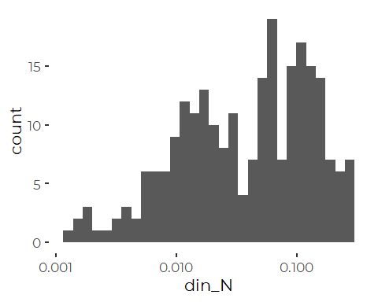

``` r
ggplot(core_months_data, aes(din_N, station_name)) +
  geom_point(aes(color = yearf), alpha = 0.25) +
  scale_x_log10()
```

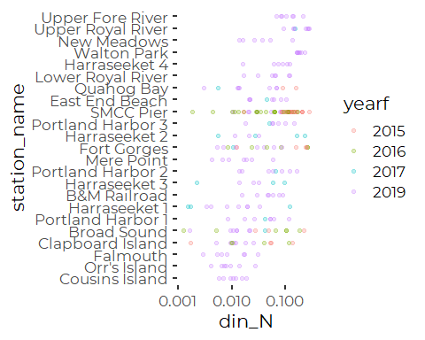

We have data only from 2019 from many sites, so this analysis has many
“empty cells” too, if we model year to year variation.

### Calculate Descriptive Statistics

``` r
results_core_months <- core_months_data %>%
  group_by(station) %>%
  summarize(across(din_N, c(mn = ~ mean(.x, na.rm = TRUE),
                                  sd = ~ sd(.x, na.rm = TRUE), 
                                  n = ~sum(! is.na(.x)),
                                  md = ~ median(.x, na.rm = TRUE),
                                  iqr = ~ IQR(.x, na.rm = TRUE),
                                  p90 = ~ quantile(.x, .9, na.rm = TRUE),
                                  gm = ~ exp(mean(log(.x), na.rm = TRUE))))) %>%
  mutate(station_name = names_df$Alt_Name[match(station,
                                                names_df$Station_ID)]) %>%
  mutate(station = fct_reorder(factor(station), din_N_md),
         station_name = fct_reorder(factor(station_name), din_N_md)) %>%
  relocate(station_name, .after = station)
```

### Linear Model

``` r
din_lm_core_months_draft <- lm(log(din_N) ~ station *  month + year, 
                               data = core_months_data)
anova(din_lm_core_months_draft)
#> Analysis of Variance Table
#> 
#> Response: log(din_N)
#>                Df  Sum Sq Mean Sq F value    Pr(>F)    
#> station        22 140.759  6.3981  5.8220 4.130e-11 ***
#> month           4  18.691  4.6729  4.2521  0.002889 ** 
#> year            1  22.121 22.1206 20.1287 1.584e-05 ***
#> station:month  82  53.603  0.6537  0.5948  0.994098    
#> Residuals     129 141.766  1.0990                      
#> ---
#> Signif. codes:  0 '***' 0.001 '**' 0.01 '*' 0.05 '.' 0.1 ' ' 1
```

``` r
din_lm_core_months <- lm(log(din_N) ~ station + month + year , data = core_months_data)
anova(din_lm_core_months)
#> Analysis of Variance Table
#> 
#> Response: log(din_N)
#>            Df  Sum Sq Mean Sq F value    Pr(>F)    
#> station    22 140.759  6.3981  6.9100 2.043e-15 ***
#> month       4  18.691  4.6729  5.0467  0.000665 ***
#> year        1  22.121 22.1206 23.8904 2.017e-06 ***
#> Residuals 211 195.369  0.9259                      
#> ---
#> Signif. codes:  0 '***' 0.001 '**' 0.01 '*' 0.05 '.' 0.1 ' ' 1
```

``` r
oldpar <- par(mfrow = c(2,2))
plot(din_lm_core_months)
```

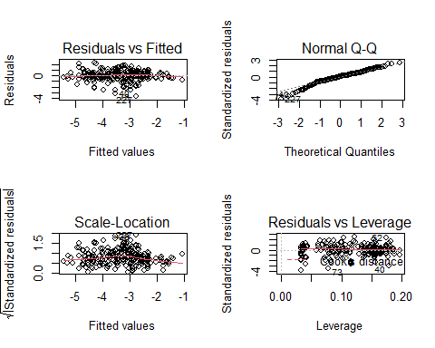

``` r
par(oldpar)
```

The log transform is slightly too strong for these data, but most
alternatives are no better. This model is adequate for our purposes.

#### Marginal Means

``` r
din_emms_lm_core_months <- emmeans(din_lm_core_months, 'station', type = 'response')
plot(din_emms_lm_core_months) + coord_flip()+ 
  theme(axis.text.x = element_text(angle = 90, vjust = 0.25))  +
  geom_point(data = results_core_months, aes(y = as.numeric(station), x = din_N_md),
             color = 'red')
```

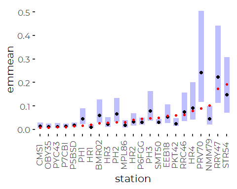

``` r
din_emms_lm_core_months_months <- emmeans(din_lm_core_months, 'month', 
                                          type = 'response')
plot(din_emms_lm_core_months_months) + coord_flip()+ 
  theme(axis.text.x = element_text(angle = 90, vjust = 0.25))
```

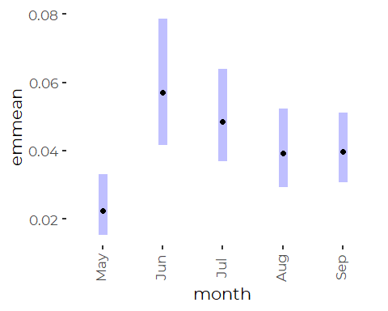

### Simplified Linear Model

``` r
din_lm_core_months_red <- lm(log(din_N) ~ station, data = core_months_data)
anova(din_lm_core_months_red)
#> Analysis of Variance Table
#> 
#> Response: log(din_N)
#>            Df Sum Sq Mean Sq F value    Pr(>F)    
#> station    22 140.76  6.3981  5.8514 7.162e-13 ***
#> Residuals 216 236.18  1.0934                      
#> ---
#> Signif. codes:  0 '***' 0.001 '**' 0.01 '*' 0.05 '.' 0.1 ' ' 1
```

#### Marginal Means

``` r
din_emms_lm_core_months_red <- emmeans(din_lm_core_months_red, 'station', type = 'response')
plot(din_emms_lm_core_months_red) + coord_flip() +
  theme(axis.text.x = element_text(angle = 90, vjust = 0.25))  +
  geom_point(data = results_core_months, aes(y = as.numeric(station), x = din_N_md),
             color = 'red') +
  geom_point(data = results_core_months, aes(y = as.numeric(station), x = din_N_gm),
             color = 'blue')
```


Many of the differences from observed means are retained by even the
simplest linear model. Results are not appreciably closer to the
geometric means.

With no covariates, why is this model not just fitting each station
perfectly? Since there is a parameter for each station, means (or here,
geometric means) should match…

### Robust Linear Model

Robust linear models, as implemented via `rlm()` from the `MASS` package
do not accept models not of full rank, which is proven a bit of a
problem for these uneven data sets. We can not fit a station + month
model.

``` r
din_rlm_core_months_FAILS <- rlm(log(din_N) ~ station + month, 
                     na.action = na.omit,
                     data = core_months_data)
#> Error in rlm.default(x, y, weights, method = method, wt.method = wt.method, : 'x' is singular: singular fits are not implemented in 'rlm'
```

``` r
din_rlm_core_months <- rlm(log(din_N) ~ station, 
                     na.action = na.omit,
                     data = core_months_data)
```

#### Marginal Means

``` r
din_emms_lm_core_months <- as_tibble(emmeans(din_lm_core_months, 
                                      'station', type = 'response'))
din_emms_rlm_core_months <- as_tibble(emmeans(din_rlm_core_months, 
                                      'station', type = 'response'))
```

## GAM model

We can use a GAM model to look at seasonal patterns within this one
year, but this also may be overfitting available data. We don’t fit a
cyclic smoother because our data covers only a small portion of the
year.

``` r
din_gam_core_months <- gam(log(din_N) ~ station +  s(doy, bs = 'cs', k = 6), 
               data = core_months_data)
anova(din_gam_core_months)
#> 
#> Family: gaussian 
#> Link function: identity 
#> 
#> Formula:
#> log(din_N) ~ station + s(doy, bs = "cs", k = 6)
#> 
#> Parametric Terms:
#>         df     F  p-value
#> station 22 5.756 1.41e-12
#> 
#> Approximate significance of smooth terms:
#>          edf Ref.df     F p-value
#> s(doy) 3.636  5.000 1.932  0.0306
```

``` r
plot(din_gam_core_months)
```

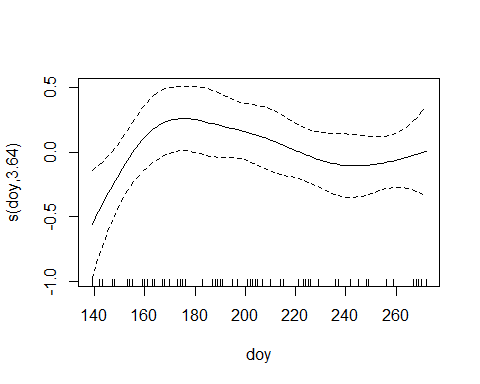

``` r
oldpar <- par(mfrow = c(2,2))
gam.check(din_gam)
```


    #> 
    #> Method: GCV   Optimizer: magic
    #> Smoothing parameter selection converged after 12 iterations.
    #> The RMS GCV score gradient at convergence was 6.894554e-07 .
    #> The Hessian was positive definite.
    #> Model rank =  30 / 30 
    #> 
    #> Basis dimension (k) checking results. Low p-value (k-index<1) may
    #> indicate that k is too low, especially if edf is close to k'.
    #> 
    #>            k'  edf k-index p-value  
    #> s(doy)   3.00 2.79    0.91   0.025 *
    #> s(yearf) 4.00 2.78      NA      NA  
    #> ---
    #> Signif. codes:  0 '***' 0.001 '**' 0.01 '*' 0.05 '.' 0.1 ' ' 1
    par(oldpar)

Those diagnostics are not too bad, although the log transform is a bit
strong.

#### GAM Marginal Means

``` r
din_emms_gam_core_months <- emmeans(din_gam_core_months, 'station', type = 'response')
plot(din_emms_gam_core_months) + coord_flip() + 
  theme(axis.text.x = element_text(angle = 90, vjust = 0.25))
```

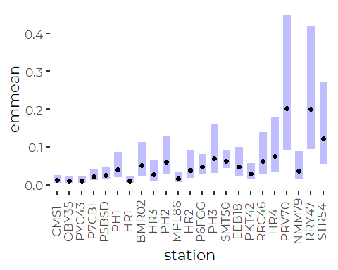

``` r
din_emms_gam_core_months <- as_tibble(din_emms_gam_core_months)
```

### Compare Model Results – Does Model Selection Matter?

#### Compare Models to Observed Means

##### Log Linear Model

``` r
compare <- results_core_months %>%
  select(station, station_name, contains('tn'), contains('din_N')) %>%
  full_join(din_emms_lm_core_months, by = 'station', suffix = c('.data', '.lm'), 
            copy = TRUE)

ggplot(compare, aes(din_N_mn, response)) +
  geom_abline(slope = 1, intercept = 0) + 
  geom_point(size = 3, color = 'blue') +
  geom_linerange(aes(xmin = din_N_mn - 2 * din_N_sd/sqrt(din_N_n), 
                     xmax = din_N_mn + 2 * din_N_sd/sqrt(din_N_n))) +
  geom_linerange(aes(ymin = lower.CL, ymax = upper.CL)) +
  xlab('Observed ') +
  ylab('Robust Linear Model') +
  coord_equal() +
  scale_x_log10()+
  scale_y_log10()
#> Warning in self$trans$transform(x): NaNs produced
#> Warning: Transformation introduced infinite values in continuous x-axis
#> Warning: Removed 1 rows containing missing values (geom_segment).
```

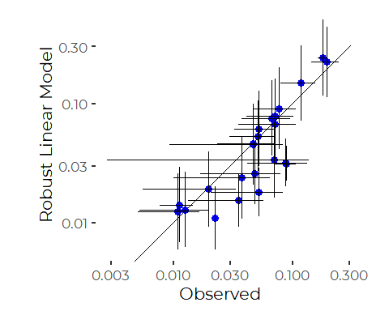
The log linear model generally fits means slightly lower than observed.
This is what is expected as we are effectively fitting geometric means
instead of arithmetic means.

##### Robust Log Linear Model

``` r
compare <- results_core_months %>%
  select(station, station_name, contains('tn'), contains('din_N')) %>%
  full_join(din_emms_rlm_core_months, by = 'station', suffix = c('.data', '.lm'), 
            copy = TRUE)

ggplot(compare, aes(din_N_mn, response)) +
  geom_abline(slope = 1, intercept = 0) + 
  geom_point(size = 3, color = 'blue') +
  geom_linerange(aes(xmin = din_N_mn - 2 * din_N_sd/sqrt(din_N_n), 
                     xmax = din_N_mn + 2 * din_N_sd/sqrt(din_N_n))) +
  geom_linerange(aes(ymin = asymp.LCL, ymax = asymp.UCL)) +
  xlab('Observed ') +
  ylab('Robust Linear Model') +
  coord_equal() +
  scale_x_log10()+
  scale_y_log10()
#> Warning in self$trans$transform(x): NaNs produced
#> Warning: Transformation introduced infinite values in continuous x-axis
#> Warning: Removed 1 rows containing missing values (geom_segment).
```

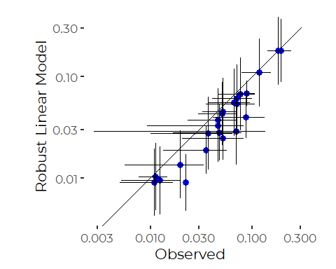
Results of the robust model are very similar.

##### GAM Model

``` r
compare <- results_core_months %>%
  select(station, station_name, contains('tn'), contains('din_N')) %>%
  full_join(din_emms_gam_core_months, by = 'station', suffix = c('.data', '.lm'), 
            copy = TRUE)

ggplot(compare, aes(din_N_mn, response)) +
  geom_abline(slope = 1, intercept = 0) + 
  geom_point(size = 3, color = 'blue') +
  geom_linerange(aes(xmin = din_N_mn - 2 * din_N_sd/sqrt(din_N_n), 
                     xmax = din_N_mn + 2 * din_N_sd/sqrt(din_N_n))) +
  geom_linerange(aes(ymin = lower.CL, ymax = upper.CL)) +
  xlab('Observed ') +
  ylab('GAM Model') +
  coord_equal() +
  scale_x_log10()+
  scale_y_log10()
#> Warning in self$trans$transform(x): NaNs produced
#> Warning: Transformation introduced infinite values in continuous x-axis
#> Warning: Removed 1 rows containing missing values (geom_segment).
```

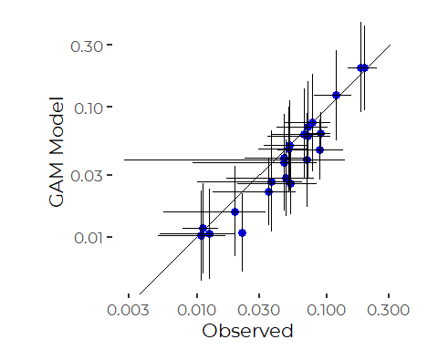

The GAM model provides adjusted estimates that generally lie close to
the observed means. These estimates are effectively adjusted for
different sampling histories. Note that error bars are higher than for
the straight means.

#### Compare Log Linear and Robust Log Linear Models

We can show that more clearly by plotting the predictions of the two
models against one another.

``` r
compare <- as_tibble(din_emms_lm_core_months) %>%
  full_join(din_emms_rlm_core_months, by = 'station', suffix = c('.lm', '.rlm'))
ggplot(compare, aes(response.lm, response.rlm)) +
  geom_abline(slope = 1, intercept = 0) + 
  geom_point(size = 3, color = 'blue') +
  geom_linerange(aes(xmin = lower.CL, xmax = upper.CL)) +
  geom_linerange(aes(ymin = asymp.LCL, ymax = asymp.UCL)) +
  xlab('Linear Model') +
  ylab('Robust Linear Model') +
  coord_equal() +
  scale_x_log10()+
  scale_y_log10()
```

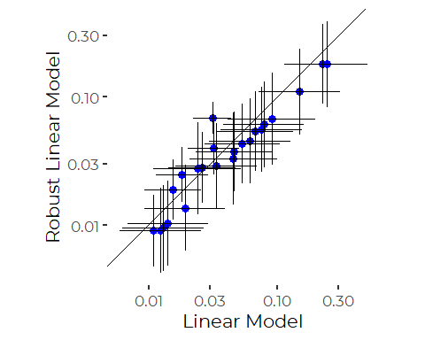

# DIN Recent Condition Conclusions

Restricting attention to 2019 makes sense. An alternative restriction to
selected months left many stations with only data from 2019 anyway.

There appears to be little advantage to robust models. Even so, there
are several approaches possible:  
1. Just use observed means / medians.  
2. Use fitted means from the simplest linear models. This effectively
fits geometric means, not arithmetic means, and pools error estimates.  
3. Use Marginal Means from the GAM model – these are effectively
adjusted for different sampling histories, especially time of year.

# Trend Analysis

Few stations have data from more than a few years. DIN data has been
collected over the past couple of years, at several stations in the mid
200s, and at a handful of stations pretty much every year since 2001.
Generally the rule we have used to examine trends is to focus on sites
with relatively complete records, say at least two of the last five
years and at least ten years total.

## Identify Trend Stations

``` r
trend_sites <- strict_data %>%
  group_by(station, year) %>%
  summarize(was_sampled =  ! all(is.na(din_N)),
            .groups = 'drop_last') %>%
  summarize(last_5 = sum(was_sampled & year > 2014),
            total = sum(was_sampled),
            .groups = 'drop') %>%
  filter(total >= 10, last_5 >= 2) %>%
  pull(station)
trend_sites
#> [1] "EEB18" "NMM79" "P5BSD" "P6FGG" "P7CBI" "PKT42" "RRY47" "SMT50"
```

## Generate Trend Data

``` r
trend_data <- strict_data %>%
  filter(station %in% trend_sites) %>%
  filter(! is.na(din_N)) %>%
   mutate(station_name = names_df$Alt_Name[match(station,
                                                names_df$Station_ID)]) %>%
   mutate(station = factor(station),
          station_name = factor(station_name)) %>%
   mutate(station = fct_reorder(station, din_N, na.rm = TRUE),
         station_name = fct_reorder(station_name, din_N, na.rm = TRUE)) %>%
   relocate(station_name, .after = station) %>%
   select(-tn_depth, -tn, -organic_N)
```

## Data Prevalence

``` r
xtabs(~ month + station, data = trend_data )%>%
  as_tibble() %>%
  mutate(month = factor(month, levels = month.abb)) %>%
  filter(n>0) %>%

  ggplot(aes(station, month, fill = sqrt(n))) +
  geom_tile() +
  theme_cbep(base_size = 12) +
  theme(axis.text.x = element_text(angle = 90, hjust = 1, vjust = .25))
```

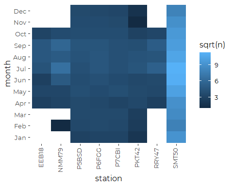
So we have few winter samples from four of these sites, suggesting we
may want to look at a more limited subset of the data to avoid
introducing bias into our models. The core data is from April to
October, with fairly consistent level of effort across sites. We could
focus on sites with more complete records, or focus on months with more
sites.

``` r
xtabs(~ year + station, data = trend_data) %>%
  as_tibble() %>% 
  filter(n>0) %>%

  ggplot(aes(station, year, fill = sqrt(n))) +
  geom_tile() +
  theme_cbep(base_size = 12) +
  theme(axis.text.x = element_text(angle = 90, hjust = 1, vjust = .25))
```

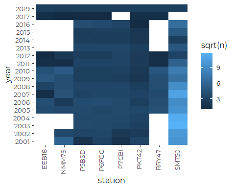
The same station have more complete records by year, suggesting we may
also want to the define five core trend stations where data is more
complete.

``` r
xtabs(~ year + month, data = trend_data) %>%
  as_tibble() %>% 
  mutate(month = factor(month, levels = month.abb))  %>%
  filter(n>0) %>%

  ggplot(aes(month, year, fill = sqrt(n))) +
  geom_tile() +
  theme_cbep(base_size = 12) +
  theme(axis.text.x = element_text(angle = 90, hjust = 1, vjust = .25))
```

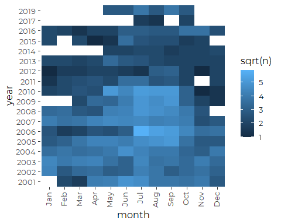

Most winter samples are older, but we have a few winter samples right up
until the last few years. The lack of recent winter data means we need
to be cautious about interpreting long-term trends, because we know from
prior analyses that din\_N values tend to be lower in the summer months.

We are mostly interested in month (or more generally, time of year) as a
covariate. Although seasonal variation is complex, probably differing
year to year and site to site, this is a place where we may be able to
fit a hierarchical model to assist with bridging some data gaps.

# Core Site Trend Data

``` r
core_sites <- strict_data %>%
  group_by(station, year) %>%
  summarize(was_sampled =  ! all(is.na(din_N)),
            .groups = 'drop_last') %>%
  summarize( total = sum(was_sampled),
            .groups = 'drop') %>%
  filter(total >= 15) %>%
  pull(station)
core_sites
#> [1] "P5BSD" "P6FGG" "P7CBI" "PKT42" "SMT50"
```

``` r
core_sites_data <- trend_data %>%
  filter(station %in% core_sites)
```

## Jitter Plot By Year

``` r
ggplot(core_sites_data, aes(year, din_N,)) +
  geom_jitter(aes( color = station_name), alpha = 0.5) + 
  stat_summary(fun = mean, geom = 'line', lwd = 1) +
  #scale_y_continuous(trans = 'log') +
  facet_wrap(~station_name, nrow = 5) +
  scale_color_manual(values = cbep_colors()) +
  theme_cbep(base_size = 12) +
  theme(legend.position = 'None')
```

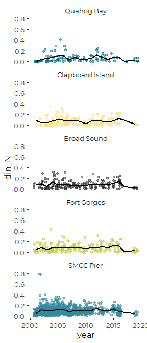

We note a small number of nominal zero values in 2003 and 2004. We note
that neither log-transforms nor transformed data conform well to
assumptions of normality, but the log plus one transform works well.

We note no obvious linear pattern to the annual means, but there is a
possible drop in annual averages in recent years. Unfortunately, that
drop corresponds to years when winter samples are no longer being
collected.

## Real Dates and Times

First, we create a summary dataframe

``` r
core_site_summary  <-   core_sites_data %>%
  select(station_name, year, din_N) %>%
  group_by(station_name, year) %>%
  summarize(ann_mn_din_N = mean(din_N, na.rm = TRUE),
            .groups = 'drop_last') %>%
  filter(! is.na(ann_mn_din_N)) %>%
  mutate(dt = as.Date (paste0('06-15-', year), format = '%m-%d-%Y'))
```

``` r
ggplot(core_sites_data) +
  geom_point(aes(dt, din_N, color = station_name), alpha = 0.5) + 
  geom_line(data = core_site_summary, 
            mapping = aes(x = dt, y = ann_mn_din_N), 
            lwd = 1,
            color = cbep_colors()[3]) +
  #scale_y_continuous(trans = 'log') +
  facet_wrap(~station_name, nrow = 5) +
  scale_color_manual(values = cbep_colors()) +
  theme_cbep(base_size = 12) +
  theme(legend.position = 'None') +
  xlab('') +
  ylab('DIN (mg/l as N)')
```

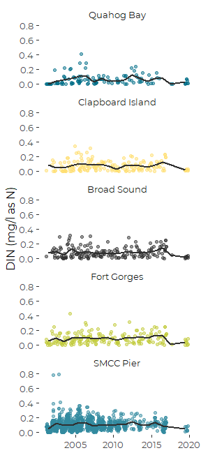

# Core Months Trend Data

``` r
core_months_data <- trend_data %>%
  filter(month %in% month.abb[5:10])
```

## Jitter Plot By Year

``` r
ggplot(core_months_data, aes(year, din_N,)) +
  geom_jitter(aes(color = station_name)) + 
  stat_summary(fun = mean, geom = 'line', lwd = 1) +
  #scale_y_continuous(trans = 'log1p') +
  facet_wrap(~station_name, nrow = 4) +
  scale_color_viridis_d(option = 'viridis') +
  theme_cbep(base_size = 12) +
  theme(legend.position = 'None',
        panel.spacing.x = unit(2.5, "lines"))
```

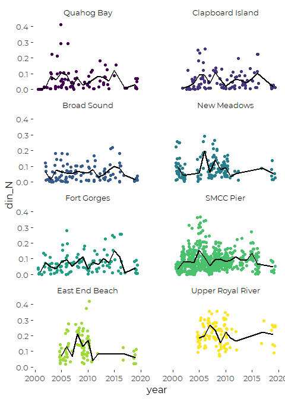

\#\#Actual Dates

``` r
core_months_summary  <-   core_months_data %>%
  select(station_name, year, din_N) %>%
  group_by(station_name, year) %>%
  summarize(ann_mn_din_N = mean(din_N, na.rm = TRUE),
            .groups = 'drop_last') %>%
  filter(! is.na(ann_mn_din_N)) %>%
  mutate(dt = as.Date (paste0('06-15-', year), format = '%m-%d-%Y'))
```

``` r
ggplot(core_months_data) +
  geom_point(aes(dt, din_N, color = station_name), alpha = 0.5) + 
  geom_line(data = core_months_summary, 
            mapping = aes(x = dt, y = ann_mn_din_N), 
            lwd = 1,
            color = cbep_colors()[3]) +
  scale_y_continuous(trans = 'log1p') +
  facet_wrap(~station_name, nrow = 4) +
  scale_color_viridis_d(option = 'viridis') +
  theme_cbep(base_size = 12) +
  theme(legend.position = 'None',
        panel.spacing.x = unit(2.5, "lines")) +
  xlab('') +
  ylab('DIN (mg/l as N)')
```


# Models

## Initial Linear Model

Note that in this setting, there is no reason to believe all stations
show the same trend, so a model that does not fit an interaction term
(station x year) is of limited value. The exception may be use of
hierarchical model that treats sites as random factors.

``` r
trnd_lm_1 <- lm(log1p(din_N) ~ (year + station + month)^2 , 
                data = core_months_data)
anova(trnd_lm_1)
#> Analysis of Variance Table
#> 
#> Response: log1p(din_N)
#>                 Df Sum Sq  Mean Sq F value  Pr(>F)    
#> year             1 0.0194 0.019401  6.2328 0.01266 *  
#> station          7 1.6111 0.230158 73.9399 < 2e-16 ***
#> month            5 0.0300 0.006001  1.9278 0.08690 .  
#> year:station     7 0.0363 0.005190  1.6674 0.11292    
#> year:month       5 0.0234 0.004673  1.5013 0.18641    
#> station:month   35 0.0967 0.002762  0.8873 0.65802    
#> Residuals     1344 4.1836 0.003113                    
#> ---
#> Signif. codes:  0 '***' 0.001 '**' 0.01 '*' 0.05 '.' 0.1 ' ' 1
```

``` r
trnd_lm_2 <- step(trnd_lm_1)
#> Start:  AIC=-8050.36
#> log1p(din_N) ~ (year + station + month)^2
#> 
#>                 Df Sum of Sq    RSS     AIC
#> - station:month 35  0.096668 4.2802 -8088.3
#> - year:month     5  0.018200 4.2018 -8054.3
#> - year:station   7  0.033646 4.2172 -8053.1
#> <none>                       4.1836 -8050.4
#> 
#> Step:  AIC=-8088.27
#> log1p(din_N) ~ year + station + month + year:station + year:month
#> 
#>                Df Sum of Sq    RSS     AIC
#> - year:station  7  0.030604 4.3108 -8092.3
#> - year:month    5  0.023366 4.3036 -8090.6
#> <none>                      4.2802 -8088.3
#> 
#> Step:  AIC=-8092.26
#> log1p(din_N) ~ year + station + month + year:month
#> 
#>              Df Sum of Sq    RSS     AIC
#> - year:month  5   0.02909 4.3399 -8092.8
#> <none>                    4.3108 -8092.3
#> - station     7   1.61655 5.9274 -7658.8
#> 
#> Step:  AIC=-8092.81
#> log1p(din_N) ~ year + station + month
#> 
#>           Df Sum of Sq    RSS     AIC
#> - month    5   0.03000 4.3699 -8093.1
#> <none>                 4.3399 -8092.8
#> - year     1   0.01174 4.3517 -8091.0
#> - station  7   1.61392 5.9538 -7662.6
#> 
#> Step:  AIC=-8093.13
#> log1p(din_N) ~ year + station
#> 
#>           Df Sum of Sq    RSS     AIC
#> <none>                 4.3699 -8093.1
#> - year     1   0.01227 4.3822 -8091.2
#> - station  7   1.61111 5.9810 -7666.2
```

``` r
anova(trnd_lm_2)
#> Analysis of Variance Table
#> 
#> Response: log1p(din_N)
#>             Df Sum Sq  Mean Sq F value  Pr(>F)    
#> year         1 0.0194 0.019401  6.1979 0.01291 *  
#> station      7 1.6111 0.230158 73.5253 < 2e-16 ***
#> Residuals 1396 4.3699 0.003130                    
#> ---
#> Signif. codes:  0 '***' 0.001 '**' 0.01 '*' 0.05 '.' 0.1 ' ' 1
```

``` r
summary(trnd_lm_2)
#> 
#> Call:
#> lm(formula = log1p(din_N) ~ year + station, data = core_months_data)
#> 
#> Residuals:
#>      Min       1Q   Median       3Q      Max 
#> -0.12135 -0.04116 -0.01095  0.02753  0.29721 
#> 
#> Coefficients:
#>                Estimate Std. Error t value Pr(>|t|)    
#> (Intercept)  -1.2683835  0.6665282  -1.903   0.0572 .  
#> year          0.0006572  0.0003319   1.980   0.0479 *  
#> stationP7CBI  0.0019448  0.0082500   0.236   0.8137    
#> stationP5BSD  0.0017903  0.0081295   0.220   0.8257    
#> stationNMM79  0.0308573  0.0074787   4.126 3.91e-05 ***
#> stationP6FGG  0.0168023  0.0080164   2.096   0.0363 *  
#> stationSMT50  0.0292688  0.0063330   4.622 4.16e-06 ***
#> stationEEB18  0.0646336  0.0083260   7.763 1.60e-14 ***
#> stationRRY47  0.1366764  0.0079648  17.160  < 2e-16 ***
#> ---
#> Signif. codes:  0 '***' 0.001 '**' 0.01 '*' 0.05 '.' 0.1 ' ' 1
#> 
#> Residual standard error: 0.05595 on 1396 degrees of freedom
#> Multiple R-squared:  0.2717, Adjusted R-squared:  0.2676 
#> F-statistic: 65.11 on 8 and 1396 DF,  p-value: < 2.2e-16
```

So the obvious linear model analysis suggests there is a weak positive
linear trend, and there are no differences in trend among stations. But
that misses what may be a recent decline.

``` r
oldpar <- par(mfrow=c(2,2))
plot(trnd_lm_2)
```

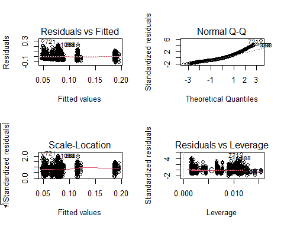

``` r
par(oldpar)
```

Other than the skewness of the residuals, model diagnostics are pretty
good, suggesting these conclusions will be robust to most other
reasonable model specifications.

## Check for Non-linear Patterns

We start by fitting a polynomial

``` r
trnd_lm_3 <- lm(log1p(din_N) ~ poly(year,2) + poly(year,2):station + 
                                month + month:year, data = core_months_data)
anova(trnd_lm_3)
#> Analysis of Variance Table
#> 
#> Response: log1p(din_N)
#>                         Df Sum Sq  Mean Sq F value  Pr(>F)    
#> poly(year, 2)            2 0.3836 0.191797 53.8665 < 2e-16 ***
#> month                    5 0.0377 0.007543  2.1184 0.06077 .  
#> poly(year, 2):station   14 0.6483 0.046310 13.0062 < 2e-16 ***
#> month:year               5 0.0243 0.004861  1.3652 0.23464    
#> Residuals             1378 4.9065 0.003561                    
#> ---
#> Signif. codes:  0 '***' 0.001 '**' 0.01 '*' 0.05 '.' 0.1 ' ' 1
```

So, there is evidence for non-linear changes over time. The problem is,
we expect year to year changes due to things like weather, so it is hard
to evaluate whether any of this matters. To get a handle on that, we
turn to a GAM model, .

``` r
trnd_gam_1 <- gam(din_N ~ station + month +
                    s(year, by = station, k = 5),
                  data = core_months_data)
anova(trnd_gam_1)
#> 
#> Family: gaussian 
#> Link function: identity 
#> 
#> Formula:
#> din_N ~ station + month + s(year, by = station, k = 5)
#> 
#> Parametric Terms:
#>         df      F p-value
#> station  7 72.080  <2e-16
#> month    5  2.089  0.0643
#> 
#> Approximate significance of smooth terms:
#>                        edf Ref.df      F  p-value
#> s(year):stationPKT42 3.843  3.983  3.849  0.00544
#> s(year):stationP7CBI 3.783  3.970  2.918  0.02431
#> s(year):stationP5BSD 1.776  2.198  0.481  0.57180
#> s(year):stationNMM79 1.747  2.098  1.331  0.26915
#> s(year):stationP6FGG 3.817  3.979  3.137  0.01583
#> s(year):stationSMT50 3.932  3.997 15.483  < 2e-16
#> s(year):stationEEB18 3.389  3.764  7.658 6.79e-06
#> s(year):stationRRY47 1.000  1.000  0.000  0.99803
```

``` r
trnd_gam_2 <- gam(din_N ~ station + month +
                    s(year, k = 5),
                  data = core_months_data)
anova(trnd_gam_1, trnd_gam_2)
#> Analysis of Deviance Table
#> 
#> Model 1: din_N ~ station + month + s(year, by = station, k = 5)
#> Model 2: din_N ~ station + month + s(year, k = 5)
#>   Resid. Df Resid. Dev      Df Deviance
#> 1      1367     5.0331                 
#> 2      1388     5.2435 -20.993 -0.21044
AIC(trnd_gam_1, trnd_gam_2)
#>                  df       AIC
#> trnd_gam_1 37.28625 -3850.837
#> trnd_gam_2 17.92853 -3832.002
```

SO there’s a large increase in deviance going to the simpler model (on
the order of 5%) and AIC goes up substantially. We need the more complex
model.

``` r
plot(trnd_gam_1, se = FALSE, trans = log1p)
```

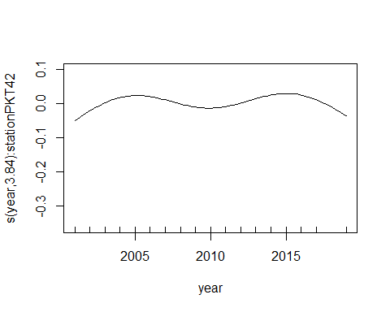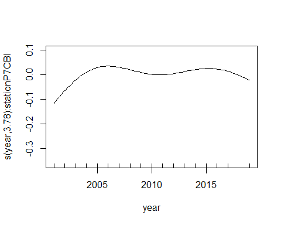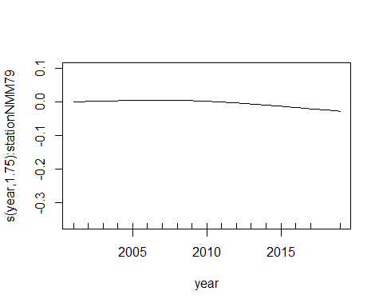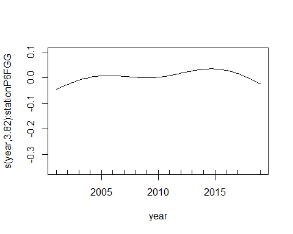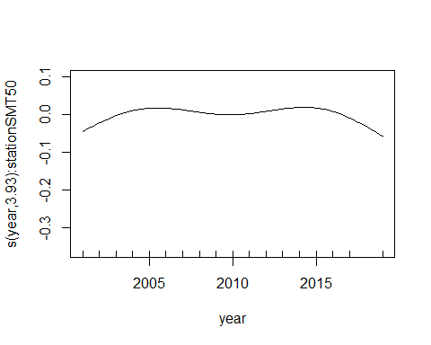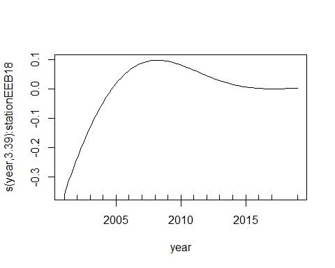

These effects are relatively large, compared to the means, but the
patterns are different from site to site. In other words, there is
little here to interpret that would add insight to readers. The
conclusion is, there are year to year differences, that differ site to
site, and thus no real trends.

It is possible a formal time series analysis might uncover
autocorrelation structure, but that is well beyond our current needs.
