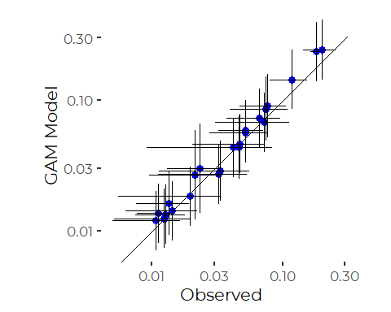

Analysis of Friends of Casco Bay DIN Data
================
Curtis C. Bohlen, Casco Bay Estuary Partnership.
04/26/2021

-   [Introduction](#introduction)
-   [Load Libraries](#load-libraries)
-   [Load Data](#load-data)
    -   [Folder References](#folder-references)
    -   [Load Data](#load-data-1)
-   [Station Names](#station-names)
-   [Data Review](#data-review)
    -   [Data Distributions](#data-distributions)
-   [Recent Conditions](#recent-conditions)
    -   [Add Shortened Site Names](#add-shortened-site-names)
    -   [Data Prevalence](#data-prevalence)
    -   [Extract Recent Results](#extract-recent-results)
-   [Restricted DIN Data (Year = 2019)](#restricted-din-data-year--2019)
    -   [Calculate Descriptive
        Statistics](#calculate-descriptive-statistics)
-   [Models](#models)
    -   [Linear Model](#linear-model)
    -   [Robust Linear Model on Transformed
        Data](#robust-linear-model-on-transformed-data)
    -   [Robust Linear Model on Untransformed
        Data](#robust-linear-model-on-untransformed-data)
    -   [GAM model](#gam-model)
        -   [Compare Model Results – Does Model Selection
            Matter?](#compare-model-results--does-model-selection-matter)
-   [DIN Recent Condition
    Conclusions](#din-recent-condition-conclusions)
-   [Trend Analysis](#trend-analysis)
    -   [Identify Trend Stations](#identify-trend-stations)
    -   [Generate Trend Data](#generate-trend-data)
    -   [Data Prevalence](#data-prevalence-1)
    -   [Core Trend Data](#core-trend-data)
    -   [Plotting](#plotting)
-   [Models](#models-1)
    -   [Initial Linear Model](#initial-linear-model)
    -   [Check for Non-linear Patterns](#check-for-non-linear-patterns)


# Introduction

This notebook Looks at DIN numbers from Friends of Casco Bay samples.

FOCB reports the TN samples and DIN samples were sent to different
laboratories, and so direct comparison relies on consistent calibration,
etc. across two labs. Accordingly, here we restrict our analysis to
looking at DIN. A separate notebook looks at TN.

FOCB reports that some DIN samples over the years had unusually high
ammonium values, and that those samples were noted by the laboratory
conducting the analyses, but not flagged as errors. We created a data
set that dropped the top 5% of ammonium values and ammonium data where
DIN was larger than TN. Details are in the
“FOCB\_Nutrients\_Combined.Rmd” notebook.

# Load Libraries

``` r
library(MASS) # for `rlm()` ans `lqs()`for robust regression
              # also `cov.rob()` for robust multivariate scatter and covariance.
              # Because MASS contains a function `select()` that conflicts with
              # the tidyverse `select()` function, `MASS` should be loaded before
              # the tidyverse.

library(readxl)
library(tidyverse)
#> -- Attaching packages --------------------------------------- tidyverse 1.3.1 --
#> v ggplot2 3.3.5     v purrr   0.3.4
#> v tibble  3.1.6     v dplyr   1.0.7
#> v tidyr   1.1.4     v stringr 1.4.0
#> v readr   2.1.1     v forcats 0.5.1
#> -- Conflicts ------------------------------------------ tidyverse_conflicts() --
#> x dplyr::filter() masks stats::filter()
#> x dplyr::lag()    masks stats::lag()
#> x dplyr::select() masks MASS::select()

library(mgcv)    # For generalized linear models
#> Loading required package: nlme
#> 
#> Attaching package: 'nlme'
#> The following object is masked from 'package:dplyr':
#> 
#>     collapse
#> This is mgcv 1.8-38. For overview type 'help("mgcv-package")'.

library(emmeans)
#library(moments)  # for skewness and kurtosis)

library(sfsmisc)  # Provides alternative access to wald test for robust models
#> 
#> Attaching package: 'sfsmisc'
#> The following object is masked from 'package:dplyr':
#> 
#>     last

library(CBEPgraphics)
load_cbep_fonts()
theme_set(theme_cbep())
```

# Load Data

## Folder References

``` r
sibfldnm <- 'Data'
parent <- dirname(getwd())
sibling <- file.path(parent,sibfldnm)
```

## Load Data

The data we use here has had a number of suspiciously high NH4 values
removed. See “FOCB\_Nutrients\_Combined.Rmd” for details and
explanation.

``` r
strict_data <- read_csv(file.path(sibling, 
                                 "focb_n_data_strict.csv"))%>%
  mutate(month = factor(month, levels = month.abb),
         yearf = factor(year)) %>%
  mutate(dt = as.Date(dt))
#> Rows: 3324 Columns: 17
#> -- Column specification --------------------------------------------------------
#> Delimiter: ","
#> chr   (3): station, month, nh4_ext
#> dbl  (13): year, yearf, doy, tn_depth, din_depth, tn, nox, nh4, din, din_N, ...
#> dttm  (1): dt
#> 
#> i Use `spec()` to retrieve the full column specification for this data.
#> i Specify the column types or set `show_col_types = FALSE` to quiet this message.
```

# Station Names

``` r
fn <- 'FOCB Monitoring Sites SHORT NAMES.xlsx'
names_df <- read_excel(file.path(sibling, fn))
```

# Data Review

## Data Distributions

``` r
ggplot(strict_data , aes(din)) +
  geom_histogram()
#> `stat_bin()` using `bins = 30`. Pick better value with `binwidth`.
#> Warning: Removed 419 rows containing non-finite values (stat_bin).
```


A log transform is “too strong” for the complete DIN data and leaves the
data skewed the other way.

``` r
ggplot(strict_data , aes(din)) +
  geom_histogram(aes(fill = station)) +
  theme(legend.position = 'none') +
  scale_x_log10()
#> Warning: Transformation introduced infinite values in continuous x-axis
#> `stat_bin()` using `bins = 30`. Pick better value with `binwidth`.
#> Warning: Removed 430 rows containing non-finite values (stat_bin).
```


We can partially correct by using a generalized log transform, although
selection of the additive constant is fairly arbitrary. A value between
0.75 and 2 appears to work fairly well.

This assessment of the value of the log + k transform changes with some
data subsets, below. Many analyses have better model diagnostics on the
log transform.

``` r
glog = function(.x, .k) log(.x + .k)

ggplot(strict_data , aes(glog(din, 1.5))) +
  geom_histogram(aes(fill = station)) +
  theme(legend.position = 'none')
#> `stat_bin()` using `bins = 30`. Pick better value with `binwidth`.
#> Warning: Removed 419 rows containing non-finite values (stat_bin).
```


But the log plus one transform looks pretty good for most stations.
Things get complex with later models, on restricted data, where the log
transform performs slightly better.

``` r
ggplot(strict_data , aes(log1p(din))) +
  geom_density(aes(fill = station)) +
  facet_wrap(~ station) +
  theme_minimal() +         # restores gridlines
  theme(legend.position = 'none')
#> Warning: Removed 419 rows containing non-finite values (stat_density).
```


A number of sites show tendencies towards bimodal distributions of DIN.
Later analyses suggest that may reflect seasonal patterns.

# Recent Conditions

Recent conditions include data from 2015 through 2019.

We remove the data for KVL84 from these analyses, because we have very
limited local data from that site.

``` r
recent_data <- strict_data %>%
  filter(year > 2014) %>%
  filter(station != 'KVL84')
```

## Add Shortened Site Names

The key step here is reordering by median total nitrogen values.

``` r
recent_data <- recent_data %>%
   mutate(station_name = names_df$Alt_Name[match(station,
                                                names_df$Station_ID)]) %>%
   mutate(station = factor(station),
          station_name = factor(station_name)) %>%
   mutate(station = fct_reorder(station, tn, na.rm = TRUE),
         station_name = fct_reorder(station_name, tn, na.rm = TRUE)) %>%
   relocate(station_name, .after = station) %>%
   select(-tn_depth, -tn, -organic_N)
```

## Data Prevalence

``` r
xtabs(~station + year, data = strict_data[! is.na(strict_data$din),])
#>        year
#> station 2001 2002 2003 2004 2005 2006 2007 2008 2009 2010 2011 2012 2013 2014
#>   BMR02    0    0    0    0    7    4    5    2    3    8    0    0    0    0
#>   CMS1     0    0    0    0    0    0    0    0   14   19    0    0    0    0
#>   EEB18    0    0    0    0   15   17    2   10   24   19    2    1    0    0
#>   HR1      0    0    0    0    0    0    0    0    0    0    0    0    0    0
#>   HR2      0    0    0    0   20   12   15   10   20   19    0    0    0    0
#>   HR3      0    0    0    0    0    0    0    0    0    0    0    0    0    0
#>   HR4      0    0    0    0    0    0    0    0    0    3    2    2    0    0
#>   KVL84    0    0    0    0    0    0   39   28   22   15    2    2    0    0
#>   MPL86    0    0    0    0    0    0    0    0    0    0    0    0    0    0
#>   NMM79   35   13    0    0   13    6   20   17   17   27    2    5    0    0
#>   OBY35    0    0    0    0    0    0   20   16   20   14    0    0    0    0
#>   P5BSD    3   11   14   13   14   15   10   11    8    8   10    7   12    8
#>   P6FGG   10   12   13   13   12   16   12   11    8    8   10    7   12    7
#>   P7CBI    3    5   12   13   14   14   12   11    7    9   10   10   12    7
#>   PH1      0    0    0    0    0    0    0    0    0    0    0    0    0    0
#>   PH2      0    0    0    0    0    0    0    0    0    0    0    0    0    0
#>   PH3      0    0    0    0    0    0    0    0    0    0    0    0    0    0
#>   PKT42   11    6    9   10   12    8   10    8    4    5    6    6    8    4
#>   PRV70    0    0    0    0    0    0   21   24   12   13    2    2    0    0
#>   PYC43    0    0    0    0   17   20   18   11   10   20    0    0    0    0
#>   RRC46    0    0    0    0   17    4   16    7    8   15    0    0    0    0
#>   RRY47    0    0    0    0   18   16   14   17   17   23    2    2    0    0
#>   SMT50   95  102  139  132   92   82  115   84   48   61   32   10   23    8
#>   STR54    0    0    0    0   13   14    9   12    5   18    2    2    0    0
#>        year
#> station 2015 2016 2017 2019
#>   BMR02    0    0    0    8
#>   CMS1     0    0    2    8
#>   EEB18    0    0    2    8
#>   HR1      0    0    3    8
#>   HR2      0    0    4    3
#>   HR3      0    0    3    3
#>   HR4      0    0    0    7
#>   KVL84    0    0    1    0
#>   MPL86    0    0    0    8
#>   NMM79    0    0    1    7
#>   OBY35    0    0    0    7
#>   P5BSD    7   16    1    8
#>   P6FGG    8   14    1    8
#>   P7CBI    8   11    0    7
#>   PH1      0    0    1    8
#>   PH2      0    0    1    8
#>   PH3      0    0    1    7
#>   PKT42    4    1    2    8
#>   PRV70    0    0    0    7
#>   PYC43    0    0    1    7
#>   RRC46    0    0    0    8
#>   RRY47    0    0    2    8
#>   SMT50   25   45    0    8
#>   STR54    0    0    0    8
```

DIN data has been collected fairly consistently from a handful of sites
over many years, and from many sites only in 2019. Samples have been
collected at different times of year as well, complicating analyses, as
year, station, and season / time of year are confounded.

``` r
xtabs(~ month + station, data = recent_data,  
      subset = ! is.na(recent_data$din)) %>%
  as_tibble() %>%
  mutate(month = factor(month, levels = month.abb)) %>%
  filter(n>0) %>%

  ggplot(aes(station, month, fill = sqrt(n))) +
  geom_tile() +
  theme_cbep(base_size = 12) +
  theme(axis.text.x = element_text(angle = 90, hjust = 1, vjust = .25))
```


``` r
xtabs(~ year + station, data = recent_data,  
      subset = ! is.na(recent_data$din)) %>%
  as_tibble() %>% 
  filter(n>0) %>%

  ggplot(aes(station, year, fill = sqrt(n))) +
  geom_tile() +
  theme_cbep(base_size = 12) +
  theme(axis.text.x = element_text(angle = 90, hjust = 1, vjust = .25))
```


So data representation is widespread in 2017, but really only
comprehensive from 2019.

``` r
xtabs(~ year + month, data = recent_data,  
      subset = ! is.na(recent_data$din)) %>%
  as_tibble() %>% 
  mutate(month = factor(month, levels = month.abb))  %>%
  filter(n>0) %>%

  ggplot(aes(month, year, fill = sqrt(n))) +
  geom_tile() +
  theme_cbep(base_size = 12) +
  theme(axis.text.x = element_text(angle = 90, hjust = 1, vjust = .25))
```


We note that several stations have fewer than ten DIN samples over the
recent period, and sampling has focused on a smaller number of sites, a
smaller number of months, or both.

Only one site (KVL84, Knightville Landing, in South Portland) has fewer
than five DIN values. It was dropped, above, for lack of recent data.

With the relatively low sample sizes and uneven sampling histories for
most sites, complex models may perform poorly. Interactions with year,
time of year, and location, in particular, will lead to many empty cells
in the model design. Those may lead to a variety of model artifacts.

We conducted analysis on both the full 5 year record, and on just data
from 2019. Here we focus on the 2019 data, as uneven sampling means
comparisons relying on the older data are fraught with difficulties due
to confounding.

## Extract Recent Results

``` r
recent_results <- recent_data %>%
  group_by(station) %>%
  summarize(across(nox:nh4_N, c(mn = ~ mean(.x, na.rm = TRUE),
                                  sd = ~ sd(.x, na.rm = TRUE), 
                                  n = ~sum(! is.na(.x)),
                                  md = ~ median(.x, na.rm = TRUE),
                                  iqr = ~ IQR(.x, na.rm = TRUE),
                                  p90 = ~ quantile(.x, .9, na.rm = TRUE),
                                  gm = ~ exp(mean(log(.x), na.rm = TRUE))))) %>%
  mutate(station_name = names_df$Alt_Name[match(station,
                                                names_df$Station_ID)]) %>%
  mutate(station = fct_reorder(factor(station), din_md),
         station_name = fct_reorder(factor(station_name), din_md)) %>%
  relocate(station_name, .after = station)
```

# Restricted DIN Data (Year = 2019)

Our primary goal is to provide a map and accompanying chart of DIN
levels. For that, we want to compare all sites on an even footing. We
now know that there are important annual and seasonal processes at work,
so the uneven sampling history affects estimates of site conditions.

Data coverage in 2019 is fairly consistent. Coverage is sparse, but
consistent across stations (but not months) in 2017 as well.

We restrict attention to just 2019, as that data will not be affected by
the uneven sampling history to the same extent. An alternative
restriction to selected months left many stations with data only from
2019 anyway.

``` r
xtabs(~ station + month, data = recent_data, subset = recent_data$year == 2019)
#>        month
#> station Jan Feb Mar Apr May Jun Jul Aug Sep Oct Nov Dec
#>   CMS1    0   0   0   0   2   1   2   1   2   1   0   0
#>   OBY35   0   0   0   0   1   1   2   1   2   0   0   0
#>   PYC43   0   0   0   0   1   1   2   1   2   0   0   0
#>   P7CBI   0   0   0   0   2   1   2   1   2   1   0   0
#>   P5BSD   0   0   0   0   2   1   2   1   2   1   0   0
#>   PH1     0   0   0   0   2   1   2   1   2   1   0   0
#>   HR1     0   0   0   0   2   1   2   1   2   1   0   0
#>   BMR02   0   0   0   0   1   1   2   1   2   1   0   0
#>   HR3     0   0   0   0   0   0   0   1   2   0   0   0
#>   PH2     0   0   0   0   2   1   2   1   2   1   0   0
#>   MPL86   0   0   0   0   2   1   2   1   2   1   0   0
#>   HR2     0   0   0   0   0   0   0   1   2   0   0   0
#>   P6FGG   0   0   0   0   2   1   2   1   2   1   0   0
#>   PH3     0   0   0   0   2   1   2   1   2   1   0   0
#>   SMT50   0   0   0   0   2   1   2   1   2   1   0   0
#>   EEB18   0   0   0   0   2   1   2   1   2   1   0   0
#>   PKT42   0   0   0   0   2   1   2   1   2   1   0   0
#>   RRC46   0   0   0   0   2   1   2   1   2   1   0   0
#>   HR4     0   0   0   0   2   1   2   1   2   1   0   0
#>   PRV70   0   0   0   0   2   1   2   1   2   0   0   0
#>   NMM79   0   0   0   0   2   1   2   1   2   1   0   0
#>   RRY47   0   0   0   0   2   1   2   1   2   1   0   0
#>   STR54   0   0   0   0   2   1   2   1   2   1   0   0
```

So sampling is not completely equal. We have two sites in the
Harraseeket with poor data coverage, and a few sites missing October
data. In other analyses, we noted that October often has higher DIN
values than other months, so we drop that month from further analysis,
to avoid confounding due to uneven sampling.

``` r
yr_2019_data <- recent_data %>%
  filter(year == 2019)  %>%
  filter(month !='Oct') %>%
  filter(! is.na(din)) %>%
  select(station, station_name, dt, month, doy, din_N)
```

``` r
ggplot(yr_2019_data, aes(din_N)) +
  geom_histogram() +
  scale_x_continuous(trans = 'log')
#> `stat_bin()` using `bins = 30`. Pick better value with `binwidth`.
```


``` r
ggplot(yr_2019_data, aes(din_N, station_name)) +
  geom_point(aes(color = month)) +
  theme_cbep(base_size = 12) +
  scale_x_log10() +
  ylab('')
```


Even from that simple plot, it is clear that stes differ in DIN levels,
and there was a strong seasonal pattern in DIN levels.

### Calculate Descriptive Statistics

``` r
results_2019 <- yr_2019_data %>%
  group_by(station) %>%
  summarize(across(din_N, c(mn = ~ mean(.x, na.rm = TRUE),
                                  sd = ~ sd(.x, na.rm = TRUE), 
                                  n = ~sum(! is.na(.x)),
                                  md = ~ median(.x, na.rm = TRUE),
                                  iqr = ~ IQR(.x, na.rm = TRUE),
                                  p90 = ~ quantile(.x, .9, na.rm = TRUE),
                                  gm = ~ exp(mean(log(.x), na.rm = TRUE))))) %>%
  mutate(station_name = names_df$Alt_Name[match(station,
                                                names_df$Station_ID)]) %>%
  mutate(station = fct_reorder(factor(station), din_N_md),
         station_name = fct_reorder(factor(station_name), din_N_md)) %>%
  relocate(station_name, .after = station)
```

# Models

We want to look at recent conditions, taking into account as best we can
possible covariates, including year and time of year. Our goal is to
extract means, medians, or marginal means by station for the recent data
to plot on graphics and GIS.

### Linear Model

``` r
din_lm_2019_draft <- lm(log(din_N) ~ station *  month , data = yr_2019_data)
anova(din_lm_2019_draft)
#> Analysis of Variance Table
#> 
#> Response: log(din_N)
#>               Df  Sum Sq Mean Sq F value    Pr(>F)    
#> station       22 125.312  5.6960  15.608 2.468e-13 ***
#> month          4  18.602  4.6506  12.744 8.898e-07 ***
#> station:month 82  37.317  0.4551   1.247    0.2225    
#> Residuals     40  14.597  0.3649                      
#> ---
#> Signif. codes:  0 '***' 0.001 '**' 0.01 '*' 0.05 '.' 0.1 ' ' 1
```

``` r
din_lm_2019 <- lm(log(din_N) ~ station + month , data = yr_2019_data)
anova(din_lm_2019)
#> Analysis of Variance Table
#> 
#> Response: log(din_N)
#>            Df  Sum Sq Mean Sq F value    Pr(>F)    
#> station    22 125.312  5.6960  13.386 < 2.2e-16 ***
#> month       4  18.602  4.6506  10.929 1.316e-07 ***
#> Residuals 122  51.914  0.4255                      
#> ---
#> Signif. codes:  0 '***' 0.001 '**' 0.01 '*' 0.05 '.' 0.1 ' ' 1
```

``` r
oldpar <- par(mfrow = c(2,2))
plot(din_lm_2019)
```


``` r
par(oldpar)
```

Nothing dreadful there….

#### Marginal Means

``` r
din_emms_lm_2019 <- emmeans(din_lm_2019, 'station', type = 'response')
plot(din_emms_lm_2019) + coord_flip()+ 
  theme(axis.text.x = element_text(angle = 90, vjust = 0.25)) +
  geom_point(data = results_2019, aes(y = station, x = din_N_md),
             color = 'red')
```


``` r
din_emms_lm_2019_months <- emmeans(din_lm_2019, 'month', type = 'response')
plot(din_emms_lm_2019_months) + coord_flip()+ 
  theme(axis.text.x = element_text(angle = 90, vjust = 0.25))
```


### Robust Linear Model on Transformed Data

The `rlm()` function from `MASS` implements robust model fitting using M
estimators. These are estimators that do not use least squares as a
criterion for model fit. Instead, they use other symmetric functions to
quantify the relative importance of the deviation of each observation
from model predictions. To achieve “robust” qualities, these functions
drop off in value at higher deviations from model predictions, making
extreme points count less, or not at all, when fitting the model.

Robust linear models, as implemented via `rlm()` from the `MASS` package
do not accept models not of full rank, which is proven a bit of a
problem for these uneven data sets. We can not fit a station + month
model.

``` r
din_rlm_2019_FAILS <- rlm(log(din_N) ~ station + month, 
                     na.action = na.omit,
                     data = yr_2019_data)
#> Error in rlm.default(x, y, weights, method = method, wt.method = wt.method, : 'x' is singular: singular fits are not implemented in 'rlm'
```

``` r
din_rlm_2019 <- rlm(log(din_N) ~ station, 
                     na.action = na.omit,
                     data = yr_2019_data)
```

``` r
f.robftest(din_rlm_2019)
#> 
#>  robust F-test (as if non-random weights)
#> 
#> data:  from rlm(formula = log(din_N) ~ station, data = yr_2019_data, na.action = na.omit)
#> F = 9.8366, p-value < 2.2e-16
#> alternative hypothesis: two.sided
#> null values:
#> stationOBY35 stationPYC43 stationP7CBI stationP5BSD   stationPH1   stationHR1 
#>            0            0            0            0            0            0 
#> stationBMR02   stationHR3   stationPH2 stationMPL86   stationHR2 stationP6FGG 
#>            0            0            0            0            0            0 
#>   stationPH3 stationSMT50 stationEEB18 stationPKT42 stationRRC46   stationHR4 
#>            0            0            0            0            0            0 
#> stationPRV70 stationNMM79 stationRRY47 stationSTR54 
#>            0            0            0            0
```

So, by the WALD test, station does matter. But we knew that….

#### Extract Margnial Means

``` r
din_emms_rlm_2019 <- emmeans(din_rlm_2019, 'station', type = 'response')
plot(din_emms_rlm_2019) + 
  coord_flip() + 
  theme(axis.text.x = element_text(angle = 90, vjust = 0.25, hjust = 1)) + 
  geom_point(data = results_2019, aes(y = station, x = din_N_md),
             color = 'red')
```


``` r
din_emms_rlm_2019 <- as_tibble(din_emms_rlm_2019)
```

That looks nearly indistinguishable from the results of the linear
model.

### Robust Linear Model on Untransformed Data

``` r
din_rlm_2019_2 <- rlm(din_N ~ station, 
                     na.action = na.omit,
                     data = yr_2019_data)
```

``` r
f.robftest(din_rlm_2019_2)
#> 
#>  robust F-test (as if non-random weights)
#> 
#> data:  from rlm(formula = din_N ~ station, data = yr_2019_data, na.action = na.omit)
#> F = 26.514, p-value < 2.2e-16
#> alternative hypothesis: two.sided
#> null values:
#> stationOBY35 stationPYC43 stationP7CBI stationP5BSD   stationPH1   stationHR1 
#>            0            0            0            0            0            0 
#> stationBMR02   stationHR3   stationPH2 stationMPL86   stationHR2 stationP6FGG 
#>            0            0            0            0            0            0 
#>   stationPH3 stationSMT50 stationEEB18 stationPKT42 stationRRC46   stationHR4 
#>            0            0            0            0            0            0 
#> stationPRV70 stationNMM79 stationRRY47 stationSTR54 
#>            0            0            0            0
```

So, by the WALD test, station does matter. But we knew that….

#### Extract Margnial Means

``` r
din_emms_rlm_2019_2 <- emmeans(din_rlm_2019_2, 'station', type = 'response')
plot(din_emms_rlm_2019_2) + 
  coord_flip() + 
  theme(axis.text.x = element_text(angle = 90, vjust = 0.25, hjust = 1)) + 
  geom_point(data = results_2019, aes(y = station, x = din_N_md),
             color = 'red')
```


``` r
din_emms_rlm_2019_2 <- as_tibble(din_emms_rlm_2019_2)
```

Qualitatively, results are similar, except that:  
1. The error no longer scales with the location of the estimates; and 2.
The estimates are closer to the observed medians.

## GAM model

We can use a GAM model to look at seasonal patterns within this one
year, but this also may be overfitting available data. We don’t fit a
cyclic smoother because our data covers only a small portion of the
year.

``` r
din_gam_2019 <- gam(log(din_N) ~ station +  s(doy, bs = 'cs', k = 6), 
               data = yr_2019_data)
anova(din_gam_2019)
#> 
#> Family: gaussian 
#> Link function: identity 
#> 
#> Formula:
#> log(din_N) ~ station + s(doy, bs = "cs", k = 6)
#> 
#> Parametric Terms:
#>         df    F p-value
#> station 22 13.1  <2e-16
#> 
#> Approximate significance of smooth terms:
#>          edf Ref.df     F  p-value
#> s(doy) 3.992  5.000 7.549 7.07e-07
```

``` r
plot(din_gam_2019)
```


The day of year smoother may be slightly over fit here, but not by a
lot.

``` r
oldpar <- par(mfrow = c(2,2))
gam.check(din_gam_2019)
```


    #> 
    #> Method: GCV   Optimizer: magic
    #> Smoothing parameter selection converged after 4 iterations.
    #> The RMS GCV score gradient at convergence was 2.792905e-05 .
    #> The Hessian was positive definite.
    #> Model rank =  28 / 28 
    #> 
    #> Basis dimension (k) checking results. Low p-value (k-index<1) may
    #> indicate that k is too low, especially if edf is close to k'.
    #> 
    #>          k'  edf k-index p-value
    #> s(doy) 5.00 3.99    0.96    0.35
    par(oldpar)

Those diagnostics are not too bad, with the exception of a slight
skewness to the residuals and a mild scale-location (negative)
correlation.

#### GAM Marginal Means

``` r
din_emms_gam_2019 <- emmeans(din_gam_2019, 'station', type = 'response')
plot(din_emms_gam_2019) + coord_flip() + 
  theme(axis.text.x = element_text(angle = 90, vjust = 0.25)) +
  geom_point(data = results_2019, aes(y = station, x = din_N_md),
             color = 'red')
```


``` r
din_emms_gam_2019 <- as_tibble(din_emms_gam_2019) 
```

Again, qualitatively similar results, but this model appears to slightly
overestimate observed means fairly consistently.

### Compare Model Results – Does Model Selection Matter?

#### Compare Models to Observed Means

##### Log Linear Model

``` r
compare <- results_2019 %>%
  select(station, station_name, contains('tn'), contains('din_N')) %>%
  full_join(din_emms_lm_2019, by = 'station', suffix = c('.data', '.lm'), 
            copy = TRUE)

ggplot(compare, aes(din_N_mn, response)) +
  geom_abline(slope = 1, intercept = 0) + 
  geom_point(size = 3, color = 'blue') +
  geom_linerange(aes(xmin = din_N_mn - 2 * din_N_sd/sqrt(din_N_n), 
                     xmax = din_N_mn + 2 * din_N_sd/sqrt(din_N_n))) +
  geom_linerange(aes(ymin = lower.CL, ymax = upper.CL)) +
  xlab('Observed ') +
  ylab('Linear Model') +
  coord_equal() +
  scale_x_log10()+
  scale_y_log10()
```


The log linear model generally fits means slightly lower than observed.

##### Robust Log Linear Model

``` r
compare <- results_2019 %>%
  select(station, station_name, contains('tn'), contains('din_N')) %>%
  full_join(din_emms_rlm_2019, by = 'station', suffix = c('.data', '.lm'), 
            copy = TRUE)

ggplot(compare, aes(din_N_mn, response)) +
  geom_abline(slope = 1, intercept = 0) + 
  geom_point(size = 3, color = 'blue') +
  geom_linerange(aes(xmin = din_N_mn - 2 * din_N_sd/sqrt(din_N_n), 
                     xmax = din_N_mn + 2 * din_N_sd/sqrt(din_N_n))) +
  geom_linerange(aes(ymin = asymp.LCL, ymax = asymp.UCL)) +
  xlab('Observed ') +
  ylab('Robust Log Linear Model') +
  coord_equal() +
  scale_x_log10()+
  scale_y_log10()
```


Results of the robust model are very similar.

##### Robust Linear Model

``` r
compare <- results_2019 %>%
  select(station, station_name, contains('tn'), contains('din_N')) %>%
  full_join(din_emms_rlm_2019_2, by = 'station', suffix = c('.data', '.lm'), 
            copy = TRUE)

ggplot(compare, aes(din_N_mn, emmean)) +
  geom_abline(slope = 1, intercept = 0) + 
  geom_point(size = 3, color = 'blue') +
  geom_linerange(aes(xmin = din_N_mn - 2 * din_N_sd/sqrt(din_N_n), 
                     xmax = din_N_mn + 2 * din_N_sd/sqrt(din_N_n))) +
  geom_linerange(aes(ymin = asymp.LCL, ymax = asymp.UCL)) +
  xlab('Observed ') +
  ylab('Robust Linear Model') +
  coord_equal() +
  scale_x_log10(limits = c(0.01, 0.3)) +
  scale_y_log10(limits = c(0.01, 0.3))
#> Warning in self$trans$transform(x): NaNs produced
#> Warning: Transformation introduced infinite values in continuous y-axis
#> Warning: Removed 9 rows containing missing values (geom_segment).
#> Warning: Removed 10 rows containing missing values (geom_segment).
```


It’s not certain why the error bars are so variable, but that is what
the data suggests.

##### GAM Model

``` r
compare <- results_2019 %>%
  select(station, station_name, contains('tn'), contains('din_N')) %>%
  full_join(din_emms_gam_2019, by = 'station', suffix = c('.data', '.lm'), 
            copy = TRUE)

ggplot(compare, aes(din_N_mn, response)) +
  geom_abline(slope = 1, intercept = 0) + 
  geom_point(size = 3, color = 'blue') +
  geom_linerange(aes(xmin = din_N_mn - 2 * din_N_sd/sqrt(din_N_n), 
                     xmax = din_N_mn + 2 * din_N_sd/sqrt(din_N_n))) +
  geom_linerange(aes(ymin = lower.CL, ymax = upper.CL)) +
  xlab('Observed ') +
  ylab('GAM Model') +
  coord_equal() +
  scale_x_log10()+
  scale_y_log10()
```



The GAM model provides adjusted estimates that generally lie close to
the observed means. Values are slightly higher than the observed means,
reflecting different time of year adjustments from the linear model.
These estimates are effectively adjusted for different sampling
histories. Note that error bars are larger than for the observed means.

#### Compare Log Linear and Robust Log Linear Models

We can show that more clearly by plotting the predictions of the two
models against one another.

``` r
compare <- as_tibble(din_emms_lm_2019) %>%
  full_join(din_emms_rlm_2019, by = 'station', suffix = c('.lm', '.rlm'))
ggplot(compare, aes(response.lm, response.rlm)) +
  geom_abline(slope = 1, intercept = 0) + 
  geom_point(size = 3, color = 'blue') +
  geom_linerange(aes(xmin = lower.CL, xmax = upper.CL)) +
  geom_linerange(aes(ymin = asymp.LCL, ymax = asymp.UCL)) +
  xlab('Linear Model') +
  ylab('Robust Linear Model') +
  coord_equal() +
  scale_x_log10()+
  scale_y_log10()
```


So, results are qualitatively similar. There is no strong reason to
prefer the robust estimates to the linear model estimates where
qualitative results are similar and model diagnostics are fairly good.

# DIN Recent Condition Conclusions

There appears to be little advantage to robust models. Even so, there
are several approaches possible:  
1. Just use observed means / medians.  
2. Use fitted means from the simplest linear models. This effectively
fits geometric means, not arithmetic means, and pools error estimates.  
3. Use Marginal Means from the GAM model – these are effectively
adjusted for different sampling histories, especially time of year.

# Trend Analysis

Few stations have data from more than a few years. DIN data has been
collected over the past couple of years, at several stations in the mid
200s, and at a handful of stations pretty much every year since 2001.
Generally the rule we have used to examine trends is to focus on sites
with relatively complete records, say at least two of the last five
years and at least ten years total.

## Identify Trend Stations

``` r
trend_sites <- strict_data %>%
  group_by(station, year) %>%
  summarize(was_sampled =  ! all(is.na(din_N)),
            .groups = 'drop_last') %>%
  summarize(last_5 = sum(was_sampled & year > 2014),
            total = sum(was_sampled),
            .groups = 'drop') %>%
  filter(total >= 10, last_5 >= 2) %>%
  pull(station)
trend_sites
#> [1] "EEB18" "NMM79" "P5BSD" "P6FGG" "P7CBI" "PKT42" "RRY47" "SMT50"
```

## Generate Trend Data

``` r
trend_data <- strict_data %>%
  filter(station %in% trend_sites) %>%
  filter(! is.na(din_N)) %>%
   mutate(station_name = names_df$Alt_Name[match(station,
                                                names_df$Station_ID)]) %>%
   mutate(station = factor(station),
          station_name = factor(station_name)) %>%
   mutate(station = fct_reorder(station, din_N, na.rm = TRUE),
         station_name = fct_reorder(station_name, din_N, na.rm = TRUE)) %>%
   relocate(station_name, .after = station) %>%
   select(-tn_depth, -tn, -organic_N)
```

## Data Prevalence

``` r
xtabs(~ month + station, data = trend_data )%>%
  as_tibble() %>%
  mutate(month = factor(month, levels = month.abb)) %>%
  filter(n>0) %>%

  ggplot(aes(station, month, fill = sqrt(n))) +
  geom_tile() +
  theme_cbep(base_size = 12) +
  theme(axis.text.x = element_text(angle = 90, hjust = 1, vjust = .25))
```


So we have few winter samples from four of these sites, suggesting we
may want to look at a more limited subset of the data to avoid
introducing bias into our models. The core data is from April to
October, with fairly consistent level of effort across sites. We could
focus on sites with more complete records, or focus on months with more
sites.

``` r
xtabs(~ year + station, data = trend_data) %>%
  as_tibble() %>% 
  filter(n>0) %>%

  ggplot(aes(station, year, fill = sqrt(n))) +
  geom_tile() +
  theme_cbep(base_size = 12) +
  theme(axis.text.x = element_text(angle = 90, hjust = 1, vjust = .25))
```


The same stations have more complete records by year, suggesting we
define five core trend stations where data is more complete.

``` r
xtabs(~ year + month, data = trend_data) %>%
  as_tibble() %>% 
  mutate(month = factor(month, levels = month.abb))  %>%
  filter(n>0) %>%

  ggplot(aes(month, year, fill = sqrt(n))) +
  geom_tile() +
  theme_cbep(base_size = 12) +
  theme(axis.text.x = element_text(angle = 90, hjust = 1, vjust = .25))
```


Most winter samples are older, but we have a few winter samples right up
until the last few years. The lack of recent winter data means we need
to be cautious about interpreting long-term trends, because we know from
prior analyses that din\_N values tend to be lower in the summer months.

We are mostly interested in month (or more generally, time of year) as a
covariate. Although seasonal variation is complex, probably differing
year to year and site to site, this is a place where we may be able to
fit a hierarchical model to assist with bridging some data gaps.

## Core Trend Data

We chose to focus on sites with data from at least 15 years.

``` r
core_sites <- strict_data %>%
  group_by(station, year) %>%
  summarize(was_sampled =  ! all(is.na(din_N)),
            .groups = 'drop_last') %>%
  summarize( total = sum(was_sampled),
            .groups = 'drop') %>%
  filter(total >= 15) %>%
  pull(station)
core_sites
#> [1] "P5BSD" "P6FGG" "P7CBI" "PKT42" "SMT50"
```

``` r
core_data <- trend_data %>%
  filter(station %in% core_sites)
```

And we limit the data to just the summer months, where the record is
fairly complete over the last few years.

``` r
core_data <-core_data %>%
  filter(month %in% month.abb[5:10])
```

## Plotting

First, we create a summary dataframe to allow us to plot annual
averages.

``` r
core_site_summary  <-   core_data %>%
  select(station_name, year, din_N) %>%
  group_by(station_name, year) %>%
  summarize(ann_mn_din_N = mean(din_N, na.rm = TRUE),
            .groups = 'drop_last') %>%
  filter(! is.na(ann_mn_din_N)) %>%
  mutate(dt = as.Date (paste0('06-15-', year), format = '%m-%d-%Y'))
```

``` r
ggplot(core_data) +
  geom_point(aes(dt, din_N, color = station_name), alpha = 0.5) + 
  geom_line(data = core_site_summary, 
            mapping = aes(x = dt, y = ann_mn_din_N), 
            lwd = 1,
            color = cbep_colors()[3]) +
  #scale_y_continuous(trans = 'log') +
  facet_wrap(~station_name, nrow = 5) +
  scale_color_manual(values = cbep_colors()) +
  theme_cbep(base_size = 12) +
  theme(legend.position = 'None') +
  xlab('') +
  ylab('DIN (mg/l as N)')
```


We noted a small number of nominal zero values in 2003 and 2004.Neither
log-transforms nor untransformed data conform well to assumptions of
normality, but the log plus one transform works fairly well.

We note no obvious linear pattern to the annual means, but there is a
possible drop in annual averages in recent years.

# Models

## Initial Linear Model

Note that in this setting, there is no reason to believe all stations
show the same trend, so a model that does not fit an interaction term
(station x year) may be of limited value.

``` r
trnd_lm_1 <- lm(log1p(din_N) ~ (year + station + month)^2 , 
                data = core_data)
anova(trnd_lm_1)
#> Analysis of Variance Table
#> 
#> Response: log1p(din_N)
#>                 Df  Sum Sq  Mean Sq F value    Pr(>F)    
#> year             1 0.00603 0.006025  2.0153    0.1560    
#> station          4 0.16108 0.040269 13.4697 1.062e-10 ***
#> month            5 0.02049 0.004098  1.3707    0.2328    
#> year:station     4 0.01305 0.003263  1.0913    0.3594    
#> year:month       5 0.01623 0.003245  1.0855    0.3667    
#> station:month   20 0.03764 0.001882  0.6295    0.8930    
#> Residuals     1010 3.01953 0.002990                      
#> ---
#> Signif. codes:  0 '***' 0.001 '**' 0.01 '*' 0.05 '.' 0.1 ' ' 1
```

``` r
trnd_lm_2 <- step(trnd_lm_1)
#> Start:  AIC=-6064.01
#> log1p(din_N) ~ (year + station + month)^2
#> 
#>                 Df Sum of Sq    RSS     AIC
#> - station:month 20  0.037638 3.0572 -6091.0
#> - year:month     5  0.014874 3.0344 -6068.9
#> - year:station   4  0.011573 3.0311 -6068.0
#> <none>                       3.0195 -6064.0
#> 
#> Step:  AIC=-6091.01
#> log1p(din_N) ~ year + station + month + year:station + year:month
#> 
#>                Df Sum of Sq    RSS     AIC
#> - year:month    5  0.016226 3.0734 -6095.4
#> - year:station  4  0.011130 3.0683 -6095.2
#> <none>                      3.0572 -6091.0
#> 
#> Step:  AIC=-6095.45
#> log1p(din_N) ~ year + station + month + year:station
#> 
#>                Df Sum of Sq    RSS     AIC
#> - year:station  4  0.013051 3.0865 -6099.0
#> - month         5  0.020407 3.0938 -6098.5
#> <none>                      3.0734 -6095.4
#> 
#> Step:  AIC=-6099
#> log1p(din_N) ~ year + station + month
#> 
#>           Df Sum of Sq    RSS     AIC
#> - month    5  0.020489 3.1069 -6102.1
#> <none>                 3.0864 -6099.0
#> - year     1  0.024772 3.1112 -6092.6
#> - station  4  0.156149 3.2426 -6055.2
#> 
#> Step:  AIC=-6102.05
#> log1p(din_N) ~ year + station
#> 
#>           Df Sum of Sq    RSS     AIC
#> <none>                 3.1069 -6102.1
#> - year     1  0.025451 3.1324 -6095.5
#> - station  4  0.161078 3.2680 -6057.0
```

``` r
anova(trnd_lm_2)
#> Analysis of Variance Table
#> 
#> Response: log1p(din_N)
#>             Df  Sum Sq  Mean Sq F value    Pr(>F)    
#> year         1 0.00603 0.006025  2.0246    0.1551    
#> station      4 0.16108 0.040269 13.5314 9.295e-11 ***
#> Residuals 1044 3.10694 0.002976                      
#> ---
#> Signif. codes:  0 '***' 0.001 '**' 0.01 '*' 0.05 '.' 0.1 ' ' 1
```

``` r
summary(trnd_lm_2)
#> 
#> Call:
#> lm(formula = log1p(din_N) ~ year + station, data = core_data)
#> 
#> Residuals:
#>      Min       1Q   Median       3Q      Max 
#> -0.08772 -0.03907 -0.01243  0.02456  0.29844 
#> 
#> Coefficients:
#>                Estimate Std. Error t value Pr(>|t|)    
#> (Intercept)  -2.0792109  0.7285720  -2.854  0.00441 ** 
#> year          0.0010610  0.0003628   2.924  0.00353 ** 
#> stationP7CBI  0.0012984  0.0080483   0.161  0.87187    
#> stationP5BSD  0.0012107  0.0079301   0.153  0.87868    
#> stationP6FGG  0.0164055  0.0078180   2.098  0.03611 *  
#> stationSMT50  0.0297481  0.0061780   4.815 1.69e-06 ***
#> ---
#> Signif. codes:  0 '***' 0.001 '**' 0.01 '*' 0.05 '.' 0.1 ' ' 1
#> 
#> Residual standard error: 0.05455 on 1044 degrees of freedom
#> Multiple R-squared:  0.05104,    Adjusted R-squared:  0.04649 
#> F-statistic: 11.23 on 5 and 1044 DF,  p-value: 1.455e-10
```

So the obvious linear model analysis suggests there is a weak positive
linear trend. That is, DIC values are increasing slightly

``` r
oldpar <- par(mfrow=c(2,2))
plot(trnd_lm_2)
```


``` r
par(oldpar)
```

The residuals show substantial skew. Otherwise, this is not too
terrible.

## Check for Non-linear Patterns

We start by fitting a polynomial

``` r
trnd_lm_3 <- lm(log1p(din_N) ~ poly(year,2) + poly(year,2):station, 
                data = core_data)
anova(trnd_lm_2, trnd_lm_3)
#> Analysis of Variance Table
#> 
#> Model 1: log1p(din_N) ~ year + station
#> Model 2: log1p(din_N) ~ poly(year, 2) + poly(year, 2):station
#>   Res.Df    RSS Df Sum of Sq      F Pr(>F)
#> 1   1044 3.1069                           
#> 2   1039 3.0920  5  0.014973 1.0063 0.4127
```

So, there is no evidence here for non-linear changes over time. The
problem is, we expect year to year changes due to things like weather,
so it is hard to evaluate whether any of this matters. To get a handle
on that, we turn to a GAM model, and fit Years as a frandom factor. This
results is a very conservative test for trend.

``` r
trnd_gam_2 <- gam(din_N ~ station + month +
                    s(year, k = 5) +
                    s(yearf, bs = 're'),   # Year is a random effect.  This is conservative.
                  data = core_data)
anova(trnd_gam_2)
#> 
#> Family: gaussian 
#> Link function: identity 
#> 
#> Formula:
#> din_N ~ station + month + s(year, k = 5) + s(yearf, bs = "re")
#> 
#> Parametric Terms:
#>         df      F p-value
#> station  4 15.271 3.9e-12
#> month    5  1.867  0.0974
#> 
#> Approximate significance of smooth terms:
#>             edf Ref.df     F p-value
#> s(year)   2.330  2.374 1.282   0.247
#> s(yearf) 13.174 16.000 7.913  <2e-16
```

Again, there is little evidence of an important trend in DIN
concentrations. There are year to year differences, but they do not add
up to a clear trend either way.
