Analysis of Friends of Casco Bay TN Data
================
Curtis C. Bohlen, Casco Bay Estuary Partnership.
04/26/2021

-   [Introduction](#introduction)
-   [Load Libraries](#load-libraries)
-   [Load Data](#load-data)
    -   [Folder References](#folder-references)
    -   [Load Data](#load-data-1)
-   [Station Names](#station-names)
-   [Data Review](#data-review)
    -   [Data Prevalence](#data-prevalence)
    -   [Data Distributions](#data-distributions)
        -   [Outliers Or Errors?](#outliers-or-errors)
        -   [Kurtosis and Skewness](#kurtosis-and-skewness)
    -   [Cross- Plot DIN by TN](#cross--plot-din-by-tn)
    -   [Add Shortened Site Names](#add-shortened-site-names)
    -   [Data Review](#data-review-1)
    -   [Extract Recent Results](#extract-recent-results)
        -   [Sample Frequencies](#sample-frequencies)
    -   [Modeling Goals](#modeling-goals)
    -   [All Data](#all-data)
        -   [Linear Models](#linear-models)
        -   [Robust Linear Models](#robust-linear-models)
        -   [GAM Models](#gam-models)
        -   [Compare Model Results – Does it
            Matter?](#compare-model-results--does-it-matter)
        -   [Month Predictions](#month-predictions)
    -   [Data Restricted to 2018 and
        2019](#data-restricted-to-2018-and-2019)
        -   [Descriptive Statistics](#descriptive-statistics)
        -   [Compare Model Results – Does it
            Matter?](#compare-model-results--does-it-matter-1)
    -   [Conclusions](#conclusions)
-   [Graphic Ideas](#graphic-ideas)
    -   [Trim Outliers](#trim-outliers)
        -   [Potential Plot \#1 Points
            Only](#potential-plot-1-points-only)
        -   [Potential Plot \#2 Points with Medians and
            IQR](#potential-plot-2-points-with-medians-and-iqr)
        -   [Potential Plot \#3 Boxplots](#potential-plot-3-boxplots)
        -   [Potential Plot \#4 Marginal Means Compared with
            Observations](#potential-plot-4-marginal-means-compared-with-observations)
        -   [Potential Plot \#5 Boxplots with Marginal
            Means](#potential-plot-5-boxplots-with-marginal-means)
        -   [Potential Plot \#6 Violins](#potential-plot-6-violins)


# Introduction

This notebook Looks at TN numbers from Friends of Casco Bay samples.

# Load Libraries

``` r
library(MASS) # for `rlm()` ans `lqs()`for robust regression
              # also `cov.rob()` for robust multivariate scatter and covariance.
              # Because MASS contains a function `select()` that conflicts with
              # the tidyverse `select()` function, `MASS` should be loaded before
              # the tidyverse.

#library(readr)
library(readxl)
library(tidyverse)
#> Warning: package 'tidyverse' was built under R version 4.0.5
#> -- Attaching packages --------------------------------------- tidyverse 1.3.1 --
#> v ggplot2 3.3.5     v purrr   0.3.4
#> v tibble  3.1.6     v dplyr   1.0.7
#> v tidyr   1.1.4     v stringr 1.4.0
#> v readr   2.1.0     v forcats 0.5.1
#> Warning: package 'ggplot2' was built under R version 4.0.5
#> Warning: package 'tidyr' was built under R version 4.0.5
#> Warning: package 'dplyr' was built under R version 4.0.5
#> Warning: package 'forcats' was built under R version 4.0.5
#> -- Conflicts ------------------------------------------ tidyverse_conflicts() --
#> x dplyr::filter() masks stats::filter()
#> x dplyr::lag()    masks stats::lag()
#> x dplyr::select() masks MASS::select()

library(mgcv)    # For generalized linear models
#> Warning: package 'mgcv' was built under R version 4.0.5
#> Loading required package: nlme
#> 
#> Attaching package: 'nlme'
#> The following object is masked from 'package:dplyr':
#> 
#>     collapse
#> This is mgcv 1.8-38. For overview type 'help("mgcv-package")'.
#library(mblm)     # for median-based linear\models -- suitable for simple robust methods.
library(emmeans)
#> Warning: package 'emmeans' was built under R version 4.0.5
library(moments)  # for skewness and kurtosis)

library(sfsmisc)  # Provides alternative access to Wald test for robust models
#> Warning: package 'sfsmisc' was built under R version 4.0.5
#> 
#> Attaching package: 'sfsmisc'
#> The following object is masked from 'package:dplyr':
#> 
#>     last

#library(Ternary) # Base graphics ternary plots

library(CBEPgraphics)
load_cbep_fonts()
theme_set(theme_cbep())
```

# Load Data

## Folder References

``` r
sibfldnm <- 'Derived_Data'
parent <- dirname(getwd())
sibling <- file.path(parent,sibfldnm)

#dir.create(file.path(getwd(), 'figures'), showWarnings = FALSE)
```

## Load Data

The data we use here has had a number of suspiciously high NH4 values
removed. See “FOCB\_Nutrients\_Combined.Rmd” for details and
explanation.

``` r
strict_data <- read_csv(file.path(sibling, 
                                 "focb_n_data_strict.csv"))%>%
  mutate(month = factor(month, levels = month.abb),
         yearf = factor(year)) %>%
  mutate(dt = as.Date(dt))
#> Rows: 3324 Columns: 16
#> -- Column specification --------------------------------------------------------
#> Delimiter: ","
#> chr   (2): station, month
#> dbl  (13): year, yearf, doy, tn_depth, din_depth, tn, nox, nh4, din, din_N, ...
#> dttm  (1): dt
#> 
#> i Use `spec()` to retrieve the full column specification for this data.
#> i Specify the column types or set `show_col_types = FALSE` to quiet this message.
```

# Station Names

``` r
fn <- 'FOCB Monitoring Sites SHORT NAMES.xlsx'
names_df <- read_excel(file.path(sibling, fn))
```

# Data Review

## Data Prevalence

``` r
xtabs(~station + year, data = strict_data[! is.na(strict_data$tn),])
#>        year
#> station 2007 2008 2009 2010 2011 2012 2013 2014 2015 2016 2017 2018 2019
#>   BMR02    0    0    0    0    0    0    2    0    0    0    0    4    8
#>   CMS1     0    0    0    0    0    0    0    0    0    2    1    5    9
#>   EEB18    0    0    8    3    2    3    0    0    0    0    2    5    9
#>   HR1      0    0    0    0    0    0    0    4    2    0    4    4    9
#>   HR2      0    0    0    0    0    0    0    4    2    0    4    4    3
#>   HR3      0    0    0    0    0    0    0    4    2    0    4    4    3
#>   HR4      0    0    2    3    2    3    0    0    0    0    0    0    9
#>   KVL84   21   21    8    3    2    3    0    0    0    0    2    1    0
#>   MPL86    0    0    0    0    0    0    0    0    0    0    2    5    9
#>   NMM79    0    0    2    9    2    6    0    0    0    0    2    5    9
#>   OBY35    0    0    0    0    0    0    0    0    0    0    0    3    7
#>   P5BSD    5    8   11    9   11   12    4    6    5   11    1    5    9
#>   P6FGG    6    8   11   10   11   11    4    8    5   11    1    5    9
#>   P7CBI    6    8   11    9   11   11    4    6    5   10    1    5    9
#>   PH1      0    0    0    0    0    0    0    0    0    0    1    4    9
#>   PH2      0    0    0    0    0    0    0    0    0    0    1    4    9
#>   PH3      0    0    0    0    0    0    0    0    0    0    1    4    9
#>   PKT42    4    4    4    5    5    7    2    3    2    0    2    5    9
#>   PRV70   21   24    0    0    2    2    0    0    0    0    0    3    8
#>   PYC43    0    0    0    0    0    0    0    0    0    0    2    3    7
#>   RRC46    0    0    0    0    0    0    0    0    0    0    0    3    9
#>   RRY47    0    0    2    4    2    3    0    0    0    0    2    5    9
#>   SMT50   21   21   11   16   11   13    4    5    8    5    0    1    9
#>   STR54    0    0    7    3    2    1    0    0    0    0    1    4    9
```

TN shows a similar, if more sparse, sampling pattern, with most samples
at just a handful of sites before 2017. Data coverage is fairly
consistent across sites, but with uneven quantities year to year from
2017, 2018, and 2019.

## Data Distributions

``` r
ggplot(strict_data , aes(tn)) +
  geom_histogram()
#> `stat_bin()` using `bins = 30`. Pick better value with `binwidth`.
#> Warning: Removed 2413 rows containing non-finite values (stat_bin).
```


### Outliers Or Errors?

The extreme TN values are perhaps suspect. The TN &gt;&gt; 3 has a huge
effect on most models, but we have no information from FOCB that these
values are in error.

``` r
strict_data %>%
  filter(tn > 1.25) %>%
  select(-contains('depth'), -c(nox:din)) %>%
  mutate(ratio = din_N / tn) %>%
  relocate(ratio, .before = tn)
#> # A tibble: 4 x 12
#>   station dt          year yearf month   doy   ratio    tn   din_N  nox_N
#>   <chr>   <date>     <dbl> <fct> <fct> <dbl>   <dbl> <dbl>   <dbl>  <dbl>
#> 1 HR4     2012-08-08  2012 2012  Aug     221  0.0233  1.49  0.0348 0.0277
#> 2 NMM79   2019-09-26  2019 2019  Sep     269  0.0840  1.61  0.135  0.0272
#> 3 SMT50   2019-06-12  2019 2019  Jun     163  0.0223  3.69  0.0823 0.0400
#> 4 STR54   2009-06-17  2009 2009  Jun     168 NA       1.36 NA      0.213 
#> # ... with 2 more variables: nh4_N <dbl>, organic_N <dbl>
```

NOx and NH4 values are not also high. Two of the samples have din:tn
ratios under 2.5%. That is not, of course, impossible, but it tends to
support the idea that there may have been a problem. The median din:tn
ratio for three of the four sites is close to 20%, so these are unusual
observations in that way as well.

``` r
strict_data %>%
  filter(station %in% c('HR4', 'NMM79', 'SMT50', 'STR54')) %>%
  select(-contains('depth'), -c(nox:din)) %>%
  mutate(ratio = din_N / tn) %>%
  group_by(station) %>%
  summarize(max_tn = max(tn, na.rm = TRUE),
            med_ratio = median(ratio, na.rm = TRUE))
#> # A tibble: 4 x 3
#>   station max_tn med_ratio
#>   <chr>    <dbl>     <dbl>
#> 1 HR4       1.49    0.208 
#> 2 NMM79     1.61    0.0928
#> 3 SMT50     3.69    0.246 
#> 4 STR54     1.36    0.298
```

The NMM79 record has a DIN:TN ration in keeping with other observations
at that site. We can not evaluate a DIN:TN ratio for the high TN
observation at STR54.

For now, we keep all observations in the data, but we remove the TN
&gt;&gt; 3 observation for some later analyses, where it has very high
leverage, and dominates model form.

### Kurtosis and Skewness

So TN data is more highly skewed than the DIN data, and models based on
normal distribution assumptions will probably not serve us well, even if
we transform the data. This is a heavy tailed distribution.

``` r
skewness(strict_data$tn, na.rm = TRUE)
#> [1] 6.990284
kurtosis(strict_data$tn, na.rm = TRUE)
#> [1] 102.2489
```

In this case, with a few exceptions, however, a log transform appears
appropriate. Also, a lot of the variation (after transformation) may
reflect differences among sites, and the impact of uneven sampling
histories.

``` r
ggplot(strict_data , aes(log(tn))) +
  geom_density(aes(fill = station)) +
  facet_wrap(~ station) +
  theme_minimal() +         # restores gridlines
  theme(legend.position = 'none')
#> Warning: Removed 2414 rows containing non-finite values (stat_density).
```

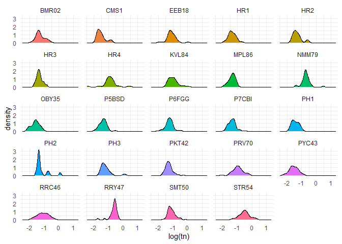

## Cross- Plot DIN by TN

``` r
ggplot(strict_data, aes(tn, din_N)) + 
  geom_point(aes(fill = month), size = 2, shape = 21, alpha = 0.5) +
  geom_abline(intercept = 0, slope = 1) +
  #scale_fill_manual(values = cbep_colors()) +
  coord_equal() +
  theme_cbep(base_size = 12) +
    ylab('DIN (mg/ l as N)') +
    xlab('TN (mg/l)')
#> Warning: Removed 2657 rows containing missing values (geom_point).
```

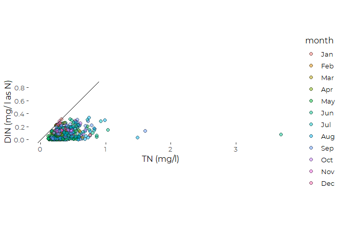
\# Recent Conditions Recent conditions include data from 2015 through
2019.

We remove the data for KVL84 from these analyses, because we have very
limited recent data from that site.

``` r
recent_data <- strict_data %>%
  filter(year > 2014) %>%
  filter(station != 'KVL84') %>%
  filter(! is.na(tn))
```

## Add Shortened Site Names

The key step here is reordering by median nitrogen values.

``` r
recent_data <- recent_data %>%
   mutate(station_name = names_df$Alt_Name[match(station,
                                                names_df$Station_ID)]) %>%
   mutate(station = factor(station),
          station_name = factor(station_name)) %>%
  mutate(station = fct_reorder(station, tn, na.rm = TRUE),
         station_name = fct_reorder(station_name, tn, na.rm = TRUE)) %>%
  relocate(station_name, .after = station)
```

## Data Review

Recall that we have some outliers in the TN data. It is not obvious how
to handle these values. The very highest values have high leverage on
several models. Omitting those data is likely to provide a better
summary of recent conditions and trends.

``` r
ggplot(recent_data, aes(station, tn)) +
  geom_point(aes(color = month)) + 
  theme_cbep(base_size = 12) +
  theme(axis.text.x = element_text(angle = 90)) +
  scale_y_log10()
#> Warning: Transformation introduced infinite values in continuous y-axis
```

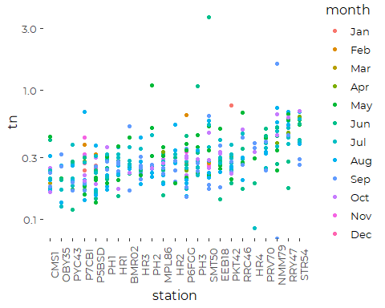

We also have one “zero” values in the recent TN data, so log transforms
are problematic.

``` r
recent_data [ ! is.na(recent_data$tn) & recent_data$tn == 0,]
#> # A tibble: 1 x 17
#>   station station_name dt          year yearf month   doy tn_depth din_depth
#>   <fct>   <fct>        <date>     <dbl> <fct> <fct> <dbl>    <dbl>     <dbl>
#> 1 NMM79   New Meadows  2019-09-06  2019 2019  Sep     249    0.169        NA
#> # ... with 8 more variables: tn <dbl>, nox <dbl>, nh4 <dbl>, din <dbl>,
#> #   din_N <dbl>, nox_N <dbl>, nh4_N <dbl>, organic_N <dbl>
```

Generally, we conduct analyze on a subset of the complete data that
omits the two highest TN values and the nominal zero value. Those
choices do affect model fits. We have not explored the option of
replacing the zero value with some arbitrary minimum value, as we have
no information on detection limits. We do consider robust regression
models.

#### Distribution of Samples

``` r
xtabs(~ year + month, data = recent_data , subset = ! is.na(tn))
#>       month
#> year   Jan Feb Mar Apr May Jun Jul Aug Sep Oct Nov Dec
#>   2015   5   0   0   3   1   0   5   0   7   6   4   0
#>   2016   0   4   1   0   0   0   4   5   5   8   6   6
#>   2017   0   0   0   0   0   0   7  12   6   7   0   0
#>   2018   0   0   0   6  14  28  20  22   0   0   0   0
#>   2019   0   0   0   0  39  21  42  23  46  18   0   0
```

``` r
xtabs(~ station + year, data = recent_data , subset = ! is.na(tn))
#>        year
#> station 2015 2016 2017 2018 2019
#>   CMS1     0    2    1    5    9
#>   OBY35    0    0    0    3    7
#>   PYC43    0    0    2    3    7
#>   P7CBI    5   10    1    5    9
#>   P5BSD    5   11    1    5    9
#>   PH1      0    0    1    4    9
#>   HR1      2    0    4    4    9
#>   BMR02    0    0    0    4    8
#>   HR3      2    0    4    4    3
#>   PH2      0    0    1    4    9
#>   MPL86    0    0    2    5    9
#>   HR2      2    0    4    4    3
#>   P6FGG    5   11    1    5    9
#>   PH3      0    0    1    4    9
#>   SMT50    8    5    0    1    9
#>   EEB18    0    0    2    5    9
#>   PKT42    2    0    2    5    9
#>   RRC46    0    0    0    3    9
#>   HR4      0    0    0    0    9
#>   PRV70    0    0    0    3    8
#>   NMM79    0    0    2    5    9
#>   RRY47    0    0    2    5    9
#>   STR54    0    0    1    4    9
```

We have data from effectively all sites from 2017 through 2019, but with
uneven distribution by month. We will have trouble fitting models that
fit station, month, and year terms because of empty cells in the model.
We may be able to use hierarchical models to address that problem.
Alternatively, data coverage looks a bit more consistent for 2018 and
2019.

## Extract Recent Results

This is the simplest analysis, with no hierarchical modeling. We drop
the extreme TN values, as we do for most analyses coming up.

``` r
recent_results <- recent_data %>%
  mutate(tn = if_else(tn > 1.5 | tn <= 0, NA_real_, tn)) %>%
  group_by(station) %>%
  summarize(across(tn, c(mn = ~ mean(.x, na.rm = TRUE),
                                  sd = ~ sd(.x, na.rm = TRUE), 
                                  n = ~sum(! is.na(.x)),
                                  md = ~ median(.x, na.rm = TRUE),
                                  iqr = ~ IQR(.x, na.rm = TRUE),
                                  p90 = ~ quantile(.x, .9, na.rm = TRUE),
                                  gm = ~ exp(mean(log(.x), na.rm = TRUE))))) %>%
  mutate(station_name = names_df$Alt_Name[match(station,
                                                names_df$Station_ID)]) %>%
  mutate(station = fct_reorder(factor(station), tn_md),
         station_name = fct_reorder(factor(station_name), tn_md)) %>%
  relocate(station_name, .after = station)
```

### Sample Frequencies

``` r
recent_results %>%
  select(station, tn_n)
#> # A tibble: 23 x 2
#>    station  tn_n
#>    <fct>   <int>
#>  1 CMS1       17
#>  2 OBY35      10
#>  3 PYC43      12
#>  4 P7CBI      30
#>  5 P5BSD      31
#>  6 PH1        14
#>  7 HR1        19
#>  8 BMR02      12
#>  9 HR3        13
#> 10 PH2        14
#> # ... with 13 more rows
```

We note that several stations have fewer than ten DIN samples over that
period of time. Only one site (KVL84, Knightville Landing, in South
Portland) has fewer than five DIN values. It and was dropped, above, for
lack of recent data.

TN values are somewhat more abundant, with only a single site with fewer
than ten TN samples.

With the relatively low sample sizes for most sites, complex models may
perform poorly. Interactions with time of year and year, in particular,
will lead to many empty cells in the implicit model design.

## Modeling Goals

We want to look at recent conditions, taking into account as best we can
possible covariates, including year and time of year. Our goal is to
extract marginal means by station for the recent data, and evaluate
trends for the long-term data.

``` r
ggplot(recent_data , aes(tn)) +
  geom_histogram()
#> `stat_bin()` using `bins = 30`. Pick better value with `binwidth`.
```

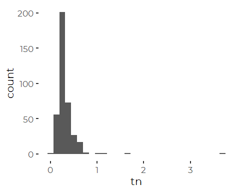

A straight log transform helps a lot. But note that two or possibly even
four extreme values still stand out.

``` r
ggplot(recent_data , aes(tn)) +
  geom_histogram() +
  scale_x_log10()
#> Warning: Transformation introduced infinite values in continuous x-axis
#> `stat_bin()` using `bins = 30`. Pick better value with `binwidth`.
#> Warning: Removed 1 rows containing non-finite values (stat_bin).
```

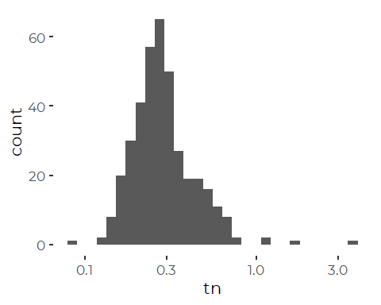

## All Data

### Linear Models

The data is too sparse to allow robust fitting of a full interaction
model.  
Trying to do so suggests the month by station interaction term may be
important, but we can’t trust that information because of the uneven
sampling history.

``` r
full_tn_lm_draft <- lm(log(tn) ~ station + month + yearf, data = recent_data,
                       subset= tn > 0)
anova(full_tn_lm_draft)
#> Analysis of Variance Table
#> 
#> Response: log(tn)
#>            Df Sum Sq Mean Sq F value    Pr(>F)    
#> station    22 20.857 0.94804  8.5375 < 2.2e-16 ***
#> month      11  2.028 0.18437  1.6603   0.08101 .  
#> yearf       4  3.723 0.93071  8.3813 1.847e-06 ***
#> Residuals 342 37.977 0.11105                      
#> ---
#> Signif. codes:  0 '***' 0.001 '**' 0.01 '*' 0.05 '.' 0.1 ' ' 1
```

``` r
summary(full_tn_lm_draft)
#> 
#> Call:
#> lm(formula = log(tn) ~ station + month + yearf, data = recent_data, 
#>     subset = tn > 0)
#> 
#> Residuals:
#>      Min       1Q   Median       3Q      Max 
#> -1.19154 -0.17770 -0.02576  0.15510  2.51961 
#> 
#> Coefficients:
#>               Estimate Std. Error t value Pr(>|t|)    
#> (Intercept)  -1.244403   0.174718  -7.122 6.30e-12 ***
#> stationOBY35 -0.057744   0.134953  -0.428 0.669003    
#> stationPYC43 -0.007048   0.127886  -0.055 0.956082    
#> stationP7CBI -0.022885   0.106512  -0.215 0.830009    
#> stationP5BSD -0.097658   0.106128  -0.920 0.358122    
#> stationPH1    0.094785   0.122382   0.774 0.439170    
#> stationHR1    0.134425   0.114718   1.172 0.242097    
#> stationBMR02  0.249081   0.127705   1.950 0.051939 .  
#> stationHR3    0.207728   0.128357   1.618 0.106506    
#> stationPH2    0.352894   0.122382   2.884 0.004181 ** 
#> stationMPL86  0.150970   0.118046   1.279 0.201796    
#> stationHR2    0.231421   0.128357   1.803 0.072276 .  
#> stationP6FGG  0.065034   0.106128   0.613 0.540426    
#> stationPH3    0.360204   0.122382   2.943 0.003470 ** 
#> stationSMT50  0.381847   0.113337   3.369 0.000840 ***
#> stationEEB18  0.256093   0.118301   2.165 0.031098 *  
#> stationPKT42  0.264752   0.115100   2.300 0.022039 *  
#> stationRRC46  0.455697   0.127726   3.568 0.000411 ***
#> stationHR4    0.271282   0.139989   1.938 0.053460 .  
#> stationPRV70  0.513228   0.131116   3.914 0.000109 ***
#> stationNMM79  0.787626   0.120041   6.561 1.98e-10 ***
#> stationRRY47  0.769172   0.118046   6.516 2.59e-10 ***
#> stationSTR54  0.788884   0.122125   6.460 3.61e-10 ***
#> monthFeb     -0.258348   0.243195  -1.062 0.288846    
#> monthMar     -0.871835   0.387723  -2.249 0.025174 *  
#> monthApr     -0.258819   0.194713  -1.329 0.184658    
#> monthMay     -0.269557   0.173502  -1.554 0.121198    
#> monthJun     -0.379987   0.175081  -2.170 0.030668 *  
#> monthJul     -0.328509   0.169361  -1.940 0.053238 .  
#> monthAug     -0.402964   0.173296  -2.325 0.020641 *  
#> monthSep     -0.390116   0.170754  -2.285 0.022945 *  
#> monthOct     -0.304203   0.171009  -1.779 0.076149 .  
#> monthNov     -0.191212   0.191536  -0.998 0.318838    
#> monthDec     -0.553241   0.222857  -2.482 0.013526 *  
#> yearf2016     0.455507   0.095067   4.791 2.47e-06 ***
#> yearf2017     0.116634   0.098648   1.182 0.237899    
#> yearf2018     0.112129   0.088284   1.270 0.204916    
#> yearf2019     0.029187   0.082117   0.355 0.722488    
#> ---
#> Signif. codes:  0 '***' 0.001 '**' 0.01 '*' 0.05 '.' 0.1 ' ' 1
#> 
#> Residual standard error: 0.3332 on 342 degrees of freedom
#> Multiple R-squared:  0.412,  Adjusted R-squared:  0.3484 
#> F-statistic: 6.476 on 37 and 342 DF,  p-value: < 2.2e-16
```

It is clear that the highest TN stations are higher than the lowest.
Also, Year = 2016 appears different, with a high coefficient.

``` r
oldpar <- par(mfrow = c(2,2))
plot(full_tn_lm_draft)
#> Warning: not plotting observations with leverage one:
#>   13
```

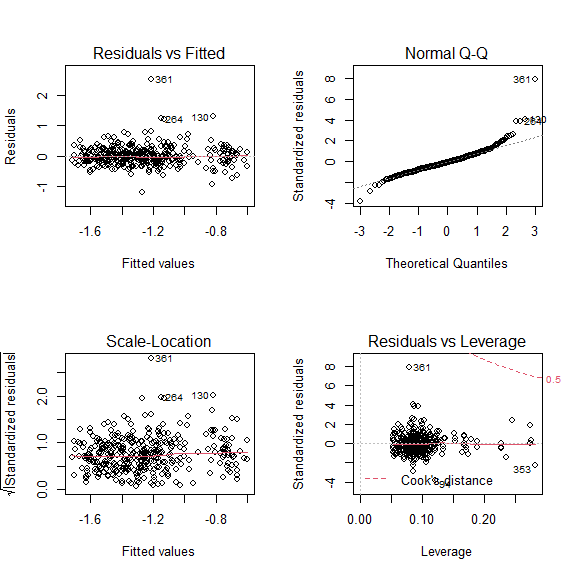

``` r
par(oldpar)
```

While there is a slight tendency for a heavy-tailed distribution, these
diagnostics are not too bad. A few high leverage points have moderately
high leverage. And we do have a few badly fit points:

``` r
recent_data[c(361,264, 130),]
#> # A tibble: 3 x 17
#>   station station_name     dt          year yearf month   doy tn_depth din_depth
#>   <fct>   <fct>            <date>     <dbl> <fct> <fct> <dbl>    <dbl>     <dbl>
#> 1 SMT50   SMCC Pier        2019-06-12  2019 2019  Jun     163    0.043     0.043
#> 2 PH3     Portland Harbor~ 2018-06-25  2018 2018  Jun     176    0.2       0.171
#> 3 NMM79   New Meadows      2019-09-26  2019 2019  Sep     269    0.241     0.241
#> # ... with 8 more variables: tn <dbl>, nox <dbl>, nh4 <dbl>, din <dbl>,
#> #   din_N <dbl>, nox_N <dbl>, nh4_N <dbl>, organic_N <dbl>
```

That list includes two of our four outliers. Omitting those two highest
samples does change model results, mostly by lessening root mean squared
error by more than 20%. But the lower RMS error is achieved through
leaving out data for no better reason than because they appear to be
extreme values.

``` r
tn_lm <- lm(log(tn) ~ station +  month + yearf, 
                 data = recent_data, subset = tn < 1.5 & tn > 0)
anova(tn_lm)
#> Analysis of Variance Table
#> 
#> Response: log(tn)
#>            Df  Sum Sq Mean Sq F value    Pr(>F)    
#> station    22 18.6529 0.84786  9.8458 < 2.2e-16 ***
#> month      11  2.8107 0.25552  2.9672 0.0008923 ***
#> yearf       4  4.2466 1.06165 12.3285 2.256e-09 ***
#> Residuals 340 29.2787 0.08611                      
#> ---
#> Signif. codes:  0 '***' 0.001 '**' 0.01 '*' 0.05 '.' 0.1 ' ' 1
summary(tn_lm)
#> 
#> Call:
#> lm(formula = log(tn) ~ station + month + yearf, data = recent_data, 
#>     subset = tn < 1.5 & tn > 0)
#> 
#> Residuals:
#>     Min      1Q  Median      3Q     Max 
#> -1.2008 -0.1707 -0.0200  0.1529  1.2613 
#> 
#> Coefficients:
#>               Estimate Std. Error t value Pr(>|t|)    
#> (Intercept)  -1.200475   0.153938  -7.798 7.75e-14 ***
#> stationOBY35 -0.051335   0.118844  -0.432 0.666049    
#> stationPYC43 -0.004849   0.112619  -0.043 0.965678    
#> stationP7CBI -0.045331   0.093829  -0.483 0.629316    
#> stationP5BSD -0.120092   0.093493  -1.285 0.199839    
#> stationPH1    0.094423   0.107772   0.876 0.381574    
#> stationHR1    0.130579   0.101032   1.292 0.197080    
#> stationBMR02  0.250060   0.112460   2.224 0.026836 *  
#> stationHR3    0.199776   0.113060   1.767 0.078127 .  
#> stationPH2    0.352533   0.107772   3.271 0.001181 ** 
#> stationMPL86  0.152739   0.103954   1.469 0.142677    
#> stationHR2    0.223469   0.113060   1.977 0.048900 *  
#> stationP6FGG  0.042600   0.093493   0.456 0.648935    
#> stationPH3    0.359842   0.107772   3.339 0.000934 ***
#> stationSMT50  0.233686   0.101182   2.310 0.021512 *  
#> stationEEB18  0.256010   0.104178   2.457 0.014492 *  
#> stationPKT42  0.260588   0.101360   2.571 0.010568 *  
#> stationRRC46  0.459208   0.112479   4.083 5.56e-05 ***
#> stationHR4    0.279180   0.123281   2.265 0.024167 *  
#> stationPRV70  0.518393   0.115465   4.490 9.78e-06 ***
#> stationNMM79  0.694415   0.107761   6.444 3.98e-10 ***
#> stationRRY47  0.770941   0.103954   7.416 9.69e-13 ***
#> stationSTR54  0.794997   0.107547   7.392 1.13e-12 ***
#> monthFeb     -0.232283   0.214183  -1.085 0.278908    
#> monthMar     -0.899639   0.341449  -2.635 0.008805 ** 
#> monthApr     -0.267167   0.171504  -1.558 0.120213    
#> monthMay     -0.248287   0.152804  -1.625 0.105116    
#> monthJun     -0.428311   0.154316  -2.776 0.005816 ** 
#> monthJul     -0.313129   0.149152  -2.099 0.036519 *  
#> monthAug     -0.390266   0.152613  -2.557 0.010985 *  
#> monthSep     -0.395870   0.150448  -2.631 0.008894 ** 
#> monthOct     -0.275527   0.150620  -1.829 0.068233 .  
#> monthNov     -0.190455   0.168670  -1.129 0.259628    
#> monthDec     -0.558608   0.196252  -2.846 0.004690 ** 
#> yearf2016     0.439383   0.083739   5.247 2.73e-07 ***
#> yearf2017     0.069533   0.087061   0.799 0.425038    
#> yearf2018     0.084599   0.077798   1.087 0.277618    
#> yearf2019    -0.028733   0.072570  -0.396 0.692400    
#> ---
#> Signif. codes:  0 '***' 0.001 '**' 0.01 '*' 0.05 '.' 0.1 ' ' 1
#> 
#> Residual standard error: 0.2935 on 340 degrees of freedom
#> Multiple R-squared:  0.4676, Adjusted R-squared:  0.4096 
#> F-statistic: 8.069 on 37 and 340 DF,  p-value: < 2.2e-16
```

Results are qualitatively similar, but differences are evident as we
sequentially remove the outliers.

``` r
oldpar <- par(mfrow = c(2,2))
plot(tn_lm)
#> Warning in sqrt(crit * p * (1 - hh)/hh): NaNs produced

#> Warning in sqrt(crit * p * (1 - hh)/hh): NaNs produced
```

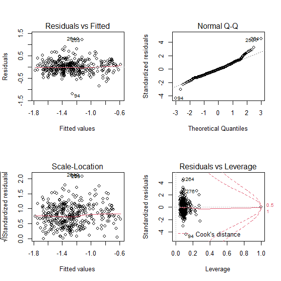

``` r
par(oldpar)
```

We see the residuals are slightly skewed, but with this large sample
size, that should have a relatively small effect on estimates.

#### High Leverage Point?

``` r
a <- round(as.vector(lm.influence(tn_lm)$hat),2)
#which.max(a)
recent_data %>%
  filter(tn > 0, tn < 1.5) %>%
  slice(which.max(a))
#> # A tibble: 1 x 17
#>   station station_name   dt          year yearf month   doy tn_depth din_depth
#>   <fct>   <fct>          <date>     <dbl> <fct> <fct> <dbl>    <dbl>     <dbl>
#> 1 CMS1    Cousins Island 2016-03-01  2016 2016  Mar      61      0.2        NA
#> # ... with 8 more variables: tn <dbl>, nox <dbl>, nh4 <dbl>, din <dbl>,
#> #   din_N <dbl>, nox_N <dbl>, nh4_N <dbl>, organic_N <dbl>
```

That is the only sample from March of 2016, so the data has to fit it
perfectly, giving it a leverage of 1. That’s not really a problem, but
it is notable.

#### Extract Marginal Means

``` r
tn_emms_lm <- emmeans(tn_lm, ~station, type = 'response')
plot(tn_emms_lm) + coord_flip() + 
  theme(axis.text.x = element_text(angle = 90, vjust = 0.25, hjust = 1))
```

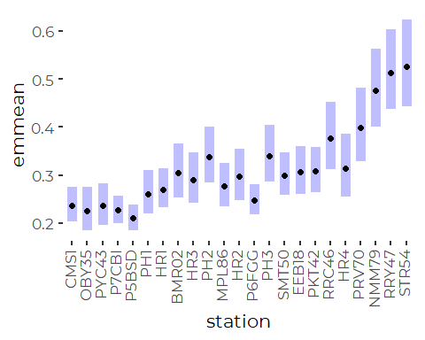

### Robust Linear Models

The function `rlm()` won’t fit models that are non full-rank. Since we
lack certain month by year by station combinations, we can not fit all
three terms.

``` r
tn_rlm <- rlm(log(tn) ~ station + month, 
                     na.action = na.omit,
                     data = recent_data,
                     subset = tn < 3 & tn > 0)
anova(tn_rlm)
#> Analysis of Variance Table
#> 
#> Response: log(tn)
#>           Df Sum Sq Mean Sq F value Pr(>F)
#> station   22 19.763 0.89833               
#> month     11  2.818 0.25617               
#> Residuals    36.031
```

`anova() won't fit  a P value, because it is really not appropriate to use the default ANOVA F tests in the context of M estimators. We need a Wald test F test instead, using`f.robftest()\`.
Even this test should be viewed with caution. Only resampling methods
are likely to give really good estimates of error.

``` r
f.robftest(tn_rlm)
#> 
#>  robust F-test (as if non-random weights)
#> 
#> data:  from rlm(formula = log(tn) ~ station + month, data = recent_data, from     subset = tn < 3 & tn > 0, na.action = na.omit)
#> F = 8.8085, p-value < 2.2e-16
#> alternative hypothesis: two.sided
#> null values:
#> stationOBY35 stationPYC43 stationP7CBI stationP5BSD   stationPH1   stationHR1 
#>            0            0            0            0            0            0 
#> stationBMR02   stationHR3   stationPH2 stationMPL86   stationHR2 stationP6FGG 
#>            0            0            0            0            0            0 
#>   stationPH3 stationSMT50 stationEEB18 stationPKT42 stationRRC46   stationHR4 
#>            0            0            0            0            0            0 
#> stationPRV70 stationNMM79 stationRRY47 stationSTR54     monthFeb     monthMar 
#>            0            0            0            0            0            0 
#>     monthApr     monthMay     monthJun     monthJul     monthAug     monthSep 
#>            0            0            0            0            0            0 
#>     monthOct     monthNov     monthDec 
#>            0            0            0
f.robftest(tn_rlm, 2:23)
#> 
#>  robust F-test (as if non-random weights)
#> 
#> data:  from rlm(formula = log(tn) ~ station + month, data = recent_data, from     subset = tn < 3 & tn > 0, na.action = na.omit)
#> F = 11.837, p-value < 2.2e-16
#> alternative hypothesis: two.sided
#> null values:
#> stationOBY35 stationPYC43 stationP7CBI stationP5BSD   stationPH1   stationHR1 
#>            0            0            0            0            0            0 
#> stationBMR02   stationHR3   stationPH2 stationMPL86   stationHR2 stationP6FGG 
#>            0            0            0            0            0            0 
#>   stationPH3 stationSMT50 stationEEB18 stationPKT42 stationRRC46   stationHR4 
#>            0            0            0            0            0            0 
#> stationPRV70 stationNMM79 stationRRY47 stationSTR54 
#>            0            0            0            0
f.robftest(tn_rlm, 24:33)
#> 
#>  robust F-test (as if non-random weights)
#> 
#> data:  from rlm(formula = log(tn) ~ station + month, data = recent_data, from     subset = tn < 3 & tn > 0, na.action = na.omit)
#> F = 3.6069, p-value = 0.0001405
#> alternative hypothesis: two.sided
#> null values:
#> monthFeb monthMar monthApr monthMay monthJun monthJul monthAug monthSep 
#>        0        0        0        0        0        0        0        0 
#> monthOct monthNov 
#>        0        0
```

So, by the WALD test, both station and month matter, which supports what
we saw from the linear model (despite leaving out the year term here).

#### Extract Margnal Means

``` r
tn_emms_rlm <- emmeans(tn_rlm, 'station', type = 'response')
plot(tn_emms_rlm) + coord_flip() + 
  theme(axis.text.x = element_text(angle = 90, vjust = 0.25, hjust = 1))
```

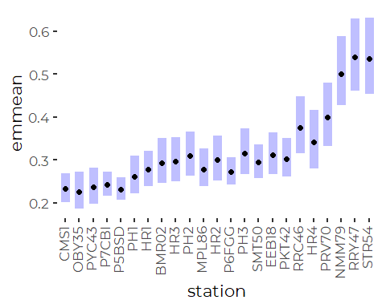

``` r
tn_emms_lm <- as_tibble(tn_emms_lm)
tn_emms_rlm <- as_tibble(tn_emms_rlm)
```

### GAM Models

``` r
tn_gam_draft <- gam(log(tn) ~ station + s(doy, bs = 'cc') + 
                                         s(yearf, bs = 're'),
               data = recent_data, subset = tn < 1.5 & tn > 0)
anova(tn_gam_draft)
#> 
#> Family: gaussian 
#> Link function: identity 
#> 
#> Formula:
#> log(tn) ~ station + s(doy, bs = "cc") + s(yearf, bs = "re")
#> 
#> Parametric Terms:
#>         df    F p-value
#> station 22 10.9  <2e-16
#> 
#> Approximate significance of smooth terms:
#>            edf Ref.df      F p-value
#> s(doy)   6.664  8.000  2.395   0.124
#> s(yearf) 3.695  4.000 10.087  <2e-16
```

The year term can not be omitted here, but the Day of Year term may be
of less importance.

``` r
plot(tn_gam_draft)
```

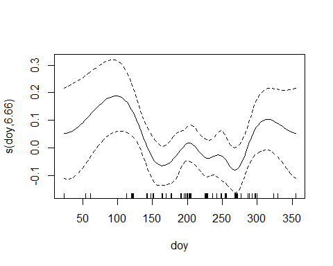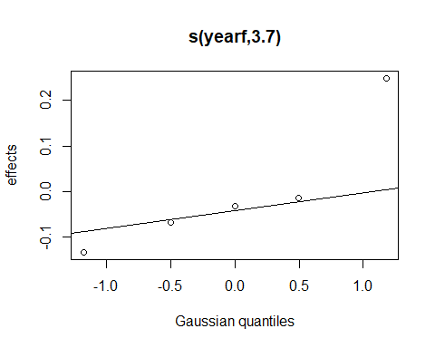
We explored several different smoother specifications. The default
smoother (shown) fits a wiggly day of year curve with effective degrees
of freedom close to 7 that is probably not reasonable for representing a
seasonal pattern.  
As we reduce the dimensionality of the smoother (`k = 6`) ,the shape of
the smoother looks more and more reasonable, but the model explains less
and less of the variation, and performs less and less well as judged by
AIC. There is seasonal pattern here, but it is hard to capture in a
model.

We look at changes in AIC with and without the DOY term.

``` r
tn_gam <- gam(log(tn) ~ station +  s(yearf, bs = 're'), 
               data = recent_data, subset = tn < 1.5 & tn > 0)
anova(tn_gam_draft, tn_gam)
#> Analysis of Deviance Table
#> 
#> Model 1: log(tn) ~ station + s(doy, bs = "cc") + s(yearf, bs = "re")
#> Model 2: log(tn) ~ station + s(yearf, bs = "re")
#>   Resid. Df Resid. Dev      Df Deviance
#> 1    343.56     30.151                 
#> 2    351.02     31.790 -7.4691   -1.638
AIC(tn_gam_draft, tn_gam)
#>                    df      AIC
#> tn_gam_draft 34.35901 185.6020
#> tn_gam       27.71216 192.3053
```

Even for the high dimensionality smoother, there is only a small change
in deviance (a few percent) for dropping the Day of Year Term. But AIC
increases by about 6.5, which suggests the larger model is quite likely
to predict better. Lower dimensional models increase AIC less
substantially.

In our context, it is not clear that retaining the smoother is worth the
practical (as opposed to statistical) problems it causes. The problem is
that our data is sampled at different dates and times, so the model may
be fitting a biased subsample of possible observations.

We focus on a GAM model without the day of year smoother, which is
effectively a simple hierarchical model that treats year as a random
factor.

``` r
plot(tn_gam)
```


Note that differences between years are substantial. Year 2016 was
especially distinct. Weather in 2016 was unusual in many ways.

``` r
gam.check(tn_gam)
```

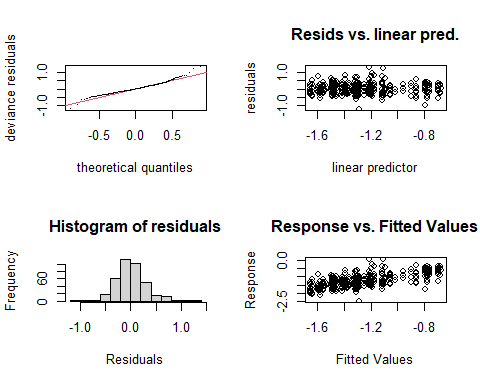

    #> 
    #> Method: GCV   Optimizer: magic
    #> Smoothing parameter selection converged after 6 iterations.
    #> The RMS GCV score gradient at convergence was 4.383504e-06 .
    #> The Hessian was positive definite.
    #> Model rank =  28 / 28 
    #> 
    #> Basis dimension (k) checking results. Low p-value (k-index<1) may
    #> indicate that k is too low, especially if edf is close to k'.
    #> 
    #>            k'  edf k-index p-value
    #> s(yearf) 5.00 3.71      NA      NA

Those diagnostics are not dreadful, although there is a remaining
location to scale relationship and moderately skewed and strongly
kurtotic residuals.

#### Marginal Means

``` r
tn_emms_gam <- emmeans(tn_gam, 'station', type = 'response')
plot(tn_emms_gam) + coord_flip() + 
  theme(axis.text.x = element_text(angle = 90, vjust = 0.25))
```

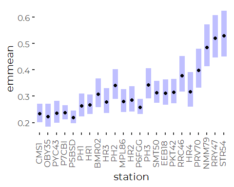

``` r
tn_emms_gam <- as_tibble(tn_emms_gam)
```

The GAM model may have a slight edge, as it represents year to year
variation explicitly and takes that into account in estimating means and
standard errors.

### Compare Model Results – Does it Matter?

#### Compare Models to Observed Means

##### Log Linear Model

``` r
compare <- recent_results %>%
  select(station, station_name, contains('tn')) %>%
  full_join(tn_emms_lm, by = 'station', suffix = c('.data', '.lm'), 
            copy = TRUE)

ggplot(compare, aes(tn_mn, response)) +
  geom_abline(slope = 1, intercept = 0) + 
  geom_point(size = 3, color = 'blue') +
  geom_linerange(aes(xmin = tn_mn - 2 * tn_sd/sqrt(tn_n), 
                     xmax = tn_mn + 2 * tn_sd/sqrt(tn_n))) +
  geom_linerange(aes(ymin = lower.CL, ymax = upper.CL)) +
  xlab('Observed ') +
  ylab('Robust Linear Model') +
  coord_equal() +
  scale_x_log10()+
  scale_y_log10()
```

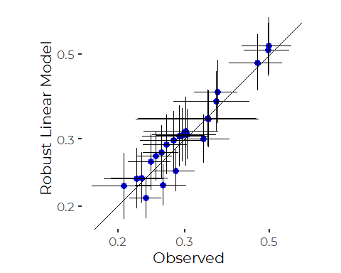
The log linear model generally fits means slightly higher than observed.

##### Robust Log Linear Model

``` r
compare <- recent_results %>%
  select(station, station_name, contains('tn'), contains('tn')) %>%
  full_join(tn_emms_rlm, by = 'station', suffix = c('.data', '.rlm'), 
            copy = TRUE)

ggplot(compare, aes(tn_mn, response)) +
  geom_abline(slope = 1, intercept = 0) + 
  geom_point(size = 3, color = 'blue') +
  geom_linerange(aes(xmin = tn_mn - 2 * tn_sd/sqrt(tn_n), 
                     xmax = tn_mn + 2 * tn_sd/sqrt(tn_n))) +
  geom_linerange(aes(ymin = asymp.LCL, ymax = asymp.UCL)) +
  xlab('Observed ') +
  ylab('Robust Linear Model') +
  coord_equal() +
  scale_x_log10()+
  scale_y_log10()
```

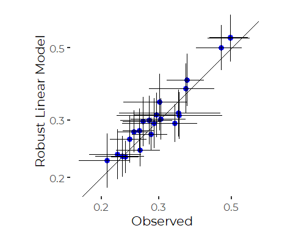
Results of the robust model are very similar.

##### GAM Model

``` r
compare <- recent_results %>%
  select(station, station_name, contains('tn'), contains('tn')) %>%
  full_join(tn_emms_gam, by = 'station', suffix = c('.data', '.lm'), 
            copy = TRUE)

ggplot(compare, aes(tn_mn, response)) +
  geom_abline(slope = 1, intercept = 0) + 
  geom_point(size = 3, color = 'blue') +
  geom_linerange(aes(xmin = tn_mn - 2 * tn_sd/sqrt(tn_n), 
                     xmax = tn_mn + 2 * tn_sd/sqrt(tn_n))) +
  geom_linerange(aes(ymin = lower.CL, ymax = upper.CL)) +
  xlab('Observed ') +
  ylab('GAM Model') +
  coord_equal() +
  scale_x_log10()+
  scale_y_log10()
```

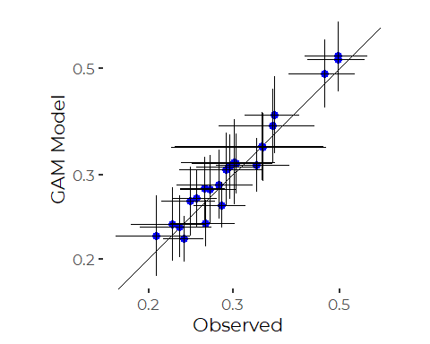
The GAM also provides similar results. The primary effect of using any
of these models to provide estimates of typical site conditions is that
by pooling errors, we end up with lower estimates of error at sites with
small sample sizes. W have little evidence of unequal variances at
different sites, so this is probably a real benefit.

#### Compare Log Linear and Robust Log Linear Models

``` r
compare <- tn_emms_lm %>%
  full_join(tn_emms_rlm, by = 'station', suffix = c('.lm', '.rlm'))
ggplot(compare, aes(response.lm, response.rlm)) +
  geom_abline(slope = 1, intercept = 0) + 
  geom_point(size = 3, color = 'blue') +
  geom_linerange(aes(xmin = lower.CL, xmax = upper.CL)) +
  geom_linerange(aes(ymin = asymp.LCL, ymax = asymp.UCL)) +
  xlab('Linear Model') +
  ylab('Robust Linear Model') +
  coord_equal() +
  scale_x_log10()+
  scale_y_log10()
```

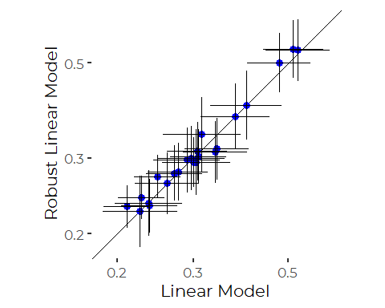

#### Compare GAM Model and Robust Model

``` r
compare <- tn_emms_gam %>%
  full_join(tn_emms_rlm, by = 'station', suffix = c('.gam', '.rlm'))
ggplot(compare, aes(response.gam, response.rlm)) +
  geom_abline(slope = 1, intercept = 0) + 
  geom_point(size = 3, color = 'blue') +
  geom_linerange(aes(xmin = lower.CL, xmax = upper.CL)) +
  geom_linerange(aes(ymin = asymp.LCL, ymax = asymp.UCL)) +
  xlab('GAM Model') +
  ylab('Robust Linear Model') +
  coord_equal() +
  scale_x_log10()+
  scale_y_log10()
```

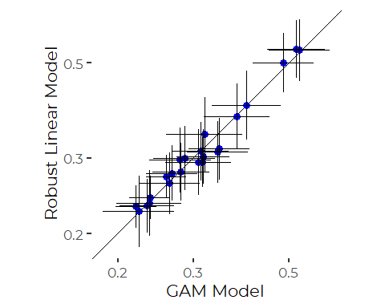
We see high correlation. The choice of model here can make little
difference in interpretation of results. The rough rank order of sites
and general estimates of precision for each model are similar.

### Month Predictions

#### From Linear Model

``` r
tn_emms_months <- emmeans(tn_lm, 'month', type = 'response')
plot(tn_emms_months) + coord_flip()
```

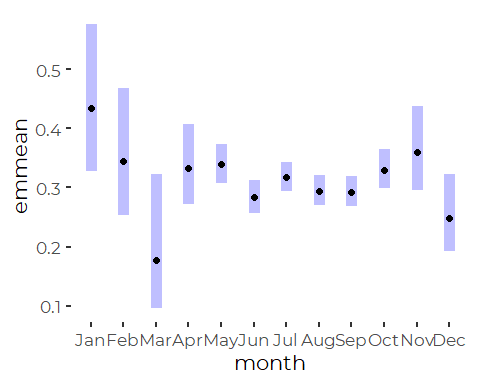

#### From Robust Linear Model

``` r
tn_emms_months <- emmeans(tn_rlm, 'month', type = 'response')
plot(tn_emms_months) + coord_flip()
```

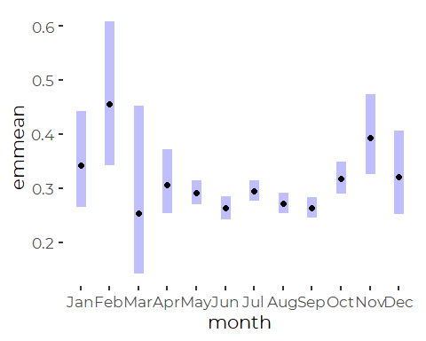
TN is generally higher in colder months, mirroring results for DIN.

Winter month forecasts are quite different for the linear model and the
robust linear model, presumably because of the limited winter data. Note
the to large standard errors.

## Data Restricted to 2018 and 2019

One way we can improve on those models is to restrict our attention to
just the last couple of years, when time of year of samples were more
consistent, with samples collected only in warmer months. This turns out
to make little difference to the qualitative interpretation of the data.

``` r
data_18_19 <- recent_data %>%
  filter(year > 2017) %>%
  filter(month %in% month.abb[5:10])
```

``` r
xtabs(~ year + month, data = data_18_19, subset = ! is.na(tn))
#>       month
#> year   Jan Feb Mar Apr May Jun Jul Aug Sep Oct Nov Dec
#>   2018   0   0   0   0  14  28  20  22   0   0   0   0
#>   2019   0   0   0   0  39  21  42  23  46  18   0   0
```

### Descriptive Statistics

``` r
results_18_19 <- data_18_19 %>%
  mutate(tn = if_else(tn > 1.5 | tn <= 0, NA_real_, tn)) %>%
  group_by(station) %>%
  summarize(across(tn, c(mn = ~ mean(.x, na.rm = TRUE),
                                  sd = ~ sd(.x, na.rm = TRUE), 
                                  n = ~sum(! is.na(.x)),
                                  md = ~ median(.x, na.rm = TRUE),
                                  iqr = ~ IQR(.x, na.rm = TRUE),
                                  p90 = ~ quantile(.x, .9, na.rm = TRUE),
                                  gm = ~ exp(mean(log(.x), na.rm = TRUE))))) %>%
  mutate(station_name = names_df$Alt_Name[match(station,
                                                names_df$Station_ID)]) %>%
  mutate(station = fct_reorder(factor(station), tn_md),
         station_name = fct_reorder(factor(station_name), tn_md)) %>%
  relocate(station_name, .after = station)
```

#### Linear Models

``` r
tn_lm_18_19 <- lm(log(tn) ~ station + month + yearf, data = data_18_19,
                       subset= tn > 0 & tn < 1.5)
anova(tn_lm_18_19)
#> Analysis of Variance Table
#> 
#> Response: log(tn)
#>            Df  Sum Sq Mean Sq F value    Pr(>F)    
#> station    22 17.9620 0.81645  8.2087 < 2.2e-16 ***
#> month       5  1.0555 0.21109  2.1223  0.063469 .  
#> yearf       1  0.7516 0.75158  7.5564  0.006432 ** 
#> Residuals 241 23.9705 0.09946                      
#> ---
#> Signif. codes:  0 '***' 0.001 '**' 0.01 '*' 0.05 '.' 0.1 ' ' 1
```

``` r
oldpar <- par(mfrow = c(2,2))
plot(tn_lm_18_19)
```


``` r
par(oldpar)
```

``` r
tn_lm_18_19_red <- lm(log(tn) ~ station + yearf, 
                 data = data_18_19, subset = tn < 1.5 & tn > 0)
AIC(tn_lm_18_19, tn_lm_18_19_red)
#>                 df      AIC
#> tn_lm_18_19     30 172.3955
#> tn_lm_18_19_red 25 176.8929
```

That suggests the larger model is probably slightly better, even on this
reduced data set.

``` r
oldpar <- par(mfrow = c(2,2))
plot(tn_lm_18_19)
```

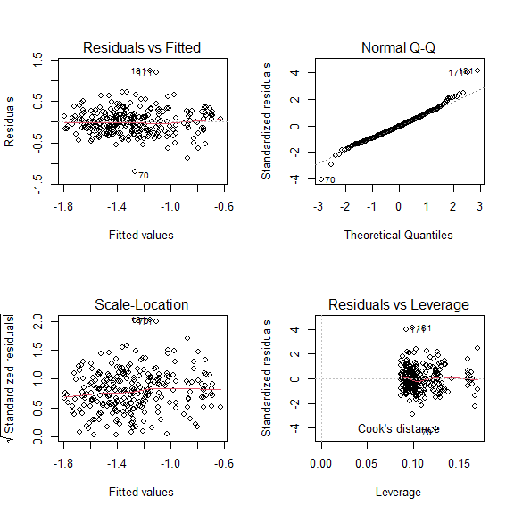

``` r
par(oldpar)
```

##### Extract Marginal Means

``` r
tn_emms_lm_18_19 <- emmeans(tn_lm_18_19, ~station, type = 'response')
plot(tn_emms_lm_18_19) + coord_flip() + 
  theme(axis.text.x = element_text(angle = 90, vjust = 0.25, hjust = 1))
```

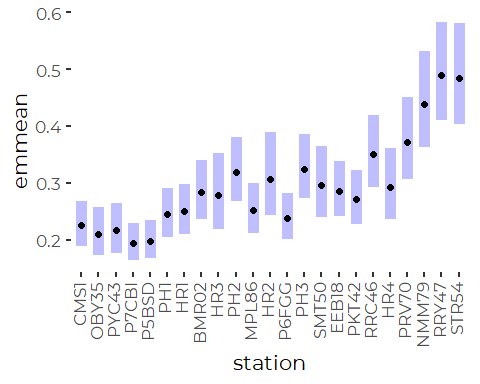

#### Robust Linear Models

The function `rlm()` won’t fit models that are non full-rank. Since we
lack certain month by year by station combinations, we can not fit all
terms.

``` r
tn_rlm_18_19 <- rlm(log(tn) ~ station, 
                     na.action = na.omit,
                     data = data_18_19,
                     subset = tn < 3 & tn > 0)
```

`anova() won't fit  a P value to a robust model, because it is really not appropriate to use the default ANOVA F tests in the context of M estimators.  We need a Wald test F test instead, using`f.robftest()\`.
Even this test should be viewed with caution. Only resampling methods
are likely to give really good estimates of error, but this is
sufficient for our purposes.

``` r
f.robftest(tn_rlm_18_19)
#> 
#>  robust F-test (as if non-random weights)
#> 
#> data:  from rlm(formula = log(tn) ~ station, data = data_18_19, subset = tn < from     3 & tn > 0, na.action = na.omit)
#> F = 10.919, p-value < 2.2e-16
#> alternative hypothesis: two.sided
#> null values:
#> stationOBY35 stationPYC43 stationP7CBI stationP5BSD   stationPH1   stationHR1 
#>            0            0            0            0            0            0 
#> stationBMR02   stationHR3   stationPH2 stationMPL86   stationHR2 stationP6FGG 
#>            0            0            0            0            0            0 
#>   stationPH3 stationSMT50 stationEEB18 stationPKT42 stationRRC46   stationHR4 
#>            0            0            0            0            0            0 
#> stationPRV70 stationNMM79 stationRRY47 stationSTR54 
#>            0            0            0            0
```

So, by the WALD test, both station does matter. but we know that….

##### Extract Margnial Means

``` r
tn_emms_rlm_18_19 <- emmeans(tn_rlm_18_19, 'station', type = 'response')
plot(tn_emms_rlm_18_19) + coord_flip() + 
  theme(axis.text.x = element_text(angle = 90, vjust = 0.25, hjust = 1))
```

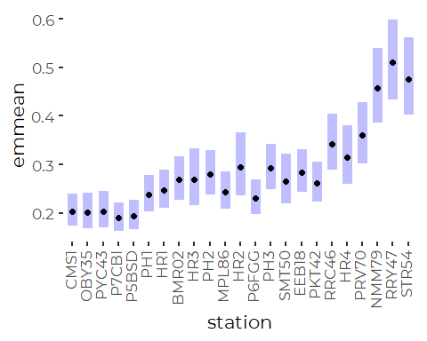

The robust model generally provides slightly narrower error bands, but
the patterns are similar.

``` r
tn_emms_lm_18_19 <- as_tibble(tn_emms_lm_18_19)
tn_emms_rlm_18_19 <- as_tibble(tn_emms_rlm_18_19)
```

#### GAM Models

Fitting the default DOY smoother returns a smoother with an unreasonable
degree of flexibility for seasonal patterns.

``` r
tn_gam_18_19_draft<- gam(log(tn) ~ station + s(doy, bs = 'cs') + 
                                         s(yearf, bs = 're'), 
               data = data_18_19, subset = tn < 1.5 & tn > 0)
anova(tn_gam_18_19_draft)
#> 
#> Family: gaussian 
#> Link function: identity 
#> 
#> Formula:
#> log(tn) ~ station + s(doy, bs = "cs") + s(yearf, bs = "re")
#> 
#> Parametric Terms:
#>         df    F p-value
#> station 22 8.78  <2e-16
#> 
#> Approximate significance of smooth terms:
#>             edf Ref.df     F p-value
#> s(doy)   8.2394 9.0000 3.530 0.00190
#> s(yearf) 0.8649 1.0000 6.301 0.00738
```

``` r
plot(tn_gam_18_19_draft)
```

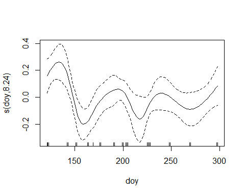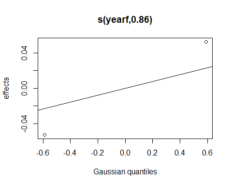
We explored several different smoother specifications. The default
smoother (shown) fits a wiggly day of year curve with effective degrees
of freedom close to 8 that is not reasonable for representing a seasonal
pattern.

But as we reduced the dimensionality of the smoothers, we got
increasingly low predictive ability, and signs that the dimensionality
of the smoother was too low. The effect is that it is unclear whether or
not to retain the smoother.

Note that differences between years are substantial. Year 2016 was
especially distinct. Weather in 2016 was unusual in many ways.

We look at changes in AIC with and without the DOY term.

``` r
tn_gam_18_19<- gam(log(tn) ~ station +  s(yearf, bs = 're'), 
               data = data_18_19, subset = tn < 1.5 & tn > 0)
anova(tn_gam_18_19_draft, tn_gam_18_19)
#> Analysis of Deviance Table
#> 
#> Model 1: log(tn) ~ station + s(doy, bs = "cs") + s(yearf, bs = "re")
#> Model 2: log(tn) ~ station + s(yearf, bs = "re")
#>   Resid. Df Resid. Dev      Df Deviance
#> 1    237.21     22.279                 
#> 2    246.04     25.315 -8.8303  -3.0355
AIC(tn_gam_18_19_draft, tn_gam_18_19)
#>                          df      AIC
#> tn_gam_18_19_draft 33.10423 158.8459
#> tn_gam_18_19       24.78792 176.7014
```

So a reduced dimensionality smoother improves fit and model prediction
as judged by AIC, but it there is not a huge AIC penalty for omitting
the DOY term. We retain a reduced dimensionality smoother.

``` r
gam.check(tn_gam_18_19)
```

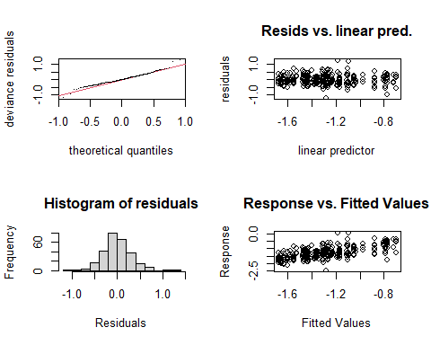

    #> 
    #> Method: GCV   Optimizer: magic
    #> Smoothing parameter selection converged after 4 iterations.
    #> The RMS GCV score gradient at convergence was 5.532238e-07 .
    #> The Hessian was positive definite.
    #> Model rank =  25 / 25 
    #> 
    #> Basis dimension (k) checking results. Low p-value (k-index<1) may
    #> indicate that k is too low, especially if edf is close to k'.
    #> 
    #>             k'   edf k-index p-value
    #> s(yearf) 2.000 0.788      NA      NA

Those diagnostics are pretty good…

##### Marginal Means

``` r
tn_emms_gam_18_19 <- emmeans(tn_gam_18_19, 'station', type = 'response')
plot(tn_emms_gam_18_19) + coord_flip() + 
  theme(axis.text.x = element_text(angle = 90, vjust = 0.25))
```

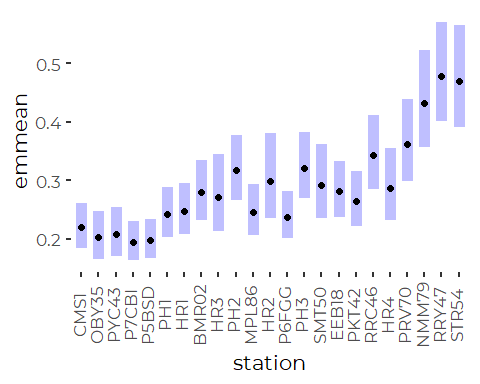

``` r
tn_emms_gam_18_19 <- as_tibble(tn_emms_gam_18_19)
```

### Compare Model Results – Does it Matter?

#### Compare Models to Observed Means

##### Log Linear Model

``` r
compare <- results_18_19 %>%
  select(station, station_name, contains('tn'), contains('din_N')) %>%
  full_join(tn_emms_lm_18_19, by = 'station', suffix = c('.data', '.lm'), 
            copy = TRUE)

ggplot(compare, aes(tn_mn, response)) +
  geom_abline(slope = 1, intercept = 0) + 
  geom_point(size = 3, color = 'blue') +
  geom_linerange(aes(xmin = tn_mn - 2 * tn_sd/sqrt(tn_n), 
                     xmax = tn_mn + 2 * tn_sd/sqrt(tn_n))) +
  geom_linerange(aes(ymin = lower.CL, ymax = upper.CL)) +
  xlab('Observed ') +
  ylab('Robust Linear Model') +
  coord_equal() +
  scale_x_log10()+
  scale_y_log10()
```

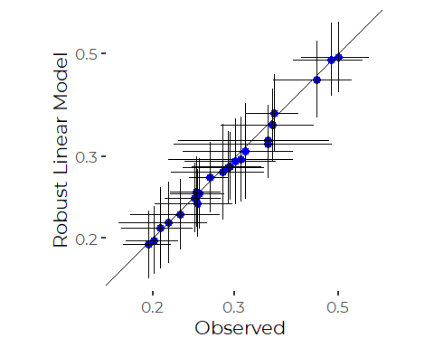
The log linear model generally fits very close to observed.

##### Robust Log Linear Model

``` r
compare <- results_18_19 %>%
  select(station, station_name, contains('tn'), contains('tn')) %>%
  full_join(tn_emms_rlm_18_19, by = 'station', suffix = c('.data', '.lm'), 
            copy = TRUE)

ggplot(compare, aes(tn_mn, response)) +
  geom_abline(slope = 1, intercept = 0) + 
  geom_point(size = 3, color = 'blue') +
  geom_linerange(aes(xmin = tn_mn - 2 * tn_sd/sqrt(tn_n), 
                     xmax = tn_mn + 2 * tn_sd/sqrt(tn_n))) +
  geom_linerange(aes(ymin = asymp.LCL, ymax = asymp.UCL)) +
  xlab('Observed ') +
  ylab('Robust Linear Model') +
  coord_equal() +
  scale_x_log10()+
  scale_y_log10()
```

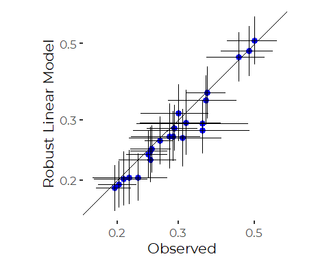

The Robust model generally predicts slightly lower values.

##### GAM Model

``` r
compare <- results_18_19 %>%
  select(station, station_name, contains('tn'), contains('tn')) %>%
  full_join(tn_emms_gam_18_19, by = 'station', suffix = c('.data', '.lm'), 
            copy = TRUE)

ggplot(compare, aes(tn_mn, response)) +
  geom_abline(slope = 1, intercept = 0) + 
  geom_point(size = 3, color = 'blue') +
  geom_linerange(aes(xmin = tn_mn - 2 * tn_sd/sqrt(tn_n), 
                     xmax = tn_mn + 2 * tn_sd/sqrt(tn_n))) +
  geom_linerange(aes(ymin = lower.CL, ymax = upper.CL)) +
  xlab('Observed ') +
  ylab('GAM Model') +
  coord_equal() +
  scale_x_log10()+
  scale_y_log10()
```

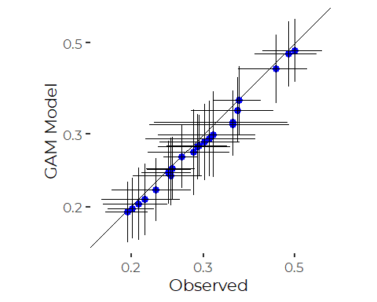

#### Compare Log Linear and Robust Log Linear Models

``` r
compare <- tn_emms_lm_18_19 %>%
  full_join(tn_emms_rlm_18_19, by = 'station', suffix = c('.lm', '.rlm'))
ggplot(compare, aes(response.lm, response.rlm)) +
  geom_abline(slope = 1, intercept = 0) + 
  geom_point(size = 3, color = 'blue') +
  geom_linerange(aes(xmin = lower.CL, xmax = upper.CL)) +
  geom_linerange(aes(ymin = asymp.LCL, ymax = asymp.UCL)) +
  xlab('Linear Model') +
  ylab('Robust Linear Model') +
  coord_equal()
```

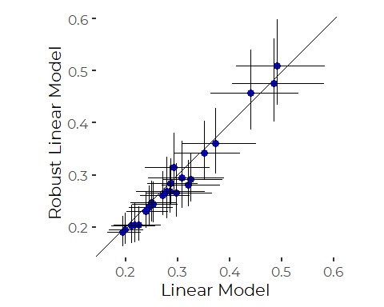

#### Compare GAM Model and Robust Model

``` r
compare <- tn_emms_gam %>%
  full_join(tn_emms_rlm, by = 'station', suffix = c('.gam', '.rlm'))
ggplot(compare, aes(response.gam, response.rlm)) +
  geom_abline(slope = 1, intercept = 0) + 
  geom_point(size = 3, color = 'blue') +
  geom_linerange(aes(xmin = lower.CL, xmax = upper.CL)) +
  geom_linerange(aes(ymin = asymp.LCL, ymax = asymp.UCL)) +
  xlab('GAM Model') +
  ylab('Robust Linear Model') +
  coord_equal()
```

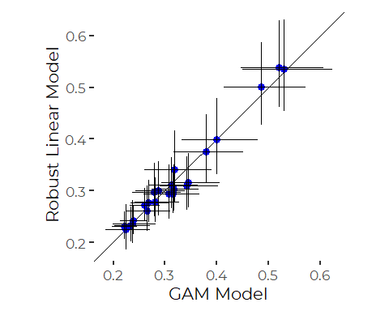
We see high correlation.

## Conclusions

There is only limited value to presenting model results to SoCB readers.

Results are largely independent of model selection, especially for the
data restricted to the last couple of years, where time of year plays
little role. Differences are well within error bands.

It may be simplest to just show observed means for recent years.

# Graphic Ideas

These are based on the Full Data, not the restricted data

## Trim Outliers

``` r
recent_data <- recent_data %>%
  filter(tn > 0, tn < 1.5)
```

### Potential Plot \#1 Points Only

``` r
ggplot(recent_data, aes(tn, station_name)) +

  geom_point(alpha = 0.5, color = cbep_colors()[3]) +
  
  ylab('') +
  xlab('Total Nitrogen\n(mg/l)') +
  theme_cbep(base_size = 12) +
  theme(axis.title.x = element_text(size = 10))  +
  scale_x_log10()
```

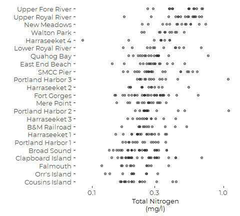

### Potential Plot \#2 Points with Medians and IQR

``` r
ggplot(recent_data, aes(tn, station_name)) +
  
  geom_pointrange(stat = "summary",
                  fun.min = function(z) {quantile(z,0.25)},
                  fun.max = function(z) {quantile(z,0.75)},
                  fun = median,
                  size = 1,
                  shape = 3,
                  color = cbep_colors()[5]) +
  geom_point(alpha = 0.5, color = cbep_colors()[3]) +
  
  ylab('') +
  xlab('Total Nitrogen\n(mg/l)') +
  theme_cbep(base_size = 12) +
  theme(axis.title.x = element_text(size = 10)) +
  scale_x_log10()
```

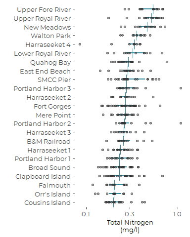

Looks pretty good. The IQR does not add much.

### Potential Plot \#3 Boxplots

Because we are relying here on robust models,

``` r
ggplot(recent_data, aes(tn, station_name)) +
  
  geom_boxplot(color = cbep_colors()[3],
               fill = cbep_colors()[6],
               outlier.shape = NA,
               coef = 0)  + 
  geom_point(alpha = 0.5, color = cbep_colors()[3]) +
  
  ylab('') +
  xlab('Total Nitrogen\n(mg/l)') +
  theme_cbep(base_size = 12) +
  theme(axis.title.x = element_text(size = 10)) +
  scale_x_log10()
```

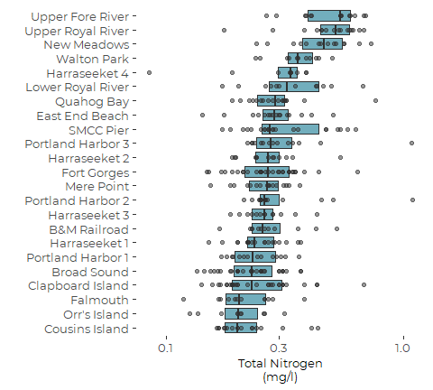

### Potential Plot \#4 Marginal Means Compared with Observations

``` r
tn_emms_gam <- tn_emms_gam  %>%
  mutate(station_name = names_df$Alt_Name[match(station,
                                                names_df$Station_ID)]) %>%
  mutate(station_name = factor(station_name, 
                               levels = levels(recent_results$station_name)))
  
ggplot(tn_emms_gam, aes(response, station_name)) +
  geom_point(data = recent_data, 
             mapping = aes(x = tn, y = station_name),
             alpha = 0.5, color = cbep_colors()[3]) +
  geom_point(color = cbep_colors()[5],
             shape = 3,
             size = 3) +
  geom_linerange(aes(xmin = lower.CL, 
                     xmax = upper.CL),
                 color = cbep_colors()[5],
                 size = .75) +
  # geom_point(data = recent_results, mapping = aes(tn_md, station_name, ),
  #            size = 2, color = cbep_colors()[2]) +
  #geom_point(data = recent_results, mapping = aes(tn_mn, station_name, ),
  #            size = 2, color = cbep_colors()[4]) +
 # geom_point(data = recent_results, mapping = aes(tn_gm, station_name, ),
   #           size = 2, color = cbep_colors()[6]) +
  ylab('') +
  xlab('Total Nitrogen\n(mg/l)') +
  theme_cbep(base_size = 12) +
  theme(axis.title.x = element_text(size = 10)) +
  scale_x_log10()
```

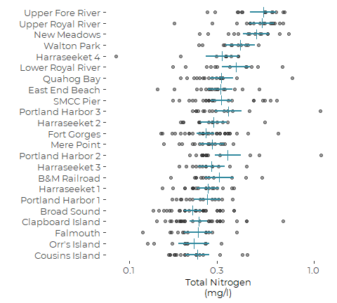

Visually, this is a nice design, but the difference between observed and
modeled measures of location are visually jarring. It may work better
with the recent data.

### Potential Plot \#5 Boxplots with Marginal Means

``` r
  ggplot(recent_data, aes(tn, station_name)) +
  
  geom_boxplot(color = cbep_colors()[5],
               fill = cbep_colors()[6],
               outlier.shape = NA)  + 
  geom_point(alpha = 0.5, color = cbep_colors()[3]) +
  geom_point(data = tn_emms_gam, mapping = aes(response, station_name),
             size = 2, shape = 3,
             color = cbep_colors()[2]) +
  
  ylab('') +
  xlab('Total Nitrogen\n(mg/l)') +
  theme_cbep(base_size = 12) +
  theme(axis.title.x = element_text(size = 10)) +
  scale_x_log10()
```

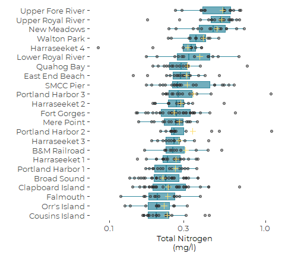

### Potential Plot \#6 Violins

Because we are relying here on robust models,

``` r
ggplot(recent_data, aes(tn, station_name)) +
  
  geom_violin(color = cbep_colors()[5],
               fill = cbep_colors()[6],
              scale = 'width')  + 
  geom_point(alpha = 0.5, color = cbep_colors()[3]) +
  
  ylab('') +
  xlab('Total Nitrogen\n(mg/l)') +
  theme_cbep(base_size = 12) +
  theme(axis.title.x = element_text(size = 10))  +
  scale_x_log10()
```

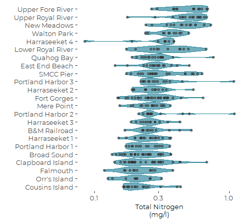
That’s overdone….
