Analysis of Friends of Casco Bay TN Data
================
Curtis C. Bohlen, Casco Bay Estuary Partnership.
04/26/2021

-   [Introduction](#introduction)
-   [Load Libraries](#load-libraries)
-   [Load Data](#load-data)
    -   [Folder References](#folder-references)
    -   [Load Data](#load-data-1)
-   [Station Names](#station-names)
-   [Data Review](#data-review)
    -   [Data Prevalence](#data-prevalence)
    -   [Data Distributions](#data-distributions)
        -   [Outliers Or Errors?](#outliers-or-errors)
        -   [Kurtosis and Skewness](#kurtosis-and-skewness)
-   [Recent Conditions](#recent-conditions)
    -   [Add Shortened Site Names](#add-shortened-site-names)
    -   [Data Review](#data-review-1)
-   [Data Restricted to 2018 and
    2019](#data-restricted-to-2018-and-2019)
    -   [Modeling Goals](#modeling-goals)
-   [Descriptive Statistics](#descriptive-statistics)
-   [Linear Model](#linear-model)
    -   [Extract Marginal Means](#extract-marginal-means)
-   [Robust Linear Model](#robust-linear-model)
    -   [Extract Margnial Means](#extract-margnial-means)
-   [GAM Models](#gam-models)
    -   [Extract Marginal Means](#extract-marginal-means-1)
-   [Compare Model Results – Does it
    Matter?](#compare-model-results--does-it-matter)
    -   [Compare Models to Observed
        Means](#compare-models-to-observed-means)
        -   [Log Linear Model](#log-linear-model)
        -   [Robust Log Linear Model](#robust-log-linear-model)
        -   [GAM Model](#gam-model)
    -   [Compare Log Linear and Robust Log Linear
        Models](#compare-log-linear-and-robust-log-linear-models)
    -   [Compare GAM Model and Robust
        Model](#compare-gam-model-and-robust-model)
-   [Conclusions](#conclusions)


# Introduction

This notebook Looks at TN numbers from Friends of Casco Bay samples.

# Load Libraries

``` r
library(MASS) # for `rlm()` and `lqs()`for robust regression
              # also `cov.rob()` for robust multivariate scatter and covariance.
              # Because MASS contains a function `select()` that conflicts with
              # the tidyverse `select()` function, `MASS` should be loaded before
              # the tidyverse.
library(readxl)
library(tidyverse)
#> -- Attaching packages --------------------------------------- tidyverse 1.3.1 --
#> v ggplot2 3.3.5     v purrr   0.3.4
#> v tibble  3.1.6     v dplyr   1.0.7
#> v tidyr   1.1.4     v stringr 1.4.0
#> v readr   2.1.1     v forcats 0.5.1
#> -- Conflicts ------------------------------------------ tidyverse_conflicts() --
#> x dplyr::filter() masks stats::filter()
#> x dplyr::lag()    masks stats::lag()
#> x dplyr::select() masks MASS::select()

library(mgcv)
#> Loading required package: nlme
#> 
#> Attaching package: 'nlme'
#> The following object is masked from 'package:dplyr':
#> 
#>     collapse
#> This is mgcv 1.8-38. For overview type 'help("mgcv-package")'.
library(emmeans)
library(moments)  # for skewness and kurtosis)

library(sfsmisc)  # Provides alternative access to Wald test for robust models
#> 
#> Attaching package: 'sfsmisc'
#> The following object is masked from 'package:dplyr':
#> 
#>     last

library(CBEPgraphics)
load_cbep_fonts()
theme_set(theme_cbep())
```

# Load Data

## Folder References

``` r
sibfldnm <- 'Data'
parent <- dirname(getwd())
sibling <- file.path(parent,sibfldnm)
```

## Load Data

The data we use here has had a number of suspiciously high NH4 values
removed. See “FOCB\_Nutrients\_Combined.Rmd” for details and
explanation. That affects DIN numbers as well, but has no effect on
analyses looking only at TN.

``` r
strict_data <- read_csv(file.path(sibling, 
                                 "focb_n_data_strict.csv"))%>%
  mutate(month = factor(month, levels = month.abb),
         yearf = factor(year)) %>%
  mutate(dt = as.Date(dt))
#> Rows: 3324 Columns: 17
#> -- Column specification --------------------------------------------------------
#> Delimiter: ","
#> chr   (3): station, month, nh4_ext
#> dbl  (13): year, yearf, doy, tn_depth, din_depth, tn, nox, nh4, din, din_N, ...
#> dttm  (1): dt
#> 
#> i Use `spec()` to retrieve the full column specification for this data.
#> i Specify the column types or set `show_col_types = FALSE` to quiet this message.
```

# Station Names

``` r
fn <- 'FOCB Monitoring Sites SHORT NAMES.xlsx'
names_df <- read_excel(file.path(sibling, fn))
```

# Data Review

## Data Prevalence

``` r
xtabs(~station + year, data = strict_data[! is.na(strict_data$tn),])
#>        year
#> station 2007 2008 2009 2010 2011 2012 2013 2014 2015 2016 2017 2018 2019
#>   BMR02    0    0    0    0    0    0    2    0    0    0    0    4    8
#>   CMS1     0    0    0    0    0    0    0    0    0    2    1    5    9
#>   EEB18    0    0    8    3    2    3    0    0    0    0    2    5    9
#>   HR1      0    0    0    0    0    0    0    4    2    0    4    4    9
#>   HR2      0    0    0    0    0    0    0    4    2    0    4    4    3
#>   HR3      0    0    0    0    0    0    0    4    2    0    4    4    3
#>   HR4      0    0    2    3    2    3    0    0    0    0    0    0    9
#>   KVL84   21   21    8    3    2    3    0    0    0    0    2    1    0
#>   MPL86    0    0    0    0    0    0    0    0    0    0    2    5    9
#>   NMM79    0    0    2    9    2    6    0    0    0    0    2    5    9
#>   OBY35    0    0    0    0    0    0    0    0    0    0    0    3    7
#>   P5BSD    5    8   11    9   11   12    4    6    5   11    1    5    9
#>   P6FGG    6    8   11   10   11   11    4    8    5   11    1    5    9
#>   P7CBI    6    8   11    9   11   11    4    6    5   10    1    5    9
#>   PH1      0    0    0    0    0    0    0    0    0    0    1    4    9
#>   PH2      0    0    0    0    0    0    0    0    0    0    1    4    9
#>   PH3      0    0    0    0    0    0    0    0    0    0    1    4    9
#>   PKT42    4    4    4    5    5    7    2    3    2    0    2    5    9
#>   PRV70   21   24    0    0    2    2    0    0    0    0    0    3    8
#>   PYC43    0    0    0    0    0    0    0    0    0    0    2    3    7
#>   RRC46    0    0    0    0    0    0    0    0    0    0    0    3    9
#>   RRY47    0    0    2    4    2    3    0    0    0    0    2    5    9
#>   SMT50   21   21   11   16   11   13    4    5    8    5    0    1    9
#>   STR54    0    0    7    3    2    1    0    0    0    0    1    4    9
```

TN shows a sparse sampling pattern, with samples at just a handful of
sites before 2017. Data coverage is fairly consistent across sites, but
with uneven quantities year to year from 2017, 2018, and 2019.

## Data Distributions

``` r
ggplot(strict_data, aes(tn)) +
  geom_histogram()
#> `stat_bin()` using `bins = 30`. Pick better value with `binwidth`.
#> Warning: Removed 2413 rows containing non-finite values (stat_bin).
```

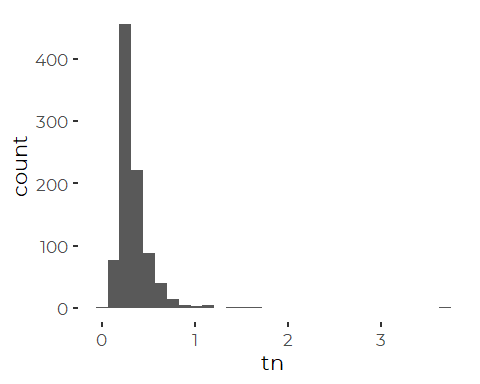

### Outliers Or Errors?

The extreme TN values (over \~ 1.25 or 1.5) are perhaps suspect. The TN
&gt;&gt; 3 has a huge effect on most models, but we have no information
from FOCB that these values are in error.

``` r
strict_data %>%
  filter(tn > 1.25) %>%
  dplyr::select(! contains('depth')) %>%
  dplyr::select(! c(nox, nh4, din)) %>%
  mutate(ratio = din_N / tn) %>%
  relocate(ratio, .before = tn)
#> # A tibble: 4 x 13
#>   station dt          year yearf month   doy   ratio    tn   din_N  nox_N
#>   <chr>   <date>     <dbl> <fct> <fct> <dbl>   <dbl> <dbl>   <dbl>  <dbl>
#> 1 HR4     2012-08-08  2012 2012  Aug     221  0.0233  1.49  0.0348 0.0277
#> 2 NMM79   2019-09-26  2019 2019  Sep     269  0.0840  1.61  0.135  0.0272
#> 3 SMT50   2019-06-12  2019 2019  Jun     163  0.0223  3.69  0.0823 0.0400
#> 4 STR54   2009-06-17  2009 2009  Jun     168 NA       1.36 NA      0.213 
#> # ... with 3 more variables: nh4_N <dbl>, organic_N <dbl>, nh4_ext <chr>
```

NOx and NH4 values are not also high. Two of the samples have din:tn
ratios under 2.5%. That is not, of course, impossible, but it tends to
support the idea that there may have been a problem.

The median din:tn ratio for three of the four sites is close to 20%, so
these are unusual observations in that way as well.

``` r
strict_data %>%
  filter(station %in% c('HR4', 'NMM79', 'SMT50', 'STR54')) %>%
  select(-contains('depth'), -c(nox:din)) %>%
  mutate(ratio = din_N / tn) %>%
  group_by(station) %>%
  summarize(max_tn = max(tn, na.rm = TRUE),
            med_ratio = median(ratio, na.rm = TRUE))
#> # A tibble: 4 x 3
#>   station max_tn med_ratio
#>   <chr>    <dbl>     <dbl>
#> 1 HR4       1.49    0.208 
#> 2 NMM79     1.61    0.0928
#> 3 SMT50     3.69    0.246 
#> 4 STR54     1.36    0.298
```

The NMM79 record has a DIN:TN ration in keeping with other observations
at that site. We can not evaluate a DIN:TN ratio for the high TN
observation at STR54.

For now, we keep all observations in the data, but we remove the TN
&gt;&gt; 3 observation for some later analyses, where it has very high
leverage, and dominates model form.

### Kurtosis and Skewness

So TN data is more highly skewed than the DIN data, and models based on
normal distribution assumptions may not serve us well, even if we
transform the data. This marginal distribution is a heavy tailed
distribution.

``` r
skewness(strict_data$tn, na.rm = TRUE)
#> [1] 6.990284
kurtosis(strict_data$tn, na.rm = TRUE)
#> [1] 102.2489
```

In this case, however, with a few exceptions, a log transform appears to
work fairly well on a site by site basis. A lot of the variation (after
transformation) may reflect differences among sites, and the impact of
uneven sampling histories.

``` r
ggplot(strict_data , aes(log(tn))) +
  geom_density(aes(fill = station)) +
  facet_wrap(~ station) +
  theme_minimal() +         # restores gridlines
  theme(legend.position = 'none')
#> Warning: Removed 2414 rows containing non-finite values (stat_density).
```

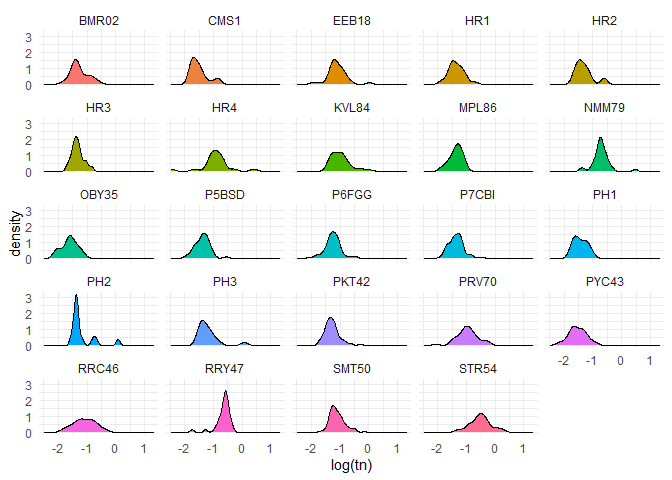

# Recent Conditions

Recent conditions include data from 2015 through 2019. We remove the
data for KVL84 from these analyses, because we have very limited recent
data from that site.

``` r
recent_data <- strict_data %>%
  filter(year > 2014) %>%
  filter(station != 'KVL84') %>%
  filter(! is.na(tn))
```

## Add Shortened Site Names

We also reorder the site factors by median nitrogen values, to simplify
later graphics.

``` r
recent_data <- recent_data %>%
   mutate(station_name = names_df$Alt_Name[match(station,
                                                names_df$Station_ID)]) %>%
   mutate(station = factor(station),
          station_name = factor(station_name)) %>%
  mutate(station = fct_reorder(station, tn, na.rm = TRUE),
         station_name = fct_reorder(station_name, tn, na.rm = TRUE)) %>%
  relocate(station_name, .after = station)
```

## Data Review

Recall that we have some outliers in the TN data. It is not obvious how
to handle these values. The very highest values have high leverage on
several models. Omitting those data is likely to provide a better
summary of recent conditions and trends.

``` r
ggplot(recent_data, aes(station, tn)) +
  geom_point(aes(color = month)) + 
  theme_cbep(base_size = 12) +
  theme(axis.text.x = element_text(angle = 90)) +
  scale_y_log10()
#> Warning: Transformation introduced infinite values in continuous y-axis
```

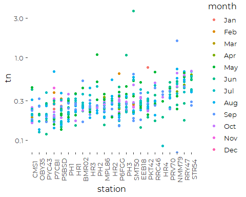

We also have one “zero” value in the recent TN data, so log transforms
are problematic.

``` r
recent_data [ ! is.na(recent_data$tn) & recent_data$tn == 0,]
#> # A tibble: 1 x 18
#>   station station_name dt          year yearf month   doy tn_depth din_depth
#>   <fct>   <fct>        <date>     <dbl> <fct> <fct> <dbl>    <dbl>     <dbl>
#> 1 NMM79   New Meadows  2019-09-06  2019 2019  Sep     249    0.169        NA
#> # ... with 9 more variables: tn <dbl>, nox <dbl>, nh4 <dbl>, din <dbl>,
#> #   din_N <dbl>, nox_N <dbl>, nh4_N <dbl>, organic_N <dbl>, nh4_ext <chr>
```

Generally, we analyze a subset of the complete data that omits the two
highest TN values and the nominal zero value. Those choices do affect
model fits. We have not explored the option of replacing the zero value
with some arbitrary minimum value, as we have no information on
detection limits. We do consider robust regression models.

``` r
recent_results <- recent_data %>%
  mutate(tn = if_else(tn > 1.5 | tn <= 0, NA_real_, tn)) %>%
  group_by(station) %>%
  summarize(across(tn, c(mn = ~ mean(.x, na.rm = TRUE),
                                  sd = ~ sd(.x, na.rm = TRUE), 
                                  n = ~sum(! is.na(.x)),
                                  md = ~ median(.x, na.rm = TRUE),
                                  iqr = ~ IQR(.x, na.rm = TRUE),
                                  p90 = ~ quantile(.x, .9, na.rm = TRUE),
                                  gm = ~ exp(mean(log(.x), na.rm = TRUE))))) %>%
  mutate(station_name = names_df$Alt_Name[match(station,
                                                names_df$Station_ID)]) %>%
  mutate(station = fct_reorder(factor(station), tn_md),
         station_name = fct_reorder(factor(station_name), tn_md)) %>%
  relocate(station_name, .after = station)
```

# Data Restricted to 2018 and 2019

Analysis shows clear seasonal patterns in TN values at many locations
(not shown). However, the sampling histories at each site differ, making
it impossible to compare differences between sites without taking into
account time of year. Several models demonstrated that the problem can
not be fully addressed if we study data from the entire 5 year period.
Sampling history from 2018 and 2019, however, was much more similar
across FOCB’s sampling locations. From here on out we restrict our
attention to data from those last two years, and only from May through
September, when sampling was most consistent.

``` r
data_18_19 <- recent_data %>%
  filter(year > 2017) %>%
  filter(month %in% month.abb[5:10])
```

## Modeling Goals

We want to look at recent conditions, taking into account as best we can
possible covariates, including year and time of year. Our goal is to
extract means, medians, or marginal means by station for the recent data
to support plotting, and evaluate importance of interannual and seasonal
variation.

# Descriptive Statistics

``` r
results_18_19 <- data_18_19 %>%
  mutate(tn = if_else(tn > 1.5 | tn <= 0, NA_real_, tn)) %>%
  group_by(station) %>%
  summarize(across(tn, c(mn = ~ mean(.x, na.rm = TRUE),
                                  sd = ~ sd(.x, na.rm = TRUE), 
                                  n = ~sum(! is.na(.x)),
                                  md = ~ median(.x, na.rm = TRUE),
                                  iqr = ~ IQR(.x, na.rm = TRUE),
                                  p90 = ~ quantile(.x, .9, na.rm = TRUE),
                                  gm = ~ exp(mean(log(.x), na.rm = TRUE))))) %>%
  mutate(station_name = names_df$Alt_Name[match(station,
                                                names_df$Station_ID)]) %>%
  mutate(station = fct_reorder(factor(station), tn_md),
         station_name = fct_reorder(factor(station_name), tn_md)) %>%
  relocate(station_name, .after = station)
```

# Linear Model

``` r
tn_lm_18_19 <- lm(log(tn) ~ station + month + yearf, data = data_18_19,
                       subset= tn > 0 & tn < 1.5)
anova(tn_lm_18_19)
#> Analysis of Variance Table
#> 
#> Response: log(tn)
#>            Df  Sum Sq Mean Sq F value    Pr(>F)    
#> station    22 17.9620 0.81645  8.2087 < 2.2e-16 ***
#> month       5  1.0555 0.21109  2.1223  0.063469 .  
#> yearf       1  0.7516 0.75158  7.5564  0.006432 ** 
#> Residuals 241 23.9705 0.09946                      
#> ---
#> Signif. codes:  0 '***' 0.001 '**' 0.01 '*' 0.05 '.' 0.1 ' ' 1
```

``` r
oldpar <- par(mfrow = c(2,2))
plot(tn_lm_18_19)
```

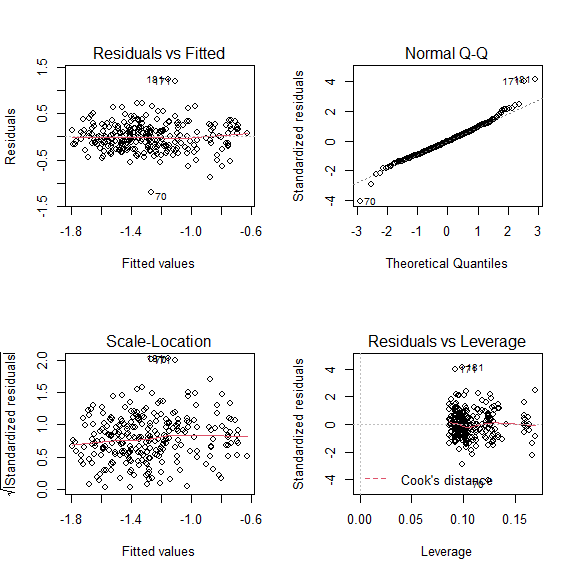

``` r
par(oldpar)
```

``` r
tn_lm_18_19_red <- lm(log(tn) ~ station + yearf, 
                 data = data_18_19, subset = tn < 1.5 & tn > 0)
AIC(tn_lm_18_19, tn_lm_18_19_red)
#>                 df      AIC
#> tn_lm_18_19     30 172.3955
#> tn_lm_18_19_red 25 176.8929
```

That suggests the larger model is slightly better, even on this reduced
data set.

## Extract Marginal Means

``` r
tn_emms_lm_18_19 <- emmeans(tn_lm_18_19, ~station, type = 'response')
plot(tn_emms_lm_18_19) + coord_flip() + 
  theme(axis.text.x = element_text(angle = 90, vjust = 0.25, hjust = 1))
```

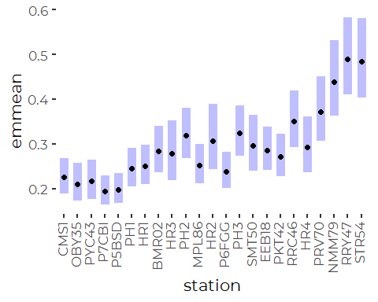

# Robust Linear Model

The function `rlm()` won’t fit models that are non full-rank. Since we
lack certain month by year by station combinations, we can not fit all
terms.

``` r
tn_rlm_18_19 <- rlm(log(tn) ~ station, 
                     na.action = na.omit,
                     data = data_18_19,
                     subset = tn < 3 & tn > 0)
```

`anova() won't fit  a P value to a robust model, because it is really not appropriate to use the default ANOVA F tests in the context of M estimators.  We need a Wald test F test instead, using`f.robftest()\`.
Even this test should be viewed with caution. Only resampling methods
are likely to give really good estimates of error, but this is
sufficient for our purposes.

``` r
f.robftest(tn_rlm_18_19)
#> 
#>  robust F-test (as if non-random weights)
#> 
#> data:  from rlm(formula = log(tn) ~ station, data = data_18_19, subset = tn < from     3 & tn > 0, na.action = na.omit)
#> F = 10.919, p-value < 2.2e-16
#> alternative hypothesis: two.sided
#> null values:
#> stationOBY35 stationPYC43 stationP7CBI stationP5BSD   stationPH1   stationHR1 
#>            0            0            0            0            0            0 
#> stationBMR02   stationHR3   stationPH2 stationMPL86   stationHR2 stationP6FGG 
#>            0            0            0            0            0            0 
#>   stationPH3 stationSMT50 stationEEB18 stationPKT42 stationRRC46   stationHR4 
#>            0            0            0            0            0            0 
#> stationPRV70 stationNMM79 stationRRY47 stationSTR54 
#>            0            0            0            0
```

So, by the WALD test, station does matter. But we knew that….

## Extract Margnial Means

``` r
tn_emms_rlm_18_19 <- emmeans(tn_rlm_18_19, 'station', type = 'response')
plot(tn_emms_rlm_18_19) + coord_flip() + 
  theme(axis.text.x = element_text(angle = 90, vjust = 0.25, hjust = 1))
```

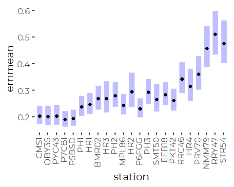

The robust model generally provides slightly narrower error bands, but
the patterns are similar.

``` r
tn_emms_lm_18_19 <- as_tibble(tn_emms_lm_18_19)
tn_emms_rlm_18_19 <- as_tibble(tn_emms_rlm_18_19)
```

# GAM Models

Fitting the default DOY smoother returns a smoother with an unreasonable
degree of flexibility for seasonal patterns.

``` r
tn_gam_18_19_draft<- gam(log(tn) ~ station + s(doy, bs = 'cs') + 
                                         s(yearf, bs = 're'), 
               data = data_18_19, subset = tn < 1.5 & tn > 0)
anova(tn_gam_18_19_draft)
#> 
#> Family: gaussian 
#> Link function: identity 
#> 
#> Formula:
#> log(tn) ~ station + s(doy, bs = "cs") + s(yearf, bs = "re")
#> 
#> Parametric Terms:
#>         df    F p-value
#> station 22 8.78  <2e-16
#> 
#> Approximate significance of smooth terms:
#>             edf Ref.df     F p-value
#> s(doy)   8.2394 9.0000 3.530 0.00190
#> s(yearf) 0.8649 1.0000 6.301 0.00738
```

``` r
plot(tn_gam_18_19_draft)
```

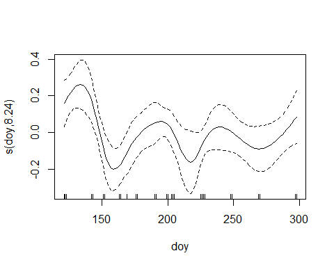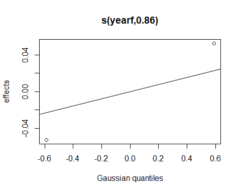

We explored several different smoother specifications. The default
smoother (shown) fits a wiggly day of year curve with effective degrees
of freedom close to 8 that is not reasonable for representing a seasonal
pattern base on such limited data. A reduced dimensionality smoother,
with K = 3 or 4 is more reasonable, but is marginally important as
judged by AIC.

Note that differences between years are substantial. Year 2016 was
especially distinct.

We fit a model without the DOY term.

``` r
tn_gam_18_19<- gam(log(tn) ~ station +  s(yearf, bs = 're'), 
               data = data_18_19, subset = tn < 1.5 & tn > 0)
```

``` r
oldpar <- par(mfrow = c(2,2))
gam.check(tn_gam_18_19)
```

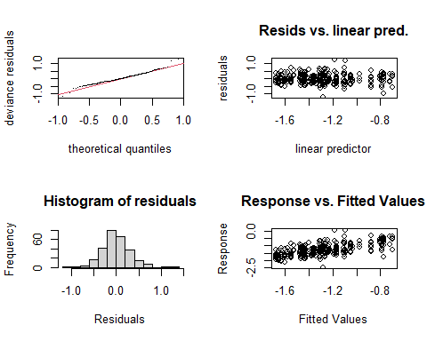

    #> 
    #> Method: GCV   Optimizer: magic
    #> Smoothing parameter selection converged after 4 iterations.
    #> The RMS GCV score gradient at convergence was 5.532238e-07 .
    #> The Hessian was positive definite.
    #> Model rank =  25 / 25 
    #> 
    #> Basis dimension (k) checking results. Low p-value (k-index<1) may
    #> indicate that k is too low, especially if edf is close to k'.
    #> 
    #>             k'   edf k-index p-value
    #> s(yearf) 2.000 0.788      NA      NA
    par(oldpar)

Those diagnostics are pretty good…

## Extract Marginal Means

``` r
tn_emms_gam_18_19 <- emmeans(tn_gam_18_19, 'station', type = 'response')
plot(tn_emms_gam_18_19) + coord_flip() + 
  theme(axis.text.x = element_text(angle = 90, vjust = 0.25))
```

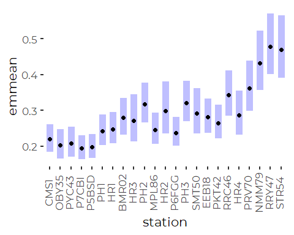

``` r
tn_emms_gam_18_19 <- as_tibble(tn_emms_gam_18_19)
```

# Compare Model Results – Does it Matter?

## Compare Models to Observed Means

### Log Linear Model

``` r
compare <- results_18_19 %>%
  select(station, station_name, contains('tn'), contains('din_N')) %>%
  full_join(tn_emms_lm_18_19, by = 'station', suffix = c('.data', '.lm'), 
            copy = TRUE)

ggplot(compare, aes(tn_mn, response)) +
  geom_abline(slope = 1, intercept = 0) + 
  geom_point(size = 3, color = 'blue') +
  geom_linerange(aes(xmin = tn_mn - 2 * tn_sd/sqrt(tn_n), 
                     xmax = tn_mn + 2 * tn_sd/sqrt(tn_n))) +
  geom_linerange(aes(ymin = lower.CL, ymax = upper.CL)) +
  xlab('Observed ') +
  ylab('Robust Linear Model') +
  coord_equal() +
  scale_x_log10()+
  scale_y_log10()
```

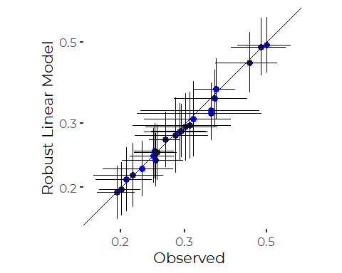

The log linear model generally fits very close to observed.

### Robust Log Linear Model

``` r
compare <- results_18_19 %>%
  select(station, station_name, contains('tn'), contains('tn')) %>%
  full_join(tn_emms_rlm_18_19, by = 'station', suffix = c('.data', '.lm'), 
            copy = TRUE)

ggplot(compare, aes(tn_mn, response)) +
  geom_abline(slope = 1, intercept = 0) + 
  geom_point(size = 3, color = 'blue') +
  geom_linerange(aes(xmin = tn_mn - 2 * tn_sd/sqrt(tn_n), 
                     xmax = tn_mn + 2 * tn_sd/sqrt(tn_n))) +
  geom_linerange(aes(ymin = asymp.LCL, ymax = asymp.UCL)) +
  xlab('Observed ') +
  ylab('Robust Linear Model') +
  coord_equal() +
  scale_x_log10()+
  scale_y_log10()
```

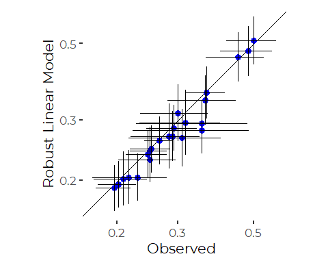

The Robust model generally predicts slightly lower values. THe fit to a
couple of sites is not all that good.

### GAM Model

``` r
compare <- results_18_19 %>%
  select(station, station_name, contains('tn'), contains('tn')) %>%
  full_join(tn_emms_gam_18_19, by = 'station', suffix = c('.data', '.lm'), 
            copy = TRUE)

ggplot(compare, aes(tn_mn, response)) +
  geom_abline(slope = 1, intercept = 0) + 
  geom_point(size = 3, color = 'blue') +
  geom_linerange(aes(xmin = tn_mn - 2 * tn_sd/sqrt(tn_n), 
                     xmax = tn_mn + 2 * tn_sd/sqrt(tn_n))) +
  geom_linerange(aes(ymin = lower.CL, ymax = upper.CL)) +
  xlab('Observed ') +
  ylab('GAM Model') +
  coord_equal() +
  scale_x_log10()+
  scale_y_log10()
```

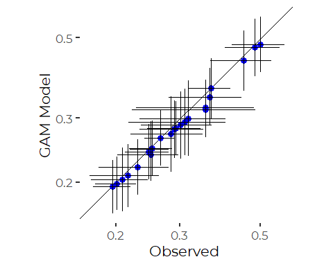

The GAM model (here , really just a hierarchical model) performs very
well, with estimates essentially indistinguishable from the log linear
model.

## Compare Log Linear and Robust Log Linear Models

``` r
compare <- tn_emms_lm_18_19 %>%
  full_join(tn_emms_rlm_18_19, by = 'station', suffix = c('.lm', '.rlm'))
ggplot(compare, aes(response.lm, response.rlm)) +
  geom_abline(slope = 1, intercept = 0) + 
  geom_point(size = 3, color = 'blue') +
  geom_linerange(aes(xmin = lower.CL, xmax = upper.CL)) +
  geom_linerange(aes(ymin = asymp.LCL, ymax = asymp.UCL)) +
  xlab('Linear Model') +
  ylab('Robust Linear Model') +
  coord_equal()
```

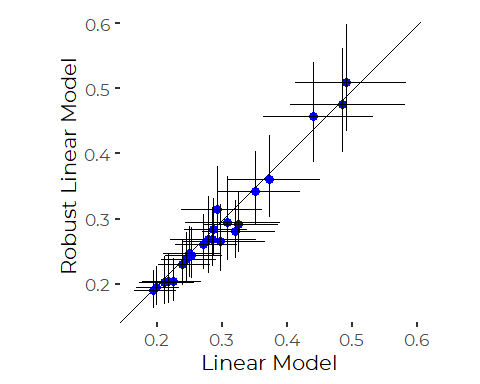

## Compare GAM Model and Robust Model

``` r
compare <- tn_emms_gam_18_19 %>%
  full_join(tn_emms_rlm_18_19, by = 'station', suffix = c('.gam', '.rlm'))
ggplot(compare, aes(response.gam, response.rlm)) +
  geom_abline(slope = 1, intercept = 0) + 
  geom_point(size = 3, color = 'blue') +
  geom_linerange(aes(xmin = lower.CL, xmax = upper.CL)) +
  geom_linerange(aes(ymin = asymp.LCL, ymax = asymp.UCL)) +
  xlab('GAM Model') +
  ylab('Robust Linear Model') +
  coord_equal()
```

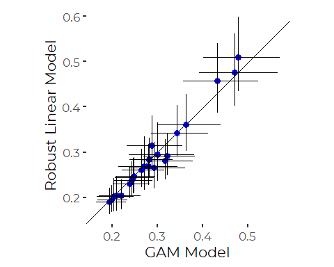

We see high correlations across the board. Differences fall well within
the confidence intervals.

# Conclusions

There is only limited value to presenting model results to SoCB readers.

The strongest qualitative findings from these analyses are that nutrient
levels differ by site, by time of year, and by season. The pattern of
seasonal variation can not be resolved clearly due to lack of consistent
sampling, especially in the colder months.

Otherwise, the broad strokes of the analysis are independent of model
selection, especially for the data restricted to the last couple of
years, where time of year plays little role. Differences between models
and between model results and observed means are well within error
bands.

It therefore is simplest to show raw observations or observed means or
medians for recent years. That avoids any hidden statistical processing,
and shows the data with the least imposed interpretation based on these
analyses.

We follow that approach in developing graphic presentations of these
data.
