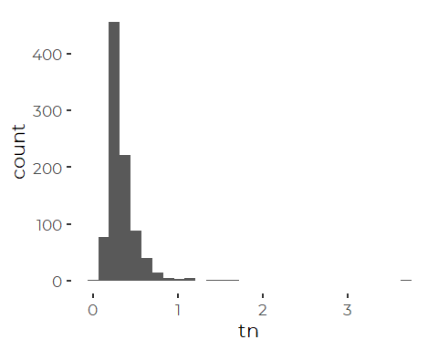

Analysis of Friends of Casco Bay TN Data
================
Curtis C. Bohlen, Casco Bay Estuary Partnership.
04/26/2021

-   [Introduction](#introduction)
-   [Load Libraries](#load-libraries)
-   [Load Data](#load-data)
    -   [Folder References](#folder-references)
    -   [Load Data](#load-data-1)
-   [Station Names](#station-names)
-   [Data Review](#data-review)
    -   [Data Prevalence](#data-prevalence)
    -   [Data Distributions](#data-distributions)
        -   [Outliers Or Errors?](#outliers-or-errors)
-   [Trend Data](#trend-data)
    -   [Identify Trend Stations](#identify-trend-stations)
    -   [Generate Trend Data](#generate-trend-data)
        -   [Data Distribution](#data-distribution)
        -   [Data Prevalence](#data-prevalence-1)
    -   [Generate Core Months Trend
        Data](#generate-core-months-trend-data)
    -   [Models](#models)
        -   [Initial Linear Model](#initial-linear-model)
        -   [Check for Non-linear
            Patterns](#check-for-non-linear-patterns)
        -   [Final Linear Model](#final-linear-model)
        -   [Actual Dates](#actual-dates)
    -   [Using Estimated Marginal
        Means](#using-estimated-marginal-means)


# Introduction

This notebook Looks at TN numbers from Friends of Casco Bay samples.

# Load Libraries

``` r
library(MASS) # for `rlm()` ans `lqs()`for robust regression
              # also `cov.rob()` for robust multivariate scatter and covariance.
              # Because MASS contains a function `select()` that conflicts with
              # the tidyverse `select()` function, `MASS` should be loaded before
              # the tidyverse.

#library(readr)
library(readxl)
library(tidyverse)
#> Warning: package 'tidyverse' was built under R version 4.0.5
#> -- Attaching packages --------------------------------------- tidyverse 1.3.1 --
#> v ggplot2 3.3.5     v purrr   0.3.4
#> v tibble  3.1.6     v dplyr   1.0.7
#> v tidyr   1.1.4     v stringr 1.4.0
#> v readr   2.1.0     v forcats 0.5.1
#> Warning: package 'ggplot2' was built under R version 4.0.5
#> Warning: package 'tidyr' was built under R version 4.0.5
#> Warning: package 'dplyr' was built under R version 4.0.5
#> Warning: package 'forcats' was built under R version 4.0.5
#> -- Conflicts ------------------------------------------ tidyverse_conflicts() --
#> x dplyr::filter() masks stats::filter()
#> x dplyr::lag()    masks stats::lag()
#> x dplyr::select() masks MASS::select()

library(mgcv)    # For generalized linear models
#> Warning: package 'mgcv' was built under R version 4.0.5
#> Loading required package: nlme
#> 
#> Attaching package: 'nlme'
#> The following object is masked from 'package:dplyr':
#> 
#>     collapse
#> This is mgcv 1.8-38. For overview type 'help("mgcv-package")'.
#library(mblm)     # for median-based linear\models -- suitable for simple robust methods.
library(emmeans)
#> Warning: package 'emmeans' was built under R version 4.0.5
library(moments)  # for skewness and kurtosis)

library(sfsmisc)  # Provides alternative access to Wald test for robust models
#> Warning: package 'sfsmisc' was built under R version 4.0.5
#> 
#> Attaching package: 'sfsmisc'
#> The following object is masked from 'package:dplyr':
#> 
#>     last

#library(Ternary) # Base graphics ternary plots

library(CBEPgraphics)
load_cbep_fonts()
theme_set(theme_cbep())
```

# Load Data

## Folder References

``` r
sibfldnm <- 'Derived_Data'
parent <- dirname(getwd())
sibling <- file.path(parent,sibfldnm)

#dir.create(file.path(getwd(), 'figures'), showWarnings = FALSE)
```

## Load Data

The data we use here has had a number of suspiciously high NH4 values
removed. See “FOCB\_Nutrients\_Combined.Rmd” for details and
explanation.

``` r
strict_data <- read_csv(file.path(sibling, 
                                 "focb_n_data_strict.csv"))%>%
  mutate(month = factor(month, levels = month.abb),
         yearf = factor(year)) %>%
  mutate(dt = as.Date(dt))
#> Rows: 3324 Columns: 16
#> -- Column specification --------------------------------------------------------
#> Delimiter: ","
#> chr   (2): station, month
#> dbl  (13): year, yearf, doy, tn_depth, din_depth, tn, nox, nh4, din, din_N, ...
#> dttm  (1): dt
#> 
#> i Use `spec()` to retrieve the full column specification for this data.
#> i Specify the column types or set `show_col_types = FALSE` to quiet this message.
```

# Station Names

``` r
fn <- 'FOCB Monitoring Sites SHORT NAMES.xlsx'
names_df <- read_excel(file.path(sibling, fn))
```

# Data Review

## Data Prevalence

``` r
xtabs(~station + year, data = strict_data[! is.na(strict_data$tn),])
#>        year
#> station 2007 2008 2009 2010 2011 2012 2013 2014 2015 2016 2017 2018 2019
#>   BMR02    0    0    0    0    0    0    2    0    0    0    0    4    8
#>   CMS1     0    0    0    0    0    0    0    0    0    2    1    5    9
#>   EEB18    0    0    8    3    2    3    0    0    0    0    2    5    9
#>   HR1      0    0    0    0    0    0    0    4    2    0    4    4    9
#>   HR2      0    0    0    0    0    0    0    4    2    0    4    4    3
#>   HR3      0    0    0    0    0    0    0    4    2    0    4    4    3
#>   HR4      0    0    2    3    2    3    0    0    0    0    0    0    9
#>   KVL84   21   21    8    3    2    3    0    0    0    0    2    1    0
#>   MPL86    0    0    0    0    0    0    0    0    0    0    2    5    9
#>   NMM79    0    0    2    9    2    6    0    0    0    0    2    5    9
#>   OBY35    0    0    0    0    0    0    0    0    0    0    0    3    7
#>   P5BSD    5    8   11    9   11   12    4    6    5   11    1    5    9
#>   P6FGG    6    8   11   10   11   11    4    8    5   11    1    5    9
#>   P7CBI    6    8   11    9   11   11    4    6    5   10    1    5    9
#>   PH1      0    0    0    0    0    0    0    0    0    0    1    4    9
#>   PH2      0    0    0    0    0    0    0    0    0    0    1    4    9
#>   PH3      0    0    0    0    0    0    0    0    0    0    1    4    9
#>   PKT42    4    4    4    5    5    7    2    3    2    0    2    5    9
#>   PRV70   21   24    0    0    2    2    0    0    0    0    0    3    8
#>   PYC43    0    0    0    0    0    0    0    0    0    0    2    3    7
#>   RRC46    0    0    0    0    0    0    0    0    0    0    0    3    9
#>   RRY47    0    0    2    4    2    3    0    0    0    0    2    5    9
#>   SMT50   21   21   11   16   11   13    4    5    8    5    0    1    9
#>   STR54    0    0    7    3    2    1    0    0    0    0    1    4    9
```

TN shows a similar, if more sparse, sampling pattern, with most samples
at just a handful of sites before 2017. Data coverage is fairly
consistent across sites, but with uneven quantities year to year from
2017, 2018, and 2019.

## Data Distributions

``` r
ggplot(strict_data , aes(tn)) +
  geom_histogram()
#> `stat_bin()` using `bins = 30`. Pick better value with `binwidth`.
#> Warning: Removed 2413 rows containing non-finite values (stat_bin).
```



### Outliers Or Errors?

The extreme TN values are perhaps suspect. The TN &gt;&gt; 3 has a huge
effect on most models, but we have no information from FOCB that these
values are in error.

``` r
strict_data %>%
  filter(tn > 1.25) %>%
  select(-contains('depth'), -c(nox:din)) %>%
  mutate(ratio = din_N / tn) %>%
  relocate(ratio, .before = tn)
#> # A tibble: 4 x 12
#>   station dt          year yearf month   doy   ratio    tn   din_N  nox_N
#>   <chr>   <date>     <dbl> <fct> <fct> <dbl>   <dbl> <dbl>   <dbl>  <dbl>
#> 1 HR4     2012-08-08  2012 2012  Aug     221  0.0233  1.49  0.0348 0.0277
#> 2 NMM79   2019-09-26  2019 2019  Sep     269  0.0840  1.61  0.135  0.0272
#> 3 SMT50   2019-06-12  2019 2019  Jun     163  0.0223  3.69  0.0823 0.0400
#> 4 STR54   2009-06-17  2009 2009  Jun     168 NA       1.36 NA      0.213 
#> # ... with 2 more variables: nh4_N <dbl>, organic_N <dbl>
```

NOx and NH4 values are not also high. Two of the samples have din:tn
ratios under 2.5%. That is not, of course, impossible, but it tends to
support the idea that there may have been a problem. The median din:tn
ratio for three of the four sites is close to 20%, so these are unusual
observations in that way as well.

``` r
strict_data %>%
  filter(station %in% c('HR4', 'NMM79', 'SMT50', 'STR54')) %>%
  select(-contains('depth'), -c(nox:din)) %>%
  mutate(ratio = din_N / tn) %>%
  group_by(station) %>%
  summarize(max_tn = max(tn, na.rm = TRUE),
            med_ratio = median(ratio, na.rm = TRUE))
#> # A tibble: 4 x 3
#>   station max_tn med_ratio
#>   <chr>    <dbl>     <dbl>
#> 1 HR4       1.49    0.208 
#> 2 NMM79     1.61    0.0928
#> 3 SMT50     3.69    0.246 
#> 4 STR54     1.36    0.298
```

The NMM79 record has a DIN:TN ration in keeping with other observations
at that site. We can not evaluate a DIN:TN ratio for the high TN
observation at STR54.

# Trend Data

Few stations have data from more than a few years. TN data has been
collected over the past couple of years, at several stations in the mid
2000s, and at a handful of stations pretty much every year since 2001.
Generally the rule we have used to examine trends is to focus on sites
with relatively complete records, say at least two of the last five
years and at least ten years total.

## Identify Trend Stations

``` r
trend_sites <- strict_data %>%
  group_by(station, year) %>%
  summarize(was_sampled =  ! all(is.na(tn)),
            .groups = 'drop_last') %>%
  summarize(last_5 = sum(was_sampled & year > 2014),
            total = sum(was_sampled),
            .groups = 'drop') %>%
  filter(total >= 10, last_5 >= 2) %>%
  pull(station)
trend_sites
#> [1] "P5BSD" "P6FGG" "P7CBI" "PKT42" "SMT50"
```

## Generate Trend Data

Note that we remove the extreme values here.

``` r
trend_data <- strict_data %>%
   filter(station %in% trend_sites) %>%
   mutate(tn = if_else(tn <= 0 | tn >= 1.5, NA_real_, tn)) %>%
   filter(! is.na(tn)) %>%
   mutate(station_name = names_df$Alt_Name[match(station,
                                                names_df$Station_ID)]) %>%
   mutate(station = factor(station),
          station_name = factor(station_name)) %>%
   mutate(station = fct_reorder(station, tn, na.rm = TRUE),
         station_name = fct_reorder(station_name, tn, na.rm = TRUE)) %>%
   relocate(station_name, .after = station) %>%
   select(-contains('n_N', ignore.case = FALSE), -contains('depth'), -organic_N)
```

### Data Distribution

``` r
ggplot(trend_data, aes(tn)) +
  geom_histogram()
#> `stat_bin()` using `bins = 30`. Pick better value with `binwidth`.
```


### Data Prevalence

``` r
xtabs(~ month + station, data = trend_data )%>%
  as_tibble() %>%
  mutate(month = factor(month, levels = month.abb)) %>%
  filter(n>0) %>%

  ggplot(aes(station, month, fill = sqrt(n))) +
  geom_tile() +
  theme_cbep(base_size = 12) +
  theme(axis.text.x = element_text(angle = 90, hjust = 1, vjust = .25))
```


``` r
xtabs(~ year + station, data = trend_data) %>%
  as_tibble() %>% 
  filter(n>0) %>%

  ggplot(aes(station, year, fill = sqrt(n))) +
  geom_tile() +
  theme_cbep(base_size = 12) +
  theme(axis.text.x = element_text(angle = 90, hjust = 1, vjust = .25))
```


``` r
xtabs(~ year + month, data = trend_data) %>%
  as_tibble() %>% 
  mutate(month = factor(month, levels = month.abb))  %>%
  filter(n>0) %>%

  ggplot(aes(month, year, fill = sqrt(n))) +
  geom_tile() +
  theme_cbep(base_size = 12) +
  theme(axis.text.x = element_text(angle = 90, hjust = 1, vjust = .25))
```


We see the change in FOCB monitoring practices in 2017. Winter data is
not available in recent\_years. If there are seasonal TN trends, annual
averages may be biased.

## Generate Core Months Trend Data

``` r
core_months_data <- trend_data %>%
  filter(month %in% month.abb[5:10])
```

## Models

### Initial Linear Model

``` r
trnd_lm_1 <- lm(log(tn) ~ (year + station_name + month)^2 , 
                data = core_months_data)
anova(trnd_lm_1)
#> Analysis of Variance Table
#> 
#> Response: log(tn)
#>                     Df  Sum Sq Mean Sq F value    Pr(>F)    
#> year                 1  4.6382  4.6382 60.5961 1.257e-13 ***
#> station_name         4  3.5619  0.8905 11.6336 8.991e-09 ***
#> month                5  0.9838  0.1968  2.5706   0.02699 *  
#> year:station_name    4  0.5500  0.1375  1.7963   0.12958    
#> year:month           5  0.8380  0.1676  2.1897   0.05546 .  
#> station_name:month  20  0.8132  0.0407  0.5312   0.95231    
#> Residuals          289 22.1208  0.0765                      
#> ---
#> Signif. codes:  0 '***' 0.001 '**' 0.01 '*' 0.05 '.' 0.1 ' ' 1
```

Note that in this setting, there is no reason to believe all stations
show the same trend, so a model that does not fit trends separately for
each station (via station x year interaction term) is of limited value,
even if the model (as here) suggests the interaction is not important.

We could be more cautious about claiming a trend by fitting a
hierarchical model that treats years as a random factor as well. That
would account for high intra-year autocorrelation. We choose not to do
that here.

``` r
trnd_lm_2 <- step(trnd_lm_1)
#> Start:  AIC=-808.15
#> log(tn) ~ (year + station_name + month)^2
#> 
#>                      Df Sum of Sq    RSS     AIC
#> - station_name:month 20   0.81323 22.934 -836.27
#> <none>                            22.121 -808.15
#> - year:station_name   4   0.60352 22.724 -807.29
#> - year:month          5   0.96334 23.084 -804.12
#> 
#> Step:  AIC=-836.27
#> log(tn) ~ year + station_name + month + year:station_name + year:month
#> 
#>                     Df Sum of Sq    RSS     AIC
#> - year:station_name  4   0.55710 23.491 -836.37
#> <none>                           22.934 -836.27
#> - year:month         5   0.83801 23.772 -834.46
#> 
#> Step:  AIC=-836.37
#> log(tn) ~ year + station_name + month + year:month
#> 
#>                Df Sum of Sq    RSS     AIC
#> <none>                      23.491 -836.37
#> - year:month    5    0.8309 24.322 -834.94
#> - station_name  4    3.4111 26.902 -799.77
```

``` r
anova(trnd_lm_2)
#> Analysis of Variance Table
#> 
#> Response: log(tn)
#>               Df  Sum Sq Mean Sq F value    Pr(>F)    
#> year           1  4.6382  4.6382 61.8000 6.188e-14 ***
#> station_name   4  3.5619  0.8905 11.8647 5.487e-09 ***
#> month          5  0.9838  0.1968  2.6217   0.02431 *  
#> year:month     5  0.8309  0.1662  2.2142   0.05275 .  
#> Residuals    313 23.4911  0.0751                      
#> ---
#> Signif. codes:  0 '***' 0.001 '**' 0.01 '*' 0.05 '.' 0.1 ' ' 1
```

``` r
summary(trnd_lm_2)
#> 
#> Call:
#> lm(formula = log(tn) ~ year + station_name + month + year:month, 
#>     data = core_months_data)
#> 
#> Residuals:
#>      Min       1Q   Median       3Q      Max 
#> -0.84216 -0.18231 -0.04746  0.13215  1.12941 
#> 
#> Coefficients:
#>                               Estimate Std. Error t value Pr(>|t|)    
#> (Intercept)                  25.476942  16.739150   1.522  0.12902    
#> year                         -0.013396   0.008318  -1.611  0.10828    
#> station_nameClapboard Island  0.025089   0.049027   0.512  0.60919    
#> station_nameQuahog Bay        0.155738   0.055314   2.816  0.00518 ** 
#> station_nameFort Gorges       0.144999   0.048447   2.993  0.00298 ** 
#> station_nameSMCC Pier         0.266594   0.045376   5.875 1.08e-08 ***
#> monthJun                     25.540096  25.972245   0.983  0.32619    
#> monthJul                     -6.121752  23.903072  -0.256  0.79804    
#> monthAug                     67.858380  24.679620   2.750  0.00631 ** 
#> monthSep                     29.798411  24.391271   1.222  0.22275    
#> monthOct                     16.632100  26.367552   0.631  0.52865    
#> year:monthJun                -0.012655   0.012910  -0.980  0.32774    
#> year:monthJul                 0.003096   0.011876   0.261  0.79453    
#> year:monthAug                -0.033665   0.012265  -2.745  0.00640 ** 
#> year:monthSep                -0.014777   0.012122  -1.219  0.22376    
#> year:monthOct                -0.008175   0.013103  -0.624  0.53314    
#> ---
#> Signif. codes:  0 '***' 0.001 '**' 0.01 '*' 0.05 '.' 0.1 ' ' 1
#> 
#> Residual standard error: 0.274 on 313 degrees of freedom
#> Multiple R-squared:  0.2989, Adjusted R-squared:  0.2653 
#> F-statistic: 8.896 on 15 and 313 DF,  p-value: < 2.2e-16
```

So the obvious linear model analysis suggests there is a weak negative
linear trend, and there are no differences in trend among stations.

The month to month terms have high standard errors, and the possible
interaction rests principally on the month of August.

``` r
oldpar <- par(mfrow=c(2,2))
plot(trnd_lm_2)
```


``` r
par(oldpar)
```

Other than the heavy tails and slight skewness of the residuals, model
diagnostics are pretty good, suggesting these conclusions will be robust
to most other reasonable model specifications.

### Check for Non-linear Patterns

We start by fitting a polynomial

``` r
trnd_lm_3 <- lm(log(tn) ~ poly(year,2) + station + poly(year,2):station + 
                                month + month:year, data = core_months_data)
anova(trnd_lm_3)
#> Analysis of Variance Table
#> 
#> Response: log(tn)
#>                        Df  Sum Sq Mean Sq F value    Pr(>F)    
#> poly(year, 2)           2  4.6410 2.32052 31.1546 4.919e-13 ***
#> station                 4  3.6279 0.90697 12.1766 3.405e-09 ***
#> month                   5  0.9432 0.18863  2.5325   0.02892 *  
#> poly(year, 2):station   8  0.8059 0.10074  1.3525   0.21708    
#> month:year              5  0.8446 0.16893  2.2680   0.04777 *  
#> Residuals             304 22.6432 0.07448                      
#> ---
#> Signif. codes:  0 '***' 0.001 '**' 0.01 '*' 0.05 '.' 0.1 ' ' 1
anova(trnd_lm_2, trnd_lm_3, test = 'F')
#> Analysis of Variance Table
#> 
#> Model 1: log(tn) ~ year + station_name + month + year:month
#> Model 2: log(tn) ~ poly(year, 2) + station + poly(year, 2):station + month + 
#>     month:year
#>   Res.Df    RSS Df Sum of Sq      F Pr(>F)
#> 1    313 23.491                           
#> 2    304 22.643  9   0.84792 1.2649 0.2555
```

So there is no evidence that we need the non-linear terms to capture the
long-term trend.

### Final Linear Model

We force-fit separate slopes for each station, and drop the year by
month interaction term as being of limited interest, and possibly
misleading.

``` r
trnd_lm <- lm(log(tn) ~ station_name + station_name:year + month,
                data = core_months_data)
anova(trnd_lm)
#> Analysis of Variance Table
#> 
#> Response: log(tn)
#>                    Df  Sum Sq Mean Sq F value    Pr(>F)    
#> station_name        4  5.3691 1.34227 17.7297 3.900e-13 ***
#> month               5  0.9055 0.18109  2.3920   0.03773 *  
#> station_name:year   5  3.4593 0.69186  9.1387 3.943e-08 ***
#> Residuals         314 23.7720 0.07571                      
#> ---
#> Signif. codes:  0 '***' 0.001 '**' 0.01 '*' 0.05 '.' 0.1 ' ' 1
summary(trnd_lm)
#> 
#> Call:
#> lm(formula = log(tn) ~ station_name + station_name:year + month, 
#>     data = core_months_data)
#> 
#> Residuals:
#>     Min      1Q  Median      3Q     Max 
#> -0.8923 -0.1825 -0.0320  0.1306  1.0674 
#> 
#> Coefficients:
#>                                     Estimate Std. Error t value Pr(>|t|)    
#> (Intercept)                        74.541641  17.453711   4.271 2.58e-05 ***
#> station_nameClapboard Island      -11.468651  24.519961  -0.468 0.640304    
#> station_nameQuahog Bay            -43.201490  26.547065  -1.627 0.104665    
#> station_nameFort Gorges           -26.166855  24.441942  -1.071 0.285184    
#> station_nameSMCC Pier             -54.898150  23.154428  -2.371 0.018345 *  
#> monthJun                            0.082046   0.053995   1.520 0.129636    
#> monthJul                            0.115013   0.050262   2.288 0.022785 *  
#> monthAug                            0.116318   0.051600   2.254 0.024871 *  
#> monthSep                            0.066779   0.052082   1.282 0.200724    
#> monthOct                            0.172540   0.054406   3.171 0.001667 ** 
#> station_nameBroad Sound:year       -0.037775   0.008671  -4.356 1.79e-05 ***
#> station_nameClapboard Island:year  -0.032065   0.008571  -3.741 0.000218 ***
#> station_nameQuahog Bay:year        -0.016237   0.009935  -1.634 0.103204    
#> station_nameFort Gorges:year       -0.024703   0.008518  -2.900 0.003993 ** 
#> station_nameSMCC Pier:year         -0.010352   0.007572  -1.367 0.172513    
#> ---
#> Signif. codes:  0 '***' 0.001 '**' 0.01 '*' 0.05 '.' 0.1 ' ' 1
#> 
#> Residual standard error: 0.2751 on 314 degrees of freedom
#> Multiple R-squared:  0.2905, Adjusted R-squared:  0.2589 
#> F-statistic: 9.184 on 14 and 314 DF,  p-value: < 2.2e-16
```

Note that we have significant trends at three sites: Broad Sound,
Clapboard Island, and Fort Gorges.

\#Trend Graphics Ideas \#\#\# Jitter Plot By Year

``` r
ggplot(core_months_data, aes(year, tn,)) +
  geom_jitter(aes(color = station_name)) + 
  stat_summary(fun = mean, geom = 'line', lwd = 1) +
  scale_y_log10() +
  facet_wrap(~station_name, nrow = 5) +
  scale_color_manual(values = cbep_colors()) +
  theme_cbep(base_size = 12) +
  theme(legend.position = 'None')
```


### Actual Dates

``` r
core_months_summary  <-   core_months_data %>%
  select(station_name, year, tn) %>%
  group_by(station_name, year) %>%
  summarize(ann_mn_tn = mean(tn, na.rm = TRUE),
            .groups = 'drop_last') %>%
  filter(! is.na(ann_mn_tn)) %>%
  mutate(dt = as.Date (paste0('06-15-', year), format = '%m-%d-%Y'))
```

``` r
ggplot(core_months_data) +
  geom_point(aes(dt, tn, color = station_name), alpha = 0.5) + 
  geom_line(data = core_months_summary, 
            mapping = aes(x = dt, y = ann_mn_tn), 
            lwd = 1,
            color = cbep_colors()[3]) +
  scale_y_continuous(trans = 'log1p') +
  facet_wrap(~station_name, nrow = 5) +
  scale_color_viridis_d(option = 'viridis') +
  theme_cbep(base_size = 12) +
  theme(legend.position = 'None',
        panel.spacing.x = unit(2.5, "lines")) +
  xlab('') +
  ylab('TN (mg/l)')
```


## Using Estimated Marginal Means

``` r
emms_tn <- emmeans(trnd_lm, c('station_name', 'year'), cov.keep = 'year', type = 'response')
#> NOTE: A nesting structure was detected in the fitted model:
#>     year %in% station_name
```

``` r
emms_df <- as.tibble(emms_tn) %>%
  mutate(dt  = as.Date(paste0(year, '-06-10')))
#> Warning: `as.tibble()` was deprecated in tibble 2.0.0.
#> Please use `as_tibble()` instead.
#> The signature and semantics have changed, see `?as_tibble`.
#> This warning is displayed once every 8 hours.
#> Call `lifecycle::last_lifecycle_warnings()` to see where this warning was generated.
ggplot(emms_df, aes(dt, response, color = station_name)) +
  geom_line() +
  geom_linerange(aes(ymin = lower.CL, ymax = upper.CL))
```


``` r
emms_sig_df <-  emms_df %>%
  filter(station_name %in% c('Broad Sound', 'Clapboard Island',  'Fort Gorges'))
```

``` r
ggplot(core_months_data) +
  geom_point(aes(dt, tn, color = station_name)) + 
  geom_line(data = emms_sig_df, 
            mapping = aes(x = dt, y = response), 
            lwd = 1,
            color = cbep_colors()[3]) +
  scale_y_continuous(trans = 'log1p') +
  facet_wrap(~station_name, nrow = 5) +
  scale_color_viridis_d(option = 'viridis') +
  theme_cbep(base_size = 12) +
  theme(legend.position = 'None',
        panel.grid.major.y = element_line(color = 'gray85'),
        strip.text.y = element_text(size = 9)) +
  xlab('') +
  ylab('Total Nitrogen (mg/l)')
```


