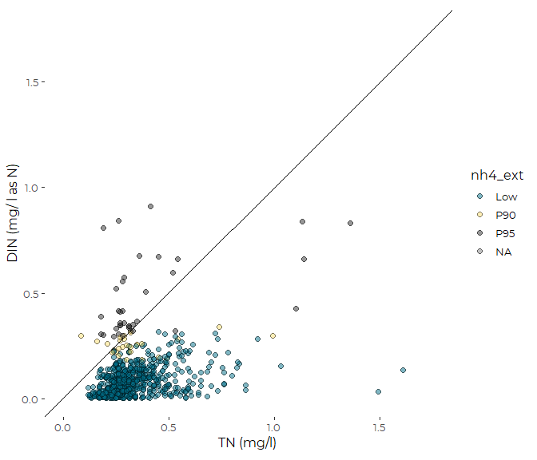
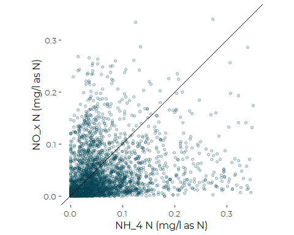
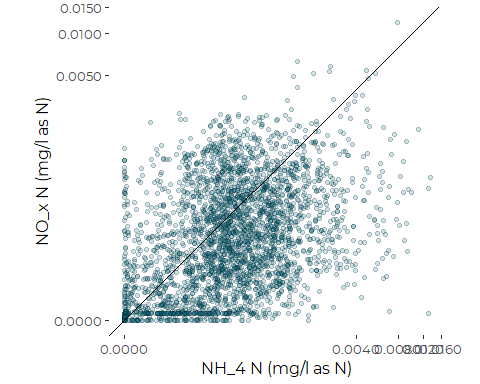
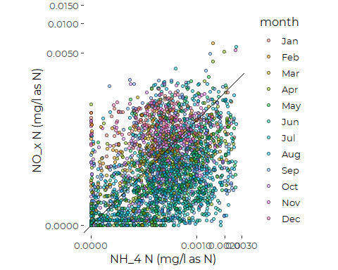
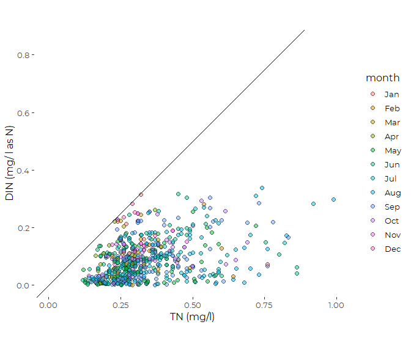

Preliminary Comparison of TN and DIN Data from Friends of Casco Bay
================
Curtis C. Bohlen, Casco Bay Estuary Partnership.
04/26/2021

-   [Introduction](#introduction)
-   [DIN Data](#din-data)
    -   [Folder References](#folder-references)
    -   [Load Data](#load-data)
    -   [Time Stamps are Inconsistent](#time-stamps-are-inconsistent)
    -   [Restrict to Surface Data](#restrict-to-surface-data)
-   [TN Data](#tn-data)
-   [Combined Data](#combined-data)
-   [Data Review](#data-review)
    -   [TN by DIN Graphic](#tn-by-din-graphic)
        -   [Dot Color by Ammonium
            Percentiles](#dot-color-by-ammonium-percentiles)
        -   [List of Samples with DIN &gt;
            TN](#list-of-samples-with-din--tn)
-   [Plotting Ammonium versus
    Nitrates](#plotting-ammonium-versus-nitrates)
    -   [Untrimmed Data](#untrimmed-data)
        -   [Create Transform Function](#create-transform-function)
        -   [Plot on Transformed Axes](#plot-on-transformed-axes)
    -   [Three Alternate Data Pruning
        Strategies](#three-alternate-data-pruning-strategies)
        -   [Restrict to data with DIN &lt;
            TN](#restrict-to-data-with-din--tn)
        -   [Drop Samples with Ammonium in the Top
            5%](#drop-samples-with-ammonium-in-the-top-5)
        -   [Drop BOTH](#drop-both)
        -   [Strict Data DIN by TN](#strict-data-din-by-tn)
-   [Output “Strict Data”](#output-strict-data)


# Introduction

This notebook Looks at DIN and TN numbers from Friends of Casco Bay
samples where both are available. We uncover a certain degree of data
inconsistency, but persevere.

FOCB reports the TN samples and DIN samples were sent to different
laboratories, and so direct comparison relies on consistent calibration,
etc. across two labs. Accordingly, these analyses should be considered
provisional.

FOCB also reports that some DIN samples over the years had unusually
high ammonium values, as uncovered in this analysis, and that those
samples were noted by the laboratory conducting the analyses, but not
flagged as in error.

\#Load libraries

``` r
library(readr)
library(readxl)
library(tidyverse)
#> Warning: package 'tidyverse' was built under R version 4.0.5
#> -- Attaching packages --------------------------------------- tidyverse 1.3.1 --
#> v ggplot2 3.3.5     v dplyr   1.0.7
#> v tibble  3.1.6     v stringr 1.4.0
#> v tidyr   1.1.4     v forcats 0.5.1
#> v purrr   0.3.4
#> Warning: package 'ggplot2' was built under R version 4.0.5
#> Warning: package 'tidyr' was built under R version 4.0.5
#> Warning: package 'dplyr' was built under R version 4.0.5
#> Warning: package 'forcats' was built under R version 4.0.5
#> -- Conflicts ------------------------------------------ tidyverse_conflicts() --
#> x dplyr::filter() masks stats::filter()
#> x dplyr::lag()    masks stats::lag()

#library(mgcv)
library(Ternary) # Base graphics ternary plots
#> Warning: package 'Ternary' was built under R version 4.0.5

library(CBEPgraphics)
load_cbep_fonts()
theme_set(theme_cbep())
```

# DIN Data

## Folder References

``` r
sibfldnm <- 'Original_Data'
parent <- dirname(getwd())
sibling <- file.path(parent,sibfldnm)

dir.create(file.path(getwd(), 'figures'), showWarnings = FALSE)
```

## Load Data

``` r
din_data <- read_excel(file.path(sibling, 
                                 "FOCB DIN All Current Sites.xlsx")) %>%
  
  rename(station = Station,
         dt = Date,
         time = Time,
         sample_depth = `Sample Depth(m)`,
         nox = `NO3+NO2`,
         silicate = `Si(OH)4`,
         nh4 = NH4,
         po4 = PO4,
         din = `DIN(uM)`,
         month = Month,
         year = Year)
```

## Time Stamps are Inconsistent

Some contain strings with times, some are fractions. This probably
reflects differences in whether Excel interpreted data entered as a time
or not.

``` r
head(din_data$time, 25)
#>  [1] "07:30"               "07:30"               "07:15"              
#>  [4] "06:45"               "07:00"               "06:45"              
#>  [7] "07:15"               "0.64930555555555558" "0.31944444444444448"
#> [10] "0.30555555555555552" "0.61458333333333337" "0.29166666666666669"
#> [13] "0.27083333333333331" "0.29166666666666669" "0.30208333333333331"
#> [16] "0.28125"             "0.60416666666666663" "0.26041666666666669"
#> [19] "0.29166666666666669" "0.2902777777777778"  "0.30208333333333331"
#> [22] "0.27083333333333331" "0.61458333333333337" "0.3298611111111111" 
#> [25] "0.29166666666666669"
```

Excel time stamps are fractions of the 24 hour day. Dates are whole
numbers.  
Date time data can include both a whole number of days and a fraction
for time of day.

We can create a function to calculate hours and minutes from a fraction,
and return a time string. We need to address two scenarios: a datetime,
which we convert to a time by dropping the whole number, and a time,
which we convert directly. We then produce a function for converting the
messy excel data to a consistent time string. This addresses the fact
that some entries are strings, not Excel date or time values.

``` r
excel_time <- function(frac) {
  #If it's a datetime from excel, strip off the integer to get a time
  frac <- if_else(frac > 0.9999, frac - trunc(frac), frac)
  # Calculate hour and minute from the decimal fraction
  tm  <- 24 * frac
  hr  <- trunc(tm)
  min <- round((tm - hr) * 60,0)
  # we use formatC to pad the numbers with leading zeros.
  strng <- paste0(formatC(hr, width = 2, format = 'd', flag = '0'), 
                  ':', 
                  formatC(min, width = 2, format = 'd', flag = '0'))
  strng <- if_else(is.na(frac), NA_character_, strng)
  return(strng)
}

clean_excel_time <- function(val) {
  r <- if_else(grepl(':', val),
               val, excel_time(as.numeric(val)))
  return(r)
}
```

``` r
din_data <- din_data %>%
  mutate(time = clean_excel_time(time),
         hour = as.numeric(substr(time,1,2))) %>%
  relocate(year, month, time, hour, .after =  dt)
#> Warning in if_else(frac > 0.9999, frac - trunc(frac), frac): NAs introduced by
#> coercion
```

## Restrict to Surface Data

Samples in the data include both surface samples and samples collected
at various depths. Preliminary analysis showed significant differences
between surface and depth DIN values, but those differences varied by
site and season, greatly complicating any analysis.

TN data is only available from surface samples, (depths &lt; 1 meter) so
here we impose the same restriction on the DIN data.

``` r
din_data <- din_data %>%
  filter(sample_depth <= 1) %>%
  select(-year, -month, -time, -hour, -silicate, -po4)
```

# TN Data

``` r
tn_data <- read_excel(file.path(sibling, 
                                 "FOCB TN All Current Sites.xlsx")) %>%
  rename(station = SiteID,
         dt = Date,
         sample_depth = `Depth (m)`,
         tn = `TN(mg/l)`,
         month = Month,
         year = Year) %>%
  select(-month, -year)
```

TN samples are all surface samples, with a change in how depths were
recorded in 2019.

# Combined Data

``` r
all_data <- tn_data %>%
  full_join(din_data, by = c("station", "dt")) %>%
  filter(! (is.na(nox) &  is.na(nh4) &is.na(tn))) %>%
  mutate(year = as.numeric(format(dt, format = '%Y')),
                           yearf = factor(year),
                           month = as.numeric(format(dt, format = '%m')),
                           month = factor(month, levels = month.abb),
                           doy   = as.numeric(format(dt, format = '%j'))) %>%
  rename(tn_depth  = sample_depth.x,
         din_depth = sample_depth.y) %>%
  relocate(din_depth, .after = tn_depth) %>%
  relocate(year, yearf, month, doy, .after = dt)
```

Note that sample depths don’t always match, but they are seldom very far
apart.

# Data Review

To compare DIN to TN, we need to convert units. The TN values are
reported in mg/l as N. The DIN values are in micromolar, so we need to
multiply them by the molecular weight of nitrogen to convert to
micrograms per liter, then divide by 1000 to convert to milligrams per
liter:

``` r
MW_NH4 <- 14.007 + (1.008 * 4)
MW_NO3 <- 14.007 + (15.999 * 3)
MW_N <- 14.007
p90_95 <- quantile(all_data$nh4, c(0.9, 0.95), na.rm = TRUE)

all_data <- all_data %>%
  mutate(din_N = din * MW_N / 1000,
         nox_N = nox * MW_N / 1000,
         nh4_N = nh4 * MW_N / 1000,
         organic_N = tn - din_N,     # Some values will be negative!
         err = ! is.na(din) & ! is.na(tn) & din_N > tn,
         nh4_ext = cut(nh4, c(0, p90_95, 100), labels = c('Low', 'P90', 'P95')))
```

Note the total rows of data includes many rows with missing values in
one value or another. The following code only adds up rows for which it
was possible to compute DIN and TN values (i.e., records where both
values were defined).

``` r
sum(all_data$err, na.rm = TRUE)
#> [1] 37
sum(! all_data$err, na.rm = TRUE)
#> [1] 3294
```

## TN by DIN Graphic

We check to see if DIN &lt; TN. It’s not….

### Dot Color by Ammonium Percentiles

``` r
ggplot(all_data, aes(tn, din_N)) + 
  geom_point(aes(fill = nh4_ext), size = 2, shape = 21, alpha = 0.5) +
  geom_abline(intercept = 0, slope = 1) +
  scale_fill_manual(values = cbep_colors()) +
  coord_equal() +
  theme_cbep(base_size = 12) +
    ylab('DIN (mg/ l as N)') +
    xlab('TN (mg/l)') +
  xlim(0,1.75) +
  ylim(0,1.75)
#> Warning: Removed 2616 rows containing missing values (geom_point).
```



As suggested by FOCB, a small number of samples were noted by the
laboratory as having unusually high ammonium values. But those samples
were not flagged in any way as in error. FOCB suggested the possibility
of arbitrarily dropping the top 5% or so of samples, which corresponds
to almost all the problematic ammonium / DIN samples. All the
problematic DIN values are in the top 10% of ammonium levels.

We have a number of strategies available for handling that.

-   We can drop those values from analyses entirely  
-   We can use resistant and robust statistics (like trimmed means) that
    downplay the impact of extreme values.
-   We can combine the two strategies.

While robust and resistant methods are attractive in this setting, it is
worth pointing out that if high NH4 values are just plain wrong, as
suspected, their presence will still affect the probability distribution
for the expected value of trimmed means. Their importance will shrink
with higher levels of trimming, but the effect won’t vanish.

### List of Samples with DIN &gt; TN

``` r
all_data[which(all_data$err),] %>%
  select(station, dt) %>%
  arrange(station, dt)
#> # A tibble: 37 x 2
#>    station dt                 
#>    <chr>   <dttm>             
#>  1 EEB18   2012-09-12 00:00:00
#>  2 HR1     2017-08-24 00:00:00
#>  3 HR3     2017-09-25 00:00:00
#>  4 HR4     2019-07-10 00:00:00
#>  5 KVL84   2007-05-30 00:00:00
#>  6 KVL84   2007-06-06 00:00:00
#>  7 KVL84   2017-10-04 00:00:00
#>  8 NMM79   2017-07-21 00:00:00
#>  9 P5BSD   2012-01-23 00:00:00
#> 10 P5BSD   2012-02-16 00:00:00
#> # ... with 27 more rows
```

# Plotting Ammonium versus Nitrates

## Untrimmed Data

This is ALL available data where `nh4_N` and `nox_N` are both defined.
This is a much larger set that rows with TN data too.

``` r
ggplot(all_data, aes(nh4_N, nox_N)) + 
  geom_point(fill = cbep_colors()[1], shape = 21, alpha = 0.2) +
  geom_abline(intercept = 0, slope = 1) +
  theme_cbep(base_size = 12) +
  xlab('NH_4 N (mg/l as N)') +
  ylab('NO_x N (mg/l as N)') +
  xlim(0, 0.35) +
  ylim(0, 0.35) +
  coord_equal()
#> Warning: Removed 354 rows containing missing values (geom_point).
```



### Create Transform Function

It appears `ggplot2` (via `scales`) does not provide a generalized log
transform. Since we have some nominal “zero” values in these data
(non-detects? What was the detection limit?), we can not use a log
transform. Because our values are well below 1.0, we have to add much
less than 1.0 to our transform, so we can’t use `log1p()`.

Unfortunately, this is not creating axis labels in untransformed units.
For exploratory purposes, this is sufficient.

### Plot on Transformed Axes

``` r
maketran = function(.val) {
  scales::trans_new(
    name = 'Generalized Log',
    transform = function(x) log(x + .val),
    inverse = function(x) exp(x) - .val,
    breaks = scales::extended_breaks(),
    minor_breaks = scales::regular_minor_breaks(),
    format = scales::label_number(scale = 0.01),
    domain = c(0, Inf)
  )
}
```

``` r
scale = 0.01
mytran = maketran(scale)

ggplot(all_data, aes(nh4_N, nox_N)) + 
  geom_point(fill = cbep_colors()[1], shape = 21, alpha = 0.2) +
  geom_abline(intercept = 0, slope = 1) +
  theme_cbep(base_size = 12) +
  scale_x_continuous(trans = mytran) +
  scale_y_continuous(trans = mytran) +
  xlab('NH_4 N (mg/l as N)') +
  ylab('NO_x N (mg/l as N)') +
  coord_equal()
#> Warning: Removed 259 rows containing missing values (geom_point).
```



What that shows is that unlike in the tributaries, ammonium and nitrogen
levels are comparable, with ammonium only slightly lower, on average,
than nitrate, but with a huge amount of scatter.

## Three Alternate Data Pruning Strategies

### Restrict to data with DIN &lt; TN

``` r
din_lt_tn_data <- all_data %>%
  #filter(! err | is.na(err)) %>%
  filter(year > 2000)     # Eliminate a handful of early samples
```

This trimming strategy drops a FEW high nitrate values too. We are
implicitly dropping our most extreme nitrogen samples, where those high
ammonium values may reflect real high N values for both ammonium and
nitrates. (And thus the TN value may be misleading.)

### Drop Samples with Ammonium in the Top 5%

``` r
p95 <- quantile(all_data$nh4, 0.95, na.rm = TRUE)
NH4_p95_data <- all_data %>%
  filter(nh4 < p95) %>%
  filter(year > 2000) # Eliminate a handful of very early samples
```

This is a slightly more aggressive trimming of the very highest ammonium
values, but leaves in place a few slightly lower but still high ammonium
values.

``` r
all_data %>%
  filter(year > 2000) %>% 
  select(nh4) %>% 
  filter(! is.na(nh4)) %>% 
  pull %>% 
  length
#> [1] 3066
```

### Drop BOTH

Here we replace suspect values with NA, to retain as much data as
possible. But we have *way* fewer complete data rows than using hte
otehr trimming strategies.

``` r
p95 <- quantile(all_data$nh4, 0.95, na.rm = TRUE)
strict_data <- all_data %>%
  filter(year > 2000) %>%  # Eliminate a handful of very early samples
  mutate(lower_95 = nh4 < p95) %>%
  mutate(nh4 = if_else(lower_95, nh4, NA_real_),
         nh4_N = if_else(lower_95, nh4_N, NA_real_),
         din = if_else(lower_95, din, NA_real_),
         din_N = if_else(lower_95, din_N, NA_real_),
         organic_N = if_else(lower_95, organic_N, NA_real_)) %>%
  mutate(nh4 = if_else(! err, nh4, NA_real_),
         nh4_N = if_else(! err, nh4_N, NA_real_),
         din = if_else(! err, din, NA_real_),
         din_N = if_else(! err, din_N, NA_real_),
         organic_N = if_else(! err, organic_N, NA_real_)) %>%
  select(-err, - nh4_ext, -lower_95) %>%
  mutate(month = as.numeric(format(dt, format = '%m')),
         month = factor(month, levels = 1:12, labels = month.abb)) %>%
  filter(! (is.na(tn) & is.na(nox) & is.na(nh4) & is.na(tn) ))
```

``` r
ggplot(strict_data, aes(nh4_N, nox_N)) + 
  geom_point(aes(fill = month), shape = 21, alpha = 0.5) +
  geom_abline(intercept = 0, slope = 1) +
  theme_cbep(base_size = 12) +
  scale_x_continuous(trans = mytran) +
  scale_y_continuous(trans = mytran) +
  xlab('NH_4 N (mg/l as N)') +
  ylab('NO_x N (mg/l as N)') +
  coord_equal()
#> Warning: Removed 419 rows containing missing values (geom_point).
```



### Strict Data DIN by TN

``` r
ggplot(strict_data, aes(tn, din_N)) + 
  geom_point(aes(fill = month), size = 2, shape = 21, alpha = 0.5) +
  geom_abline(intercept = 0, slope = 1) +
  #scale_fill_manual(values = cbep_colors()) +
  coord_equal() +
  theme_cbep(base_size = 12) +
    ylab('DIN (mg/ l as N)') +
    xlab('TN (mg/l)')  +
  xlim(0,1) #+
#> Warning: Removed 2661 rows containing missing values (geom_point).
```



``` r
  #ylim(0,1.75)
```

# Output “Strict Data”

``` r
strict_data <- strict_data

write_csv(strict_data, 'focb_n_data_strict.csv')
```
