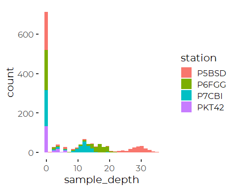
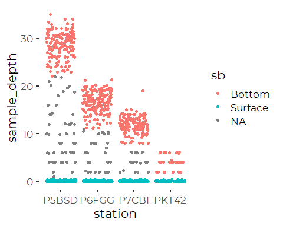

Initial Review of Friends of Casco Bay Nutrient Data
================
Curtis C. Bohlen, Casco Bay Estuary Partnership.
04/26/2021

-   [DIN Data](#din-data)
    -   [Folder References](#folder-references)
    -   [Load Data](#load-data)
    -   [Time Stamps are Inconsistent](#time-stamps-are-inconsistent)
    -   [Address Sample Depths](#address-sample-depths)
        -   [Crosstabs](#crosstabs)
        -   [Create Data Only From Sites With Deep
            Data](#create-data-only-from-sites-with-deep-data)
        -   [Linear Model](#linear-model)
    -   [Surface Versus Depth Models](#surface-versus-depth-models)
        -   [Create Surface and Bottom
            Classes](#create-surface-and-bottom-classes)
-   [TN Data](#tn-data)
    -   [Check Sample Depths](#check-sample-depths)


\#Load libraries

``` r
library(readr)
library(readxl)
library(tidyverse)
#> Warning: package 'tidyverse' was built under R version 4.0.5
#> -- Attaching packages --------------------------------------- tidyverse 1.3.1 --
#> v ggplot2 3.3.3     v dplyr   1.0.6
#> v tibble  3.1.2     v stringr 1.4.0
#> v tidyr   1.1.3     v forcats 0.5.1
#> v purrr   0.3.4
#> Warning: package 'tidyr' was built under R version 4.0.5
#> Warning: package 'dplyr' was built under R version 4.0.5
#> Warning: package 'forcats' was built under R version 4.0.5
#> -- Conflicts ------------------------------------------ tidyverse_conflicts() --
#> x dplyr::filter() masks stats::filter()
#> x dplyr::lag()    masks stats::lag()

library(mgcv)
#> Loading required package: nlme
#> 
#> Attaching package: 'nlme'
#> The following object is masked from 'package:dplyr':
#> 
#>     collapse
#> This is mgcv 1.8-36. For overview type 'help("mgcv-package")'.
library(Ternary) # Base graphics ternary plots
#> Warning: package 'Ternary' was built under R version 4.0.5

library(CBEPgraphics)
load_cbep_fonts()
theme_set(theme_cbep())
```

# DIN Data

## Folder References

``` r
sibfldnm <- 'Original_Data'
parent <- dirname(getwd())
sibling <- file.path(parent,sibfldnm)

#dir.create(file.path(getwd(), 'figures'), showWarnings = FALSE)
```

## Load Data

``` r
din_data <- read_excel(file.path(sibling, 
                                 "FOCB DIN All Current Sites.xlsx")) %>%
  
  rename(station = Station,
         dt = Date,
         time = Time,
         sample_depth = `Sample Depth(m)`,
         nox = `NO3+NO2`,
         silicate = `Si(OH)4`,
         nh4 = NH4,
         po4 = PO4,
         din = `DIN(uM)`,
         month = Month,
         year = Year) %>%
  mutate(month = factor(month, levels = 1:12, labels = month.abb))
```

## Time Stamps are Inconsistent

Some contain strings with times, some are fractions. This probably
reflects differences in whether Excel interpreted data entered as a time
or not.

``` r
head(din_data$time, 25)
#>  [1] "07:30"               "07:30"               "07:15"              
#>  [4] "06:45"               "07:00"               "06:45"              
#>  [7] "07:15"               "0.64930555555555558" "0.31944444444444448"
#> [10] "0.30555555555555552" "0.61458333333333337" "0.29166666666666669"
#> [13] "0.27083333333333331" "0.29166666666666669" "0.30208333333333331"
#> [16] "0.28125"             "0.60416666666666663" "0.26041666666666669"
#> [19] "0.29166666666666669" "0.2902777777777778"  "0.30208333333333331"
#> [22] "0.27083333333333331" "0.61458333333333337" "0.3298611111111111" 
#> [25] "0.29166666666666669"
```

By looking at the Excel spreadsheet, we can see that:

“0.64930555555555558” equates to 15:35 “0.31944444444444448” equates to
7:40.

Excel time stamps are fractions of the 24 hour day. Dates are whole
numbers.  
Date time data can include both a whole number of days and a fraction
for time of day.

We can create a function to calculate hours and minutes from a fraction,
and return a time string. We need to address two scenarios: a datetime,
which we convert to a time by dropping the whole number, and a time,
which we convert directly.

(The `hm()` function from
lubridate`converts strings to intervals, implicitly  since midnight, of formal class`Period`.  The`Period\`
S4 class, is both more capable and more complex than we need.)

``` r
excel_time <- function(frac) {
  #If it's a datetime from excel, strip off the integer to get a time
  frac <- if_else(frac > 0.9999, frac - trunc(frac), frac)
  # Calculate hour and minute from the decimal fraction
  tm  <- 24 * frac
  hr  <- trunc(tm)
  min <- round((tm - hr) * 60,0)
  # we use formatC to pad the numbers with leading zeros.
  strng <- paste0(formatC(hr, width = 2, format = 'd', flag = '0'), 
                  ':', 
                  formatC(min, width = 2, format = 'd', flag = '0'))
  strng <- if_else(is.na(frac), NA_character_, strng)
  return(strng)
}

excel_time(0.64930555555555558)
#> [1] "15:35"
excel_time(0.31944444444444448)
#> [1] "07:40"
excel_time(c(0.64930555555555558, 0.31944444444444448, 17.5, NA))
#> [1] "15:35" "07:40" "12:00" NA
```

So, here’s a general function for converting the messy excel data to a
consistent time string. This addresses the fact that some entries are
strings, not Excel datetimes or times.

``` r
clean_excel_time <- function(val) {
  r <- if_else(grepl(':', val),
               val, excel_time(as.numeric(val)))
  return(r)
}
```

``` r
din_data <- din_data %>%
  mutate(time = clean_excel_time(time),
         hour = as.numeric(substr(time,1,2))) %>%
  relocate(year, month, time, hour, .after =  dt)
#> Warning in if_else(frac > 0.9999, frac - trunc(frac), frac): NAs introduced by
#> coercion
```

## Address Sample Depths

Samples in the data include both surface samples and samples collected
at various depths. This complicates analysis, in part because sampling
history is not consistent across years and sites. Here we explore how
and whether to include depth samples in our analyses.

### Crosstabs

``` r
tmp <- din_data %>%
  mutate(smdpth = round(sample_depth,0))
xtabs(~smdpth + year, data = tmp)
#>       year
#> smdpth 1996 2001 2002 2003 2004 2005 2006 2007 2008 2009 2010 2011 2012 2013
#>     0     5  158  158  189  186  272  232  346  336  267  307   82   67   68
#>     1     1    4    0    0    0    0    0    0    0    0    0    0    0    0
#>     2     1    6    7    7    2    6    3    0    0    0    0    0    0    0
#>     3     0    4    0    0    0    0    0    0    0    0    0    0    0    0
#>     4     0    7    6    8   11    9    6    0    0    0    0    0    0    0
#>     5     1    1    1    0    0    0    0    0    0    0    0    0    0    1
#>     6     0    3    0    8    3    7    5    0    0    0    0    0    0    0
#>     7     0    0    0    0    0    0    0    0    0    0    0    0    0    0
#>     8     0    0    1    3    1    7    1    1    0    0    0    1    1    0
#>     9     0    0    0    1    0    0    2    0    0    0    0    0    1    1
#>     10    0    2    1    5    3    6    1    2    0    0    0    1    0    0
#>     11    0    3    0    1    4    3    3    2    4    1    4    1    5    0
#>     12    0    1    3    7    4    5    4    5    4    5    2    3    3    5
#>     13    0    0    2    0    3    3    2    0    2    1    5    4    3    2
#>     14    0    1    2    6    4    1    5    2    1    0    0    1    1    3
#>     15    1    1    0    1    1    1    6    3    2    2    1    0    0    1
#>     16    0    1    3    2    1    4    2    0    4    1    1    2    3    4
#>     17    0    1    0    3    4    1    4    5    1    1    3    2    1    0
#>     18    0    2    2    1    4    1    1    1    2    3    1    3    0    1
#>     19    0    4    1    2    2    2    1    2    1    1    1    0    1    2
#>     20    0    0    2    0    1    3    1    1    1    0    0    0    0    1
#>     21    0    0    1    0    1    0    1    0    0    0    0    0    0    0
#>     22    0    0    0    0    0    0    0    2    0    0    0    0    0    0
#>     23    0    0    0    0    0    1    0    3    0    0    0    0    0    0
#>     24    0    0    0    0    1    2    0    0    1    0    0    0    1    0
#>     25    0    0    1    1    1    0    0    0    0    0    1    0    1    0
#>     26    0    0    1    2    1    1    0    0    2    0    2    2    0    0
#>     27    0    1    1    0    0    0    0    2    0    0    0    0    1    0
#>     28    0    0    2    3    0    3    5    1    2    0    1    2    2    4
#>     29    0    0    0    0    1    0    3    1    2    0    2    1    1    0
#>     30    0    1    1    3    3    1    1    1    3    2    3    0    0    3
#>     31    0    0    3    0    2    0    3    2    0    3    0    0    4    1
#>     32    0    0    0    1    1    3    0    0    1    1    0    4    0    0
#>     33    0    0    0    2    0    0    2    0    0    0    0    0    0    0
#>     34    0    0    0    0    0    0    0    0    0    0    0    0    0    2
#>     35    0    0    0    0    1    0    0    0    0    0    0    0    0    0
#>       year
#> smdpth 2014 2015 2016 2017 2018 2019
#>     0    37   61   93   33  135  168
#>     1     0    2    0    0    1    2
#>     2     0    0    0    0    0    0
#>     3     0    0    0    0    1    0
#>     4     0    0    2    0    0    0
#>     5     0    0    0    0    2    0
#>     6     0    0    0    0    1    0
#>     7     0    0    0    0    1    0
#>     8     0    1    1    0    0    0
#>     9     0    0    0    0    0    0
#>     10    0    0    1    0    4    0
#>     11    1    0    2    0    6    0
#>     12    2    2    8    0    8    0
#>     13    3    2    1    0    9    0
#>     14    4    3    4    0    3    0
#>     15    1    0    0    0    3    0
#>     16    0    0    2    0    0    0
#>     17    1    1    3    0    1    0
#>     18    2    2    3    0    2    0
#>     19    1    3    1    0    1    0
#>     20    1    2    2    0    0    0
#>     21    0    0    0    0    0    0
#>     22    0    0    0    0    1    0
#>     23    0    1    0    0    2    0
#>     24    0    2    1    0    1    0
#>     25    0    0    0    0    0    0
#>     26    2    0    3    0    0    0
#>     27    0    1    0    0    0    0
#>     28    0    1    4    0    2    0
#>     29    1    1    3    0    0    0
#>     30    1    1    1    0    1    0
#>     31    2    1    1    0    0    0
#>     32    1    0    1    0    0    0
#>     33    1    0    0    0    0    0
#>     34    0    0    0    0    0    0
#>     35    0    0    0    0    0    0
```

1.  For the most part, data has only been collected since 2001.  
2.  Most DIN samples are surface samples.  
3.  There is no complete break in samples by depth, so there is fully
    satisfactory basis for separating the data into “Surface” and
    “Depth” samples, although MOST samples at depth are more than a few
    meters below the surface. There is a partial gap between D \~ 5 and
    D \~ 10.

``` r
tmp <- din_data %>%
  mutate(smdpth = round(sample_depth,0))
xtabs(~smdpth + station, data = tmp)
#>       station
#> smdpth BMR02 CMS1 EEB18  HR1  HR2  HR3  HR4 KVL84 MPL86 NMM79 OBY35 P5BSD P6FGG
#>     0     50   49   122   19  119   15   15   128     8   173    83   192   203
#>     1      0    2     0    1    0    0    0     0     0     4     0     1     0
#>     2      0    0     0    0    0    1    0     0     0     5     0     2     9
#>     3      0    0     0    0    0    1    0     0     0     4     0     0     0
#>     4      0    0     0    0    0    0    0     0     0     6     0     8     6
#>     5      0    0     0    0    3    0    0     0     0     2     0     0     0
#>     6      0    0     0    0    1    0    0     0     0     0     0     8     3
#>     7      0    0     0    0    0    0    0     0     0     0     0     0     1
#>     8      0    0     0    0    0    0    0     0     0     0     0     5     5
#>     9      0    0     0    0    0    0    0     0     0     0     0     0     0
#>     10     0    0     0    0    0    0    0     0     0     0     0     5     7
#>     11     0    0     0    0    0    0    0     0     0     0     0     0     5
#>     12     0    0     0    0    0    0    0     0     0     0     0     6     6
#>     13     0    0     0    0    0    0    0     0     0     0     0     0     5
#>     14     0    0     0    0    0    0    0     0     0     0     0     4    15
#>     15     0    0     0    2    0    0    0     0     0     0     0     0    19
#>     16     0    0     0    0    0    0    0     0     0     0     0     2    28
#>     17     0    0     0    1    0    0    0     0     0     0     0     0    30
#>     18     0    0     0    1    0    0    0     0     0     0     0     1    29
#>     19     0    0     0    1    0    0    0     0     0     0     0     2    22
#>     20     0    0     0    0    0    0    0     0     0     0     0     3    12
#>     21     0    0     0    0    0    0    0     0     0     0     0     1     2
#>     22     0    0     0    0    0    0    0     0     0     0     0     3     0
#>     23     0    0     0    0    0    0    0     0     0     0     0     7     0
#>     24     0    0     0    0    0    0    0     0     0     0     0     9     0
#>     25     0    0     0    0    0    0    0     0     0     0     0     5     0
#>     26     0    0     0    0    0    0    0     0     0     0     0    16     0
#>     27     0    0     0    0    0    0    0     0     0     0     0     6     0
#>     28     0    0     0    0    0    0    0     0     0     0     0    32     0
#>     29     0    0     0    0    0    0    0     0     0     0     0    16     0
#>     30     0    0     0    0    0    0    0     0     0     0     0    26     0
#>     31     0    0     0    0    0    0    0     0     0     0     0    22     0
#>     32     0    0     0    0    0    0    0     0     0     0     0    13     0
#>     33     0    0     0    0    0    0    0     0     0     0     0     5     0
#>     34     0    0     0    0    0    0    0     0     0     0     0     2     0
#>     35     0    0     0    0    0    0    0     0     0     0     0     1     0
#>       station
#> smdpth P7CBI  PH1  PH2  PH3 PKT42 PRV70 PYC43 RRC46 RRY47 SMT50 STR54
#>     0    184   16   15   14   133    87   116   101   129  1128   101
#>     1      0    0    0    1     0     0     0     0     0     1     0
#>     2      5    0    0    0    10     0     0     0     0     0     0
#>     3      0    0    0    0     0     0     0     0     0     0     0
#>     4      8    0    0    0    19     0     0     0     0     2     0
#>     5      0    0    0    0     0     0     0     1     0     0     0
#>     6      5    0    0    0    10     0     0     0     0     0     0
#>     7      0    0    0    0     0     0     0     0     0     0     0
#>     8      8    0    0    0     0     0     0     0     0     0     0
#>     9      5    0    0    0     0     0     0     0     0     0     0
#>     10    12    1    1    0     0     0     0     0     0     0     0
#>     11    30    2    1    2     0     0     0     0     0     0     0
#>     12    53    3    3    0     0     0     0     0     0     0     0
#>     13    30    1    2    4     0     0     0     0     0     0     0
#>     14    22    0    0    0     0     0     0     0     0     0     0
#>     15     3    0    0    0     0     0     0     0     0     0     0
#>     16     0    0    0    0     0     0     0     0     0     0     0
#>     17     0    0    0    0     0     0     0     0     0     1     0
#>     18     0    0    0    0     0     0     0     0     0     0     0
#>     19     1    0    0    0     0     0     0     0     0     0     0
#>     20     0    0    0    0     0     0     0     0     0     0     0
#>     21     0    0    0    0     0     0     0     0     0     0     0
#>     22     0    0    0    0     0     0     0     0     0     0     0
#>     23     0    0    0    0     0     0     0     0     0     0     0
#>     24     0    0    0    0     0     0     0     0     0     0     0
#>     25     0    0    0    0     0     0     0     0     0     0     0
#>     26     0    0    0    0     0     0     0     0     0     0     0
#>     27     0    0    0    0     0     0     0     0     0     0     0
#>     28     0    0    0    0     0     0     0     0     0     0     0
#>     29     0    0    0    0     0     0     0     0     0     0     0
#>     30     0    0    0    0     0     0     0     0     0     0     0
#>     31     0    0    0    0     0     0     0     0     0     0     0
#>     32     0    0    0    0     0     0     0     0     0     0     0
#>     33     0    0    0    0     0     0     0     0     0     0     0
#>     34     0    0    0    0     0     0     0     0     0     0     0
#>     35     0    0    0    0     0     0     0     0     0     0     0
```

So, depth samples were only collected at a few stations with any
regularity. Clearly in this setting, it makes little sense to model
across all stations. We have no reason to think the relationship between
depth and DIN is similar across different sites, and we have too few
sites to treat them as meaningful random samples of possible sites.

The stations with regular depth samples include:

-   P5BSD  
-   P6FGG  
-   P7CBI  
-   PKT42

### Create Data Only From Sites With Deep Data

``` r
deep_data <- din_data %>%
  filter(station %in% c('P5BSD', 'P6FGG', 'P7CBI', 'PKT42')) %>%
  mutate(station = factor(station))
```

### Linear Model

``` r
d_lm <- lm(log1p(din) ~ station + 
                             sample_depth + I(sample_depth^2) +
                             station:sample_depth + station:I(sample_depth^2) + 
                  factor(year) + month, 
                data = deep_data)
anova(d_lm)
#> Analysis of Variance Table
#> 
#> Response: log1p(din)
#>                             Df Sum Sq Mean Sq F value    Pr(>F)    
#> station                      3  38.36 12.7861 19.7617 1.611e-12 ***
#> sample_depth                 1  19.69 19.6909 30.4335 4.193e-08 ***
#> I(sample_depth^2)            1   3.46  3.4623  5.3512   0.02087 *  
#> factor(year)                17 137.23  8.0724 12.4765 < 2.2e-16 ***
#> month                       11 102.71  9.3376 14.4319 < 2.2e-16 ***
#> station:sample_depth         3   3.13  1.0421  1.6106   0.18512    
#> station:I(sample_depth^2)    3   3.94  1.3145  2.0317   0.10765    
#> Residuals                 1254 811.35  0.6470                      
#> ---
#> Signif. codes:  0 '***' 0.001 '**' 0.01 '*' 0.05 '.' 0.1 ' ' 1
```

``` r
d_lm_2 <- step(d_lm)
#> Start:  AIC=-524.02
#> log1p(din) ~ station + sample_depth + I(sample_depth^2) + station:sample_depth + 
#>     station:I(sample_depth^2) + factor(year) + month
#> 
#>                             Df Sum of Sq    RSS     AIC
#> <none>                                   811.35 -524.02
#> - station:I(sample_depth^2)  3     3.944 815.30 -523.75
#> - station:sample_depth       3     4.384 815.74 -523.05
#> - month                     11   101.666 913.02 -393.26
#> - factor(year)              17   133.934 945.29 -360.32
anova(d_lm_2)
#> Analysis of Variance Table
#> 
#> Response: log1p(din)
#>                             Df Sum Sq Mean Sq F value    Pr(>F)    
#> station                      3  38.36 12.7861 19.7617 1.611e-12 ***
#> sample_depth                 1  19.69 19.6909 30.4335 4.193e-08 ***
#> I(sample_depth^2)            1   3.46  3.4623  5.3512   0.02087 *  
#> factor(year)                17 137.23  8.0724 12.4765 < 2.2e-16 ***
#> month                       11 102.71  9.3376 14.4319 < 2.2e-16 ***
#> station:sample_depth         3   3.13  1.0421  1.6106   0.18512    
#> station:I(sample_depth^2)    3   3.94  1.3145  2.0317   0.10765    
#> Residuals                 1254 811.35  0.6470                      
#> ---
#> Signif. codes:  0 '***' 0.001 '**' 0.01 '*' 0.05 '.' 0.1 ' ' 1
```

So `step()` does not alter model selection here, despite non-significant
terms. Sample depth appears to matter, but….

## Surface Versus Depth Models

An alternative way to analyze these data is as “surface” versus “bottom”
data, where “bottom” is defined for each site. Note that the maximum
observed depth is quite different for each site.

``` r
deep_data %>%
  group_by(station) %>%
  summarize(d = max(sample_depth))
#> # A tibble: 4 x 2
#>   station     d
#>   <fct>   <dbl>
#> 1 P5BSD    35  
#> 2 P6FGG    21.3
#> 3 P7CBI    19  
#> 4 PKT42     6.1
```

And the distribution of depths for each site is non-continuous. We
believe FOCB actually sampled DIN at surface and at “bottom” over the
years.

``` r
ggplot(deep_data, aes(sample_depth, fill = station)) + 
  geom_histogram()
#> `stat_bin()` using `bins = 30`. Pick better value with `binwidth`.
```



For P5BSD, “Bottom” is over about 22 meters,  
For P6FGG, over about 11 meters,  
For P7CBI, over about 8 meters, and  
For PKT42, over about 2 meters

### Create Surface and Bottom Classes

``` r
deep_data_2 <- deep_data %>%
  mutate(sb = NA_character_,
         sb = if_else((station == 'P5BSD' & sample_depth > 22) |
                      (station == 'P6FGG' & sample_depth > 11) |
                      (station == 'P7CBI' & sample_depth > 7)  |
                      (station == 'PKT42' & sample_depth > 1.5),
                      'Bottom', sb),
         sb = if_else(sample_depth < 1.0, 'Surface', sb))
```

``` r
ggplot(deep_data_2, aes(station, sample_depth, color = sb)) + 
  geom_jitter(width = .4, height = 0)
```



``` r
sb_lm <- lm(log1p(din) ~ (station + sb + sample_depth)^2 +
                             month + factor(year),
                 data = deep_data_2, subset = ! is.na(sb))
```

``` r
anova(sb_lm)
#> Analysis of Variance Table
#> 
#> Response: log1p(din)
#>                        Df Sum Sq Mean Sq F value    Pr(>F)    
#> station                 3  46.89 15.6284 25.2079 8.456e-16 ***
#> sb                      1   9.61  9.6065 15.4947 8.768e-05 ***
#> sample_depth            1   7.73  7.7260 12.4616 0.0004318 ***
#> month                  11  90.86  8.2600 13.3229 < 2.2e-16 ***
#> factor(year)           17 127.23  7.4841 12.0715 < 2.2e-16 ***
#> station:sb              3   5.89  1.9643  3.1684 0.0236491 *  
#> station:sample_depth    3   3.02  1.0053  1.6215 0.1826198    
#> sb:sample_depth         1   0.76  0.7637  1.2319 0.2672716    
#> Residuals            1155 716.08  0.6200                      
#> ---
#> Signif. codes:  0 '***' 0.001 '**' 0.01 '*' 0.05 '.' 0.1 ' ' 1
```

So, even after segregating surface vs. bottom samples, sample depth
continues to be important, and the difference between surfaceand bottom
varies by site. In short, there is no convenient way to summarize the
differences between surface and depth in DIN.

We conclude we should restrict analysis to one or the other.

# TN Data

``` r
tn_data <- read_excel(file.path(sibling, 
                                 "FOCB TN All Current Sites.xlsx")) %>%
  rename(station = SiteID,
         dt = Date,
         sample_depth = `Depth (m)`,
         tn = `TN(mg/l)`,
         month = Month,
         year = Year) %>%
  mutate(month = factor(month, levels = 1:12, labels = month.abb))
```

## Check Sample Depths

``` r
tmp <- tn_data %>%
  mutate(smdpth = round(sample_depth,1))
xtabs(~smdpth + year, data = tmp)
#>       year
#> smdpth 1996 2007 2008 2009 2010 2011 2012 2013 2014 2015 2016 2017 2018 2019
#>    0      0    0    0    0    0    0    0    0    0    0    0    0    0   20
#>    0.1    0    0    0    0    0    0    0    0    0    0    0    0    0   62
#>    0.2    6   83   94   77   72   63   73   20   40   31   27   34   91   75
#>    0.3    0    0    0    0    0    0    0    0    0    0    0    0    0   23
#>    0.4    0    0    0    0    0    0    0    0    0    0    0    0    0    6
#>    0.5    0    0    0    0    0    0    0    0    0    0    0    0    0    2
#>    1      0    0    0    0    0    0    0    0    0    0    0    0    0    1
```

So TN samples are all surface samples, with a change in how depths were
recorded in 2019.

``` r
xtabs(~station + year, data = tmp)
#>        year
#> station 1996 2007 2008 2009 2010 2011 2012 2013 2014 2015 2016 2017 2018 2019
#>   BMR02    0    0    0    0    0    0    0    2    0    0    0    0    4    8
#>   CMS1     0    0    0    0    0    0    0    0    0    0    2    1    5    9
#>   EEB18    0    0    0    8    3    2    3    0    0    0    0    2    5    9
#>   HR1      1    0    0    0    0    0    0    0    4    2    0    4    4    9
#>   HR2      2    0    0    0    0    0    0    0    4    2    0    4    4    3
#>   HR3      3    0    0    0    0    0    0    0    4    2    0    4    4    3
#>   HR4      0    0    0    2    3    2    3    0    0    0    0    0    0    9
#>   KVL84    0   21   21    8    3    2    3    0    0    0    0    2    1    0
#>   MPL86    0    0    0    0    0    0    0    0    0    0    0    2    5    9
#>   NMM79    0    0    0    2    8    2    4    0    0    0    0    2    5    9
#>   OBY35    0    0    0    0    0    0    0    0    0    0    0    0    3    7
#>   P5BSD    0    5    8   11    9   11   12    4    6    5    7    1    5    9
#>   P6FGG    0    6    8   11   10   11   11    4    8    5    7    1    5    9
#>   P7CBI    0    6    8   11    9   11   11    4    6    5    7    1    5    9
#>   PH1      0    0    0    0    0    0    0    0    0    0    0    1    4    9
#>   PH2      0    0    0    0    0    0    0    0    0    0    0    1    4    9
#>   PH3      0    0    0    0    0    0    0    0    0    0    0    1    4    9
#>   PKT42    0    4    4    4    5    5    7    2    3    2    0    2    5    9
#>   PRV70    0   21   24    0    0    2    2    0    0    0    0    0    3    8
#>   PYC43    0    0    0    0    0    0    0    0    0    0    0    2    3    7
#>   RRC46    0    0    0    0    0    0    0    0    0    0    0    0    3    9
#>   RRY47    0    0    0    2    3    2    3    0    0    0    0    2    5    9
#>   SMT50    0   20   21   11   16   11   13    4    5    8    4    0    1    9
#>   STR54    0    0    0    7    3    2    1    0    0    0    0    1    4    9
```

TN samples are well distributed by station in recent years, but older
data is uneven. Trend analysis will require selection station with a
sufficient record to be useful.
