Graphics From Friends of Casco Bay Nutrient Data
================
Curtis C. Bohlen, Casco Bay Estuary Partnership.
04/26/2021

-   [Introduction](#introduction)
-   [Load Data](#load-data)
    -   [Folder References](#folder-references)
    -   [Load Data](#load-data-1)
    -   [Station Names](#station-names)
-   [Recent Conditions](#recent-conditions)
    -   [TN Data 2018 and 2019](#tn-data-2018-and-2019)
        -   [Descriptive Statistics](#descriptive-statistics)
        -   [Output Descriptive Statistics for
            GIS](#output-descriptive-statistics-for-gis)
    -   [DIN Data from 2019](#din-data-from-2019)
        -   [Descriptive Statistics](#descriptive-statistics-1)
        -   [Output Descriptive Statistics for
            GIS](#output-descriptive-statistics-for-gis-1)
-   [Recent Conditions](#recent-conditions-1)
    -   [Total Nitrogen Graphics](#total-nitrogen-graphics)
        -   [Basic Plot](#basic-plot)
        -   [TN Plot \#2 Points with
            Medians](#tn-plot-2-points-with-medians)
    -   [DIN Graphics](#din-graphics)
        -   [din Plot \#2 Points with
            Medians](#din-plot-2-points-with-medians)
    -   [Combined Graphics](#combined-graphics)
        -   [Combined Dataframe](#combined-dataframe)
        -   [Combined Plot \#1 Points
            Only](#combined-plot-1-points-only)
        -   [Combined Plot \#2 Points with
            Medians](#combined-plot-2-points-with-medians)
        -   [Combined Plot \#3 Boxplots](#combined-plot-3-boxplots)
-   [Trend Data](#trend-data)
    -   [Identify Trend Stations](#identify-trend-stations)
    -   [Generate Trend Data](#generate-trend-data)
    -   [Restrict Data to Summer
        Months](#restrict-data-to-summer-months)
-   [TN Graphics](#tn-graphics)
    -   [Create TN Trend Data](#create-tn-trend-data)
    -   [Showing Annual Medians](#showing-annual-medians)
    -   [ShowingEstimated Marginal
        Means](#showingestimated-marginal-means)
        -   [Linear Model](#linear-model)
-   [Combined Graphics](#combined-graphics-1)
    -   [Reorganize Data](#reorganize-data)
    -   [Potential Plot \# 1 Facet Grid](#potential-plot--1-facet-grid)
    -   [Potential Plot \# 2 Colors](#potential-plot--2-colors)


# Introduction

This notebook produces graphics summarizing DIN and TN data from Friends
of Casco Bay samples.

FOCB reports the TN samples and DIN samples were sent to different
laboratories, and so direct comparison relies on consistent calibration,
etc. across two labs. Accordingly, here we restrict our analysis to
looking at the two data sources as complementary views of nitrogen in
Casco Bay.

FOCB also reports that some DIN samples over the years had unusually
high ammonium values, and that those samples were noted by the
laboratory conducting the analyses, but not flagged as errors. We
created a reduced data set that dropped those potentially spurious
ammonium (and DIN) values. See the notebook
“FOCB\_Nutrients\_Combined.Rmd” for explanation and details.

Note that analysis showed significant site to site, year to year, and
seasonal variation in nutrient values (see “FOCB\_DIN\_Analysis.Rmd” and
“FOCB\_TN\_Analysis.Rmd” for details). Much of the data preparation here
consists of selecting a subset of available data where differences in
sampling history from site to site and month to month are unlikely to
bias results in any significant way.

\#Load Libraries

``` r
#library(MASS) # for `rlm()` ans `lqs()`for robust regression
              # also `cov.rob()` for robust multivariate scatter and covariance.
              # Because MASS contains a function `select()` that conflicts with
              # the tidyverse `select()` function, `MASS` should be loaded before
              # the tidyverse.

#library(readr)
library(readxl)
library(tidyverse)
#> Warning: package 'tidyverse' was built under R version 4.0.5
#> -- Attaching packages --------------------------------------- tidyverse 1.3.1 --
#> v ggplot2 3.3.5     v purrr   0.3.4
#> v tibble  3.1.6     v dplyr   1.0.7
#> v tidyr   1.1.4     v stringr 1.4.0
#> v readr   2.1.0     v forcats 0.5.1
#> Warning: package 'ggplot2' was built under R version 4.0.5
#> Warning: package 'tidyr' was built under R version 4.0.5
#> Warning: package 'dplyr' was built under R version 4.0.5
#> Warning: package 'forcats' was built under R version 4.0.5
#> -- Conflicts ------------------------------------------ tidyverse_conflicts() --
#> x dplyr::filter() masks stats::filter()
#> x dplyr::lag()    masks stats::lag()

library(mgcv)    # For generalized linear models
#> Warning: package 'mgcv' was built under R version 4.0.5
#> Loading required package: nlme
#> 
#> Attaching package: 'nlme'
#> The following object is masked from 'package:dplyr':
#> 
#>     collapse
#> This is mgcv 1.8-38. For overview type 'help("mgcv-package")'.
library(emmeans)
#> Warning: package 'emmeans' was built under R version 4.0.5

library(CBEPgraphics)
load_cbep_fonts()
theme_set(theme_cbep())
```

# Load Data

## Folder References

``` r
sibfldnm <- 'Derived_Data'
parent <- dirname(getwd())
sibling <- file.path(parent,sibfldnm)

dir.create(file.path(getwd(), 'figures'), showWarnings = FALSE)
```

## Load Data

The data we use here has had a number of suspiciously high NH4 values
removed. See “FOCB\_Nutrients\_Combined.Rmd” for details and
explanation.

``` r
strict_data <- read_csv(file.path(sibling, 
                                 "focb_n_data_strict.csv"))%>%
  mutate(dt = as.Date(dt)) %>%
  mutate(month = factor(month, levels = month.abb),
         yearf = factor(year))
#> Rows: 3324 Columns: 16
#> -- Column specification --------------------------------------------------------
#> Delimiter: ","
#> chr   (2): station, month
#> dbl  (13): year, yearf, doy, tn_depth, din_depth, tn, nox, nh4, din, din_N, ...
#> dttm  (1): dt
#> 
#> i Use `spec()` to retrieve the full column specification for this data.
#> i Specify the column types or set `show_col_types = FALSE` to quiet this message.
```

## Station Names

``` r
fn <- 'FOCB Monitoring Sites SHORT NAMES.xlsx'
names_df <- read_excel(file.path(sibling, fn))
```

# Recent Conditions

In our analyses (“FOCB\_DIN\_Analysis.Rmd” and
“FOCB\_TN\_Analysis.Rmd”), we concluded that uneven sampling across
sites, years, and times of year strongly influences models fit to
“recent” data. We have fairly complete data on DIN from all FOCB
stations from 2019, and for TN from 2018 and 2019.

Our primary goal is to provide a map and accompanying chart of DIN and
TN levels. For that, we want to compare all **sites** on an even
footing. We now know that there are important annual and seasonal
processes at work, so the uneven sampling history affects estimates of
site conditions. We worked through several models to account for those
differences, but ultimately concluded that we are better off simply
restricting data to subsets of he available data where those effects are
minimized.

We remove the Knightsville Landing Station, which has very limited TN
data and no DIN data.

``` r
recent_data <- strict_data %>%
  filter(year > 2014) %>%
  filter(station != 'KVL84') %>%
  select(station, dt, year, yearf, month, doy, tn, nox_N, nh4_N, din_N, organic_N)
```

``` r
recent_data <- recent_data %>%
   mutate(station_name = names_df$Alt_Name[match(station,
                                                names_df$Station_ID)]) %>%
   mutate(station = factor(station),
          station_name = factor(station_name)) %>%
   mutate(station = fct_reorder(station, tn, na.rm = TRUE),
         station_name = fct_reorder(station_name, tn, median, na.rm = TRUE)) %>%
   relocate(station_name, .after = station)
```

## TN Data 2018 and 2019

We restrict to May to September and omit station KVL84, for which data
is very sparse.

``` r
tn_data_18_19 <- recent_data %>%
  filter(year > 2017) %>%
  filter(month %in% month.abb[5:9]) %>%
  filter(tn > 0, tn < 1.5) %>%
  select(station, station_name, dt, month, doy, tn) %>%
  mutate(station = fct_reorder(factor(station), tn, na.rm = TRUE)) %>%
  mutate(station_name = fct_reorder(factor(station_name), tn, na.rm = TRUE))
```

### Descriptive Statistics

``` r
tn_results_18_19 <- tn_data_18_19 %>%
  mutate(tn = if_else(tn > 1.5 | tn <= 0, NA_real_, tn)) %>%
  group_by(station) %>%
  summarize(across(tn, c(mn = ~ mean(.x, na.rm = TRUE),
                                  sd = ~ sd(.x, na.rm = TRUE), 
                                  n = ~sum(! is.na(.x)),
                                  md = ~ median(.x, na.rm = TRUE),
                                  iqr = ~ IQR(.x, na.rm = TRUE),
                                  p90 = ~ quantile(.x, .9, na.rm = TRUE),
                                  gm = ~ exp(mean(log(.x), na.rm = TRUE))))) %>%
  mutate(station_name = names_df$Alt_Name[match(station,
                                                names_df$Station_ID)]) %>%
  mutate(station = fct_reorder(factor(station), tn_md),
         station_name = fct_reorder(factor(station_name), tn_md)) %>%
  relocate(station_name, .after = station)
```

### Output Descriptive Statistics for GIS

``` r
write_csv(tn_results_18_19, file.path(sibling, 'GIS', 'tn_18_19.csv'))
```

## DIN Data from 2019

DIN coverage in 2019 is sparse, but consistent across stations. October
often has higher DIN values than other months, and we have uneven
sampling across stations, so we drop October data from the analysis,
since the uneven samples may bias results.

``` r
din_data_19 <- recent_data %>%
  filter(year == 2019)  %>%
  filter(month %in% month.abb[5:9]) %>%
  filter(! is.na(din_N)) %>%
  select(station, station_name, dt, month, doy, din_N) %>%
  mutate(station = factor(station, levels = levels(tn_data_18_19$station))) %>%
  mutate(station_name = factor(station_name, 
                               levels = levels(tn_data_18_19$station_name)))
```

``` r
ggplot(din_data_19, aes(din_N, station_name)) +
  geom_point(aes(color = month)) +
  theme_cbep(base_size = 12) +
  scale_x_log10() +
  ylab('') +
  scale_color_manual(values = cbep_colors2(), name = '') +
  xlab('DIN (mg/l as N)')
```

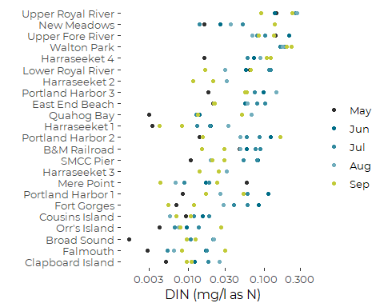

### Descriptive Statistics

``` r
din_results_2019 <- din_data_19 %>%
  group_by(station) %>%
  summarize(across(din_N, c(mn = ~ mean(.x, na.rm = TRUE),
                                  sd = ~ sd(.x, na.rm = TRUE), 
                                  n = ~sum(! is.na(.x)),
                                  md = ~ median(.x, na.rm = TRUE),
                                  iqr = ~ IQR(.x, na.rm = TRUE),
                                  p90 = ~ quantile(.x, .9, na.rm = TRUE),
                                  gm = ~ exp(mean(log(.x), na.rm = TRUE)))))
```

### Output Descriptive Statistics for GIS

``` r
write_csv(din_results_2019, file.path(sibling, 'GIS', 'din_2019.csv'))
```

# Recent Conditions

For consistency, we keep graphics ordered by TN throughout.

## Total Nitrogen Graphics

### Basic Plot

``` r
plt <- ggplot(tn_data_18_19, aes(tn, station_name)) +

  geom_point(alpha = 1, color = cbep_colors()[4]) +
  
  ylab('') +
  xlab('Total Nitrogen (mg/l)') +
  
  theme_cbep(base_size = 12) +
  theme(axis.title.x = element_text(size = 10),
        #axis.text.x= element_text(angle = 45, hjust = 1, size = 8),
        legend.position = 'None',
        #panel.grid.major.x = element_line(color = 'gray85'),
        panel.spacing.x = unit(1, 'lines')) +
  
  geom_vline(xintercept = 0.32, color = cbep_colors()[3], lty = 3) +
  geom_text(aes(x = 0.35, y = 3, label = '0.32'), 
            angle = 90, hjust = 0, size = 3,
                color = cbep_colors()[3]) +
  geom_vline(xintercept = 0.45, color = cbep_colors()[3], lty = 3) +
  geom_text(aes(x = 0.49, y = 3, label = '0.45'), 
            angle = 90, hjust = 0, size = 3,
                color = cbep_colors()[3]) +
  ggtitle('FOCB Data 2018-2019')
plt
```

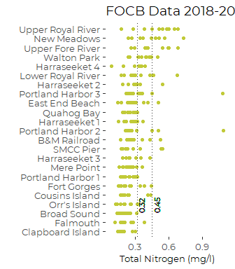

``` r
ggsave('figures/tn_by_site.pdf', device = cairo_pdf, width = 3.5, height = 4)
```

### TN Plot \#2 Points with Medians

``` r
plt + 
  # geom_pointrange(stat = "summary",
  #                 fun.min = function(z) {quantile(z,0.25)},
  #                 fun.max = function(z) {quantile(z,0.75)},
  #                 fun = median,
  #                 size = .5,
  #                 shape = 3,
  #                 color = cbep_colors()[5]) +

  stat_summary(fun = median,
                  size = .5,
                  shape = 3,
                  color = cbep_colors()[3])
#> Warning: Removed 23 rows containing missing values (geom_segment).
```

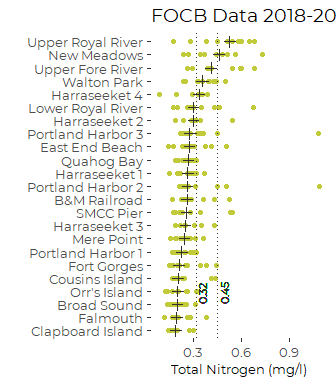

``` r

ggsave('figures/tn_by_site_median.pdf', device = cairo_pdf, width = 3.5, height = 4)
#> Warning: Removed 23 rows containing missing values (geom_segment).
```

## DIN Graphics

``` r
plt <- ggplot(din_data_19, aes(din_N, station_name)) +

  geom_point(alpha = 1, color = cbep_colors()[6]) +
  
  ylab('') +
  xlab('Dissolved Inorganic Nitrogen\n(mg/l)') +
  
  theme_cbep(base_size = 12) +
  theme(axis.title.x = element_text(size = 9),
        legend.position = 'None',
        #panel.grid.major.x = element_line(color = 'gray85'),
        panel.spacing.x = unit(1, 'lines')) +
  ggtitle('FOCB Data 2019')
plt
```

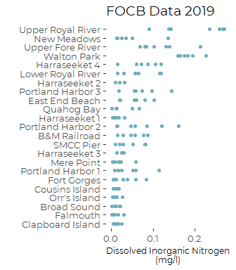

``` r
ggsave('figures/din_by_site.pdf', device = cairo_pdf, width = 3.5, height = 4)
```

### din Plot \#2 Points with Medians

``` r
plt + 
  # geom_pointrange(stat = "summary",
  #                 fun.min = function(z) {quantile(z,0.25)},
  #                 fun.max = function(z) {quantile(z,0.75)},
  #                 fun = median,
  #                 size = .5,
  #                 shape = 3,
  #                 color = cbep_colors()[5]) +

  stat_summary(fun = median,
                  size = .5,
                  shape = 3,
                  color = cbep_colors()[3])
#> Warning: Removed 23 rows containing missing values (geom_segment).
```

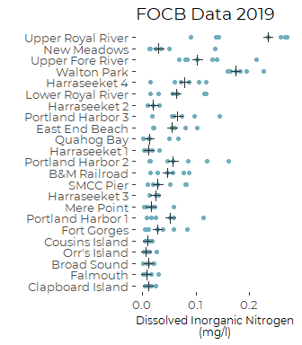

``` r

ggsave('figures/din_by_site_median.pdf', device = cairo_pdf, width = 3.5, height = 4)
#> Warning: Removed 23 rows containing missing values (geom_segment).
```

## Combined Graphics

### Combined Dataframe

To facilitate combined plots, we create a data frame with 2018 and 2019
TN data and 2019 DIN data. For consistency, we keep graphics ordered by
TN.

``` r
tmp_din <- din_data_19 %>%
  mutate(parameter = 'DIN') %>%
  rename(value = din_N)

tmp_tn <- tn_data_18_19 %>%
  mutate(parameter = 'TN') %>%
  mutate(station = fct_reorder(station, tn, na.rm = TRUE),
         station_name = fct_reorder(station_name, tn, median, na.rm = TRUE)) %>%
  rename(value = tn)

combo_data <- tmp_din %>%
  bind_rows(tmp_tn) %>%
  mutate(parameter = factor(parameter, levels = c('DIN', 'TN'),
                            labels = c('DIN 2019','TN 2018-19' ))) %>%
  mutate(station = factor(station, levels = levels(tmp_tn$station)),
         station_name = factor(station_name, 
                               levels = levels(tmp_tn$station_name)))
rm(tmp_din, tmp_tn)
```

### Combined Plot \#1 Points Only

``` r
plt <- ggplot(combo_data, aes(value, station_name)) +

  geom_point(aes(color = parameter), alpha = 1) +
  
  scale_color_manual(values = cbep_colors()[c(6,4)]) +
  
  ylab('') +
  xlab('Nitrogen (mg/l)') +
  
  theme_cbep(base_size = 12) +
  theme(axis.title.x = element_text(size = 10),
        #axis.text.x= element_text(angle = 90),
        legend.position = 'None',
        panel.grid.major.x = element_line(color = 'gray85'),
          panel.spacing.x = unit(1, 'lines'))  +
  #scale_x_continuous(breaks = c(0.32, 0.45)) +
  facet_wrap(~parameter)
plt
```

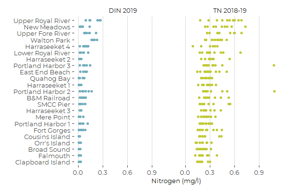

``` r
ggsave('figures/n_by_site.pdf', device = cairo_pdf, width = 6, height = 4)
```

### Combined Plot \#2 Points with Medians

``` r
plt + 
  # geom_pointrange(stat = "summary",
  #                 fun.min = function(z) {quantile(z,0.25)},
  #                 fun.max = function(z) {quantile(z,0.75)},
  #                 fun = median,
  #                 size = .5,
  #                 shape = 3,
  #                 color = cbep_colors()[5]) +

  stat_summary(fun = median,
                  size = .5,
                  shape = 3,
                  color = cbep_colors()[3])
#> Warning: Removed 23 rows containing missing values (geom_segment).

#> Warning: Removed 23 rows containing missing values (geom_segment).
```

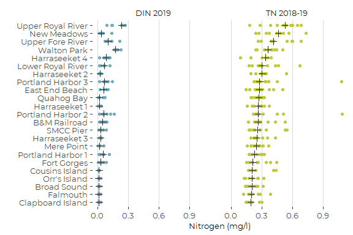

``` r

ggsave('figures/n_by_site_median.pdf', device = cairo_pdf, width = 6, height = 4)
#> Warning: Removed 23 rows containing missing values (geom_segment).

#> Warning: Removed 23 rows containing missing values (geom_segment).
```

Looks pretty good. The IQR does not add much, so we removed it.

### Combined Plot \#3 Boxplots

Because we are relying here on robust models,

``` r
plt <- ggplot(combo_data, aes(value, station_name)) +
  geom_boxplot(color = cbep_colors()[3],
               fill = cbep_colors2()[4],
               outlier.shape = NA,
               coef = 0)  + 
  geom_point(aes(color = parameter), alpha = 1) +
  
  scale_color_manual(values = cbep_colors()[c(1,4)]) +
  
  ylab('') +
  xlab('Nitrogen\n(mg/l as N)') +
  
  theme_cbep(base_size = 12) +
  theme(axis.title.x = element_text(size = 10),
        legend.position = 'None',
        panel.grid.major.x = element_line(color = 'gray85'),
          panel.spacing.x = unit(2, 'lines'))  +
  #scale_x_log10() +
  facet_wrap(~parameter)
plt
```


``` r
ggsave('figures/n_by_site_box.pdf', device = cairo_pdf, width = 6, height = 4)
```

# Trend Data

Few stations have data from more than a few years. DIN data has been
collected over the past couple of years, at several stations in the mid
2000s, and at a handful of stations pretty much every year since 2001.
Generally the rule we have used to examine trends is to focus on sites
with relatively complete records, here at least two of the last five
years and at least ten years total.

## Identify Trend Stations

``` r
trend_counts <- strict_data %>%
  group_by(station, year) %>%
  summarize(din_was_sampled =  ! all(is.na(din_N)),
            tn_was_sampled =  ! all(is.na(tn)),
            .groups = 'drop_last') %>%
  summarize(din_last_5 = sum(din_was_sampled & year > 2014),
            din_total = sum(din_was_sampled),
            tn_last_5 = sum(tn_was_sampled & year > 2014),
            tn_total = sum(tn_was_sampled),
            .groups = 'drop') %>%
  filter((din_total >= 10 & din_last_5 >= 2) | 
           (tn_total >= 10 & tn_last_5 >= 2))

trend_sites <- trend_counts %>%
  filter(tn_total > 10) %>%
  pull(station)
trend_sites
#> [1] "P5BSD" "P6FGG" "P7CBI" "PKT42" "SMT50"
rm(trend_counts)
```

## Generate Trend Data

``` r
trend_data_prelim <- strict_data %>%
  filter(station %in% trend_sites) %>%
  filter(!(is.na(din_N) & is.na(tn))) %>%
  mutate(station_name = names_df$Alt_Name[match(station,
                                                names_df$Station_ID)]) %>%
  mutate(station = factor(station),
         station_name = factor(station_name)) %>%
  mutate(station = fct_reorder(station, tn, na.rm = TRUE),
         station_name = fct_reorder(station_name, tn, na.rm = TRUE)) %>%
  relocate(station_name, .after = station) %>%
  select(- din_depth, -tn_depth, -c(nox:din))
```

## Restrict Data to Summer Months

Analysis showed that sampling at different times of year biased results,
with nitrogen levels generally higher in cold season. Since FOCB did not
sample at consistent times of year across al lyears, different sampling
histories can generate the spurious appearance of long term trends.

To avoid that problem, we restrict attention to just the “warm” months
from May through October, when FOCB is currently collecting data on a
consistent basis.

``` r
trend_data <- trend_data_prelim %>%
  filter(month %in% month.abb[5:10])
```

# TN Graphics

## Create TN Trend Data

``` r
tn_trend <- trend_data %>%
  mutate(tn = if_else(tn <= 0 | tn >= 1.5, NA_real_, tn)) %>%
  select(-nox_N, -nh4_N, -organic_N, -din_N) %>%
  filter(! is.na(tn))

tn_trend_summary  <-   tn_trend %>%
  select(station_name, year, tn) %>%
  group_by(station_name, year) %>%
  summarize(across(tn, 
                   .fns = list(mn = ~ mean(.x, na.rm = TRUE),
                               sd = ~ sd(.x, na.rm = TRUE), 
                               n = ~sum(! is.na(.x)),
                               md = ~ median(.x, na.rm = TRUE),
                               iqr = ~ IQR(.x, na.rm = TRUE),
                               p90 = ~ quantile(.x, .9, na.rm = TRUE),
                               gm = ~ exp(mean(log(.x), na.rm = TRUE)))),
            .groups = 'drop') %>%
  filter(! is.na(tn_md)) %>%
  mutate(dt = as.Date(paste0('06-15-', year), format = '%m-%d-%Y'))
```

## Showing Annual Medians

``` r
plt_2 <- ggplot(tn_trend, aes(dt, tn)) +
  geom_point( alpha = 0.75, color = cbep_colors()[5]) + 
   geom_line(data = tn_trend_summary, 
             mapping = aes(x = dt, y = tn_md), 
             lwd = 1,
             color = cbep_colors()[3]) +
  #geom_smooth(method = 'lm') +
  #scale_y_log10() +
  facet_wrap( ~station_name, ncol = 1) +

  theme_cbep(base_size = 12) +
  theme(legend.position = 'bottom',
        panel.grid.major.y = element_line(color = 'gray85'),
        strip.text.y = element_text(size = 9)) +
  xlab('') +
  ylab('Total Nitrogen (mg/l)')
plt_2
```

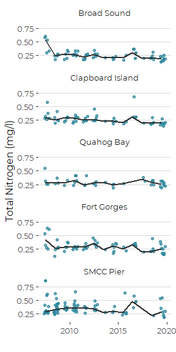

``` r
#ggsave('figures/tn_trend_by_site_tall.pdf', device = cairo_pdf, width = 3, height = 6)
```

``` r
plt_2 <- ggplot(tn_trend, aes(dt, tn)) +
  geom_point(alpha = 0.75, color = cbep_colors()[5]) + 
   geom_line(data = tn_trend_summary, 
             mapping = aes(x = dt, y = tn_md), 
             lwd = 1,
             color = cbep_colors()[3])+
  #geom_smooth(method = 'lm') +
  #scale_y_log10() +
  facet_wrap( ~station_name, ncol = 6) +

  theme_cbep(base_size = 12) +
  theme(legend.position = 'bottom',
        panel.grid.major.y = element_line(color = 'gray85'),
        strip.text.y = element_text(size = 9)) +
  xlab('') +
  ylab('Total Nitrogen (mg/l)')
plt_2
```

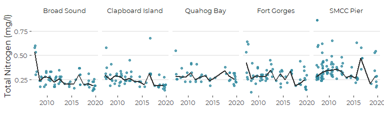

``` r
#ggsave('figures/tn_trend_by_site_wide.pdf', device = cairo_pdf, width = 4, height = 7)
```

## ShowingEstimated Marginal Means

### Linear Model

``` r
trnd_lm <- lm(log(tn) ~ station_name + station_name:year + month,
                data = trend_data)
anova(trnd_lm)
#> Analysis of Variance Table
#> 
#> Response: log(tn)
#>                    Df  Sum Sq Mean Sq F value    Pr(>F)    
#> station_name        4  6.2815 1.57037 16.8046 1.689e-12 ***
#> month               5  1.0103 0.20206  2.1623    0.0581 .  
#> station_name:year   5  3.3193 0.66386  7.1040 2.592e-06 ***
#> Residuals         315 29.4363 0.09345                      
#> ---
#> Signif. codes:  0 '***' 0.001 '**' 0.01 '*' 0.05 '.' 0.1 ' ' 1
```

``` r
emms_tn <- emmeans(trnd_lm, c('station_name', 'year'), cov.keep = 'year', type = 'response')
#> NOTE: A nesting structure was detected in the fitted model:
#>     year %in% station_name
```

``` r
emms_df <- as_tibble(emms_tn) %>%
  mutate(dt  = as.Date(paste0(year, '-06-10')))
```

We remove the predictions for Stations without significant trends.

``` r
emms_sig_df <-  emms_df %>%
  filter(station_name %in% c('Broad Sound', 'Clapboard Island',  'Fort Gorges'))
```

``` r
ggplot(tn_trend, aes(dt, tn)) +
  geom_point( color = cbep_colors()[5]) + 
  geom_line(data = emms_sig_df, 
            mapping = aes(x = dt, y = response), 
            lwd = 1,
            color = cbep_colors()[3]) +
  scale_y_continuous(trans = 'log1p') +
  facet_wrap(~station_name, nrow = 5) +
  theme_cbep(base_size = 12) +
  theme(legend.position = 'None',
        panel.grid.major.y = element_line(color = 'gray85'),
        strip.text.y = element_text(size = 9)) +
  xlab('') +
  ylab('Total Nitrogen (mg/l)')
```

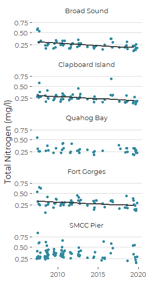

``` r
ggsave('figures/tn_trend_emmeans_tall.pdf', device = cairo_pdf, width = 4, height = 7)
```

``` r
ggplot(tn_trend, aes(dt, tn)) +
  geom_point( color = cbep_colors()[5]) + 
  geom_line(data = emms_sig_df, 
            mapping = aes(x = dt, y = response), 
            lwd = 1,
            color = cbep_colors()[3]) +
  scale_y_continuous(trans = 'log1p') +
  facet_wrap(~station_name, nrow = 1) +
  theme_cbep(base_size = 12) +
  theme(legend.position = 'None',
        panel.grid.major.y = element_line(color = 'gray85'),
        strip.text.y = element_text(size = 9)) +
  xlab('') +
  ylab('Total Nitrogen (mg/l)')
```

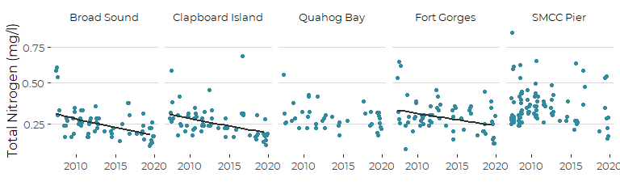

``` r
ggsave('figures/tn_trend_emmeans_wide.pdf', device = cairo_pdf, width = 4, height = 7)
```

# Combined Graphics

## Reorganize Data

First, we pivot the trend data to long form.

``` r
combo_trend <- trend_data %>%
  mutate(tn = if_else(tn <= 0 | tn >= 1.5, NA_real_, tn)) %>%
  select(-nox_N, -nh4_N, -organic_N) %>%
  pivot_longer(c(tn, din_N), names_to = 'parameter', values_to = 'value') %>%
  mutate(parameter = factor(parameter, levels = c('din_N', 'tn'),
                            labels = c('DIN', 'TN')))
```

Then we calculate long-form summaries.

``` r
trend_summary  <-   combo_trend %>%
  select(station_name, year, parameter, value) %>%
  group_by(station_name, year, parameter) %>%
  summarize(across(value, 
                   .fns = list(mn = ~ mean(.x, na.rm = TRUE),
                               sd = ~ sd(.x, na.rm = TRUE), 
                               n = ~sum(! is.na(.x)),
                               md = ~ median(.x, na.rm = TRUE),
                               iqr = ~ IQR(.x, na.rm = TRUE),
                               p90 = ~ quantile(.x, .9, na.rm = TRUE),
                               gm = ~ exp(mean(log(.x), na.rm = TRUE)))),
            .groups = 'drop') %>%
  filter(! is.na(value_mn)) %>%
  mutate(dt = as.Date(paste0('06-15-', year), format = '%m-%d-%Y'))
```

## Potential Plot \# 1 Facet Grid

``` r
plt_1 <- ggplot(combo_trend) +
  geom_point(aes(dt, value, color = parameter), alpha = 0.5) + 
  geom_line(data = trend_summary, 
            mapping = aes(x = dt, y = value_md), 
            lwd = 1,
            color = cbep_colors()[3])+
  
  facet_grid(rows = vars(station_name), cols = vars(parameter)) +
  scale_color_manual(values = cbep_colors()[c(6,4)], name = '') +
  theme_cbep(base_size = 12) +
  theme(legend.position = 'None',
        panel.spacing.x = unit(.5, "lines"),
        panel.grid.major.y = element_line(color = 'gray85'),
        axis.line.y =  element_line(color = 'gray85')) +
  xlab('') +
  ylab('Nitrogen (mg/l)')
plt_1
#> Warning: Removed 849 rows containing missing values (geom_point).
```

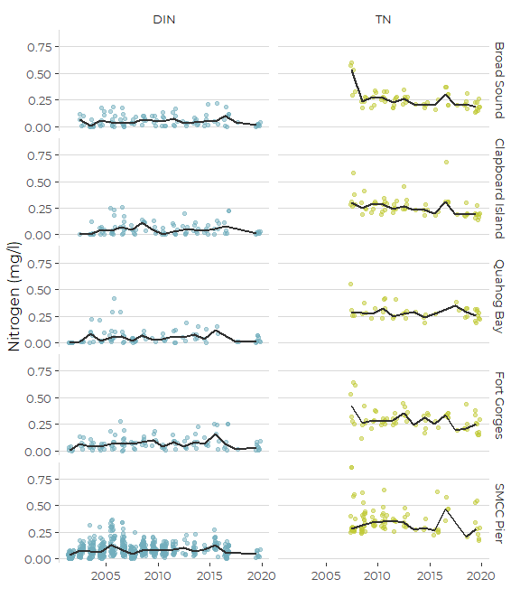

``` r
#ggsave('figures/n_trends_by_site.pdf', device = cairo_pdf, width = 6, height = 7)
```

## Potential Plot \# 2 Colors

``` r
plt_2 <- ggplot(combo_trend) +
  geom_point(aes(dt, value, color = parameter), alpha = 0.5) + 
  geom_line(data = trend_summary, 
            mapping = aes(x = dt, y = value_md, group = parameter), 
            lwd = 1,
            color = cbep_colors()[3])+
  scale_y_log10(breaks = c(0.001, 0.01, 0.1, 1),
                labels = c(0.001, 0.01, 0.1, 1)) +
  facet_grid(rows = vars(station_name)) +
  scale_color_manual(values = cbep_colors()[c(6,4)], name = '') +
  theme_cbep(base_size = 12) +
  theme(legend.position = 'bottom',
        panel.spacing.x = unit(1, "lines"),
        strip.text.y = element_text(size = 9)) +
  xlab('') +
  ylab('Nitrogen (mg/l)')
plt_2
#> Warning: Transformation introduced infinite values in continuous y-axis
#> Warning: Removed 849 rows containing missing values (geom_point).
```

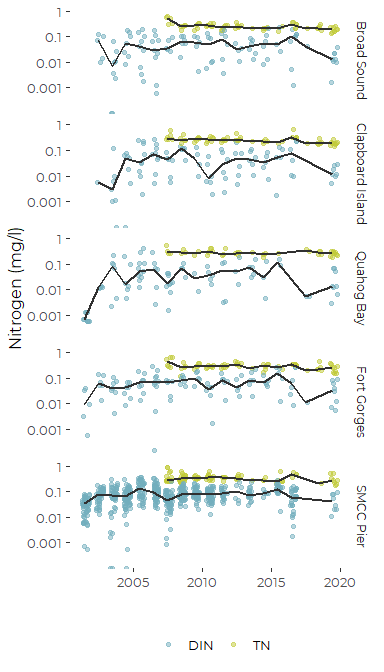

``` r
#ggsave('figures/n_trends_by_site_2.pdf', device = cairo_pdf, width = 4, height = 7)
```
