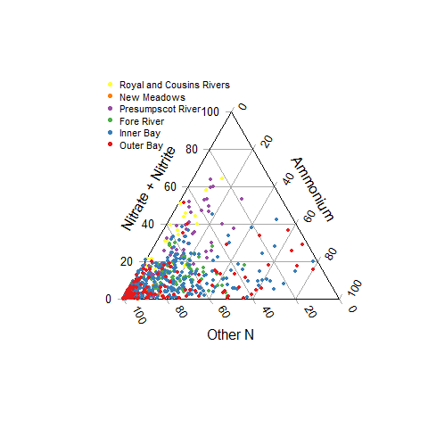
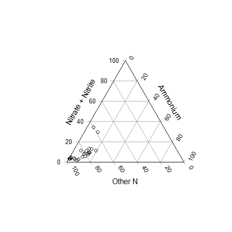
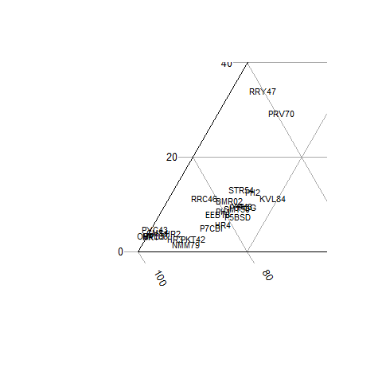

Nitrogen Ternary Plots from Friends of Casco Bay Nutrient Data
================
Curtis C. Bohlen, Casco Bay Estuary Partnership.
04/26/2021

-   [Introduction](#introduction)
-   [Load Data](#load-data)
    -   [Folder References](#folder-references)
    -   [Load Data](#load-data-1)
-   [Ternary Plots](#ternary-plots)
    -   [Draft Plots](#draft-plots)
        -   [By Bay “Regions”](#by-bay-regions)
    -   [Produce PDF](#produce-pdf)
-   [Simplified Ternary Diagrams by Median
    Values](#simplified-ternary-diagrams-by-median-values)


# Introduction

This notebook Looks at DIN and TN numbers from Friends of Casco Bay
samples and produces “ternary plots” showing the relative importance of
ammonium, nitrates, and “organic” nitrogen in Casco Bay waters.

FOCB reports the TN samples and DIN samples were sent to different
laboratories, and so direct comparison relies on consistent calibration
across two labs. So combining data across labs, as we do here, should be
done with caution.

FOCB also reports that some DIN samples over the years had unusually
high ammonium values, and that those samples were noted by the
laboratory conducting the analyses, but not flagged as errors. We
removed those possibly erroneous samples before conducting this
analysis, by removing the top 5% of all ammonium values in the data and
removing a handful of remaining ammonium samples where the calculated
DIN was higher than reported TN. See “FOCB\_Nutrients\_Combined.Rmd” for
details.

\#Load libraries

``` r
library(readr)
library(readxl)
library(tidyverse)
#> -- Attaching packages --------------------------------------- tidyverse 1.3.1 --
#> v ggplot2 3.3.5     v dplyr   1.0.7
#> v tibble  3.1.6     v stringr 1.4.0
#> v tidyr   1.1.4     v forcats 0.5.1
#> v purrr   0.3.4
#> -- Conflicts ------------------------------------------ tidyverse_conflicts() --
#> x dplyr::filter() masks stats::filter()
#> x dplyr::lag()    masks stats::lag()

library(Ternary) # Base graphics ternary plots

library(CBEPgraphics)
load_cbep_fonts()
theme_set(theme_cbep())
```

# Load Data

## Folder References

``` r
sibfldnm <- 'Data'
parent <- dirname(getwd())
sibling <- file.path(parent,sibfldnm)

dir.create(file.path(getwd(), 'figures'), showWarnings = FALSE)
```

## Load Data

The data we use here has had a number of suspiciously high NH4 values
removed. See “FOCB\_Nutrients\_Combined.Rmd” for details and
explanation.

``` r
strict_data <- read_csv(file.path(sibling, 
                                 "focb_n_data_strict.csv"))%>%
  mutate(month = factor(month, levels = month.abb),
         yearf <- factor(year))
#> Rows: 3324 Columns: 17
#> -- Column specification --------------------------------------------------------
#> Delimiter: ","
#> chr   (3): station, month, nh4_ext
#> dbl  (13): year, yearf, doy, tn_depth, din_depth, tn, nox, nh4, din, din_N, ...
#> dttm  (1): dt
#> 
#> i Use `spec()` to retrieve the full column specification for this data.
#> i Specify the column types or set `show_col_types = FALSE` to quiet this message.
```

# Ternary Plots

``` r
proportion_data <- strict_data %>%
  mutate(across(nox_N:organic_N, ~ .x/tn)) %>%
  select(station, dt, year, nox_N:organic_N) %>%
  filter(! is.na(nox_N), ! is.na(nh4_N), ! is.na(organic_N)) %>%
  mutate(era = ((year - 2005) %/% 5),
         offshore = substr(station,1,1) == 'P' & ! substr(station,2,2) == 'H')
```

## Draft Plots

### By Bay “Regions”

``` r
proportion_data <- proportion_data %>%
  mutate(region  = recode_factor(station, 
                                 "BMR02" = "Inner Bay",
                                 "CMS1"  = "Inner Bay",
                                 "EEB18" = "Inner Bay",
                                 "HR1"   = "Harraseeket",
                                 "HR2"   = "Harraseeket",
                                 "HR3"   = "Harraseeket",
                                 "HR4"   = "Harraseeket",
                                 "KVL84" = "Fore River",
                                 "MPL86" = "Inner Bay",
                                 "NMM79" = "New Meadows",
                                 "OBY35" = "Outer Bay",
                                 "P5BSD" = "Outer Bay",
                                 "P6FGG" = "Inner Bay",
                                 "P7CBI" = "Inner Bay",
                                 "PH1"   = "Fore River",
                                 "PH2"   = "Fore River",
                                 "PH3"   = "Fore River",
                                 "PKT42" = "Outer Bay",
                                 "PRV70" = "Presumpscot River",
                                 "PYC43" = "Inner Bay",
                                 "RRC46" = "Royal and Cousins Rivers",
                                 "RRY47" = "Royal and Cousins Rivers",
                                 "SMT50" = "Inner Bay",
                                 "STR54" = "Fore River"),
         region = factor(region, levels = c("Royal and Cousins Rivers",
                                            "New Meadows",  
                                            "Presumpscot River",
                                            "Fore River",
                                            "Inner Bay",
                                            "Outer Bay"))) %>%
  arrange(region)
```

We use a different color palette that provides more color separation for
six categories than the CBEP colors. Unfortunately, this palette is not
especially colorblind friendly.

We borrowed a function to add alpha values to color palettes from here:
[Description](https://www.r-bloggers.com/2014/03/colorramppalettealpha-and-addalpha-helper-functions-for-adding-transparency-to-colors-in-r/)
[GitHub](https://github.com/mylesmharrison/colorRampPaletteAlpha/blob/master/colorRampPaletteAlpha.R)

``` r
addalpha <- function(colors, alpha=1.0) {
  r <- col2rgb(colors, alpha=T)
  # Apply alpha
  r[4,] <- alpha*255
  r <- r/255.0
  return(rgb(r[1,], r[2,], r[3,], r[4,]))
}
```

``` r
pal = rev(addalpha(RColorBrewer::brewer.pal(6, 'Set1'), 1))

# Cairo::Cairo(file = 'figures/ternary.png', width = 400, height = 400,
#       type = 'png',
#       family = 'Montserrat', pointsize = 9)

TernaryPlot(alab = 'Nitrate + Nitrite', blab = 'Ammonium', clab = 'Other N',
            grid.lines = 5, grid.minor.lines = 0)
TernaryPoints(proportion_data[4:6], pch = 16, 
              col = pal[as.numeric(proportion_data$region)],
              cex = 0.5)
legend(x = -.6, y = 1.05, 
       ncol = 1, bg = NULL,
       cex = .7,
       pt.cex = 1,
        legend = levels(proportion_data$region),
        box.lty = 0,
        pch = 20,
        col = pal)
```



``` r
# dev.off()
```

## Produce PDF

We have slightly more control of size when we specify the graphics
device, as we can specify fonts and base font size.

``` r
cairo_pdf('figures/ternary.pdf', width = 3.5, height = 5,
          family = 'Montserrat', pointsize = 8)
TernaryPlot(alab = 'Nitrate + Nitrite', blab = 'Ammonium', clab = 'Other N',
            grid.lines = 5, grid.minor.lines = 0)
TernaryPoints(proportion_data[4:6], pch = 16, 
              col = pal[as.numeric(proportion_data$region)],
              cex = 0.5)
legend(x = -.6, y = 1.05, 
       ncol = 1, bg = NULL,
       cex = .7,
       pt.cex = 1,
        legend = levels(proportion_data$region),
        box.lty = 0,
        pch = 20,
        col = pal)
dev.off()
#> png 
#>   2
```

# Simplified Ternary Diagrams by Median Values

``` r
sum_p_data <- strict_data %>%
   filter(! is.na(nox_N), ! is.na(nh4_N), ! is.na(organic_N)) %>%
   group_by(station) %>%
   summarize(across(nox_N:organic_N, median),
            .groups = 'drop') %>%
   mutate(across(nox_N:organic_N, ~ .x/(nox_N + nh4_N + organic_N)))
```

``` r
TernaryPlot(alab = 'Nitrate + Nitrite', blab = 'Ammonium', clab = 'Other N',
            grid.lines = 5, grid.minor.lines = 0,
            #xlim = c(-0.5, -0.25), ylim  = c(0, .25)
            )
TernaryPoints(sum_p_data[2:4])
```



``` r
#TernaryText(sum_p_data[2:4], labels = sum_p_data$station, cex = .5)
```

``` r
TernaryPlot(alab = 'Nitrate + Nitrite', blab = 'Ammonium', clab = 'Other N',

            grid.lines = 5, grid.minor.lines = 0,
            xlim = c(-0.5, -0.25), ylim  = c(0, .25))
#TernaryPoints(sum_p_data[2:4])
TernaryText(sum_p_data[2:4], labels = sum_p_data$station, cex = .7)
```


